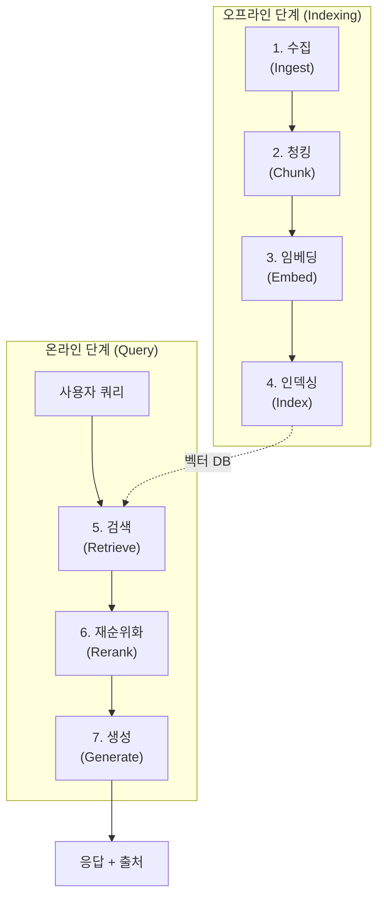
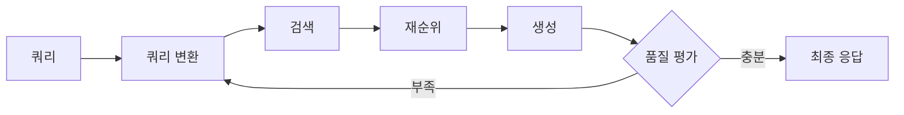

# RAG 파이프라인 (Retrieval-Augmented Generation Pipeline)

## 정의

RAG 파이프라인(Retrieval-Augmented Generation Pipeline)은 **외부 지식 소스에서 관련 정보를 검색하여 LLM의 생성에 주입하는 엔드투엔드 시스템 구조**를 말한다. LLM의 학습 데이터에 포함되지 않은 최신 정보, 도메인 전문 지식, 비공개 문서를 활용할 수 있게 하며, 환각(hallucination)을 줄이고 응답의 근거를 제공하는 핵심 아키텍처다.

## 표준 파이프라인 단계

RAG 파이프라인은 크게 **오프라인 인덱싱 단계**와 **온라인 쿼리 단계**로 나뉜다.

문서 수집부터 응답 생성까지 7단계의 표준 RAG 파이프라인 흐름이다.

### 1. 수집(Ingest)

원본 문서를 시스템에 투입하는 단계다. PDF, HTML, Markdown, 데이터베이스, API 응답 등 다양한 소스를 통합 포맷으로 변환한다.

- 문서 로더(Document Loader)가 포맷별 파서를 적용
- 메타데이터 추출: 제목, 작성일, 저자, 카테고리 등
- 중복 문서 탐지 및 제거

### 2. 청킹(Chunking)

문서를 검색 가능한 단위로 분할한다. [[chunking-strategies|청킹 전략]]은 파이프라인 전체 품질에 결정적 영향을 미친다.

| 전략 | 설명 | 적합한 경우 |
|------|------|-----------|
| 고정 크기(Fixed-size) | 토큰/문자 수 기준 분할 | 빠른 프로토타이핑 |
| 의미 기반(Semantic) | 문장 임베딩 유사도로 경계 탐지 | 주제가 혼재된 문서 |
| 재귀적(Recursive) | 구분자 계층(단락 > 문장 > 단어)으로 분할 | 범용적 |
| 문서 구조(Structural) | 제목, 섹션, 표 등 구조 활용 | 정형화된 문서 |

청크 크기는 보통 256-1024 토큰이며, 20-30%의 오버랩(overlap)을 주어 문맥 손실을 방지한다.

### 3. 임베딩(Embed)

각 청크를 고차원 벡터 공간에 매핑한다. [[embedding-layers|임베딩 모델]]이 텍스트의 의미를 수치 벡터로 변환한다.

- OpenAI `text-embedding-3-large`, Cohere `embed-v4`, `BAAI/bge-m3` 등
- 차원: 384 ~ 3072 (모델에 따라 다름)
- 쿼리와 문서에 동일한 임베딩 모델을 사용해야 일관된 유사도 비교 가능

### 4. 인덱싱(Index)

임베딩 벡터를 효율적으로 검색할 수 있는 구조에 저장한다.

- **벡터 데이터베이스**: Pinecone, Weaviate, Qdrant, Milvus, ChromaDB
- **근사 최근접 이웃(ANN)**: HNSW, IVF-PQ 등의 알고리즘으로 밀리초 단위 검색
- 메타데이터 필터링: 날짜 범위, 카테고리 등으로 검색 범위 제한

### 5. 검색(Retrieve)

사용자 쿼리를 임베딩하여 가장 유사한 청크를 찾는다.

- **밀집 검색(Dense Retrieval)**: 임베딩 벡터 코사인 유사도 기반
- **희소 검색(Sparse Retrieval)**: BM25, TF-IDF 등 키워드 매칭
- **하이브리드 검색(Hybrid)**: 밀집 + 희소 결과를 [[hybrid-search-rrf|RRF(Reciprocal Rank Fusion)]] 등으로 결합
- 보통 Top-K (K=5~20) 청크를 후보로 반환

### 6. 재순위화(Rerank)

검색된 후보 청크의 관련성을 더 정밀하게 평가하여 순위를 재조정한다.

- Cross-encoder 모델: 쿼리-문서 쌍을 함께 입력하여 관련성 점수 산출
- Cohere Rerank, `BAAI/bge-reranker-v2.5-gemma2-lightweight` 등
- 비용과 정확도의 트레이드오프: bi-encoder(검색)가 넓게 후보를 잡고, cross-encoder(재순위)가 정밀 필터링

### 7. 생성(Generate)

선별된 청크를 LLM 컨텍스트에 주입하여 최종 응답을 생성한다.

- 프롬프트 구성: 시스템 프롬프트 + 검색된 컨텍스트 + 사용자 쿼리
- 출처 인용(Citation): 응답에 근거 문서를 명시하여 검증 가능성 확보
- 컨텍스트 윈도우 관리: 검색 결과가 윈도우를 초과하면 요약 또는 압축 적용

## Naive RAG vs Advanced RAG

### Naive RAG

위의 7단계를 순차적으로 한 번만 실행하는 가장 단순한 형태다.

- 장점: 구현이 간단하고 빠름
- 한계: 쿼리가 모호하면 검색 품질이 낮고, 단일 검색으로 부족한 정보를 보완할 수 없음

### Advanced RAG

각 단계에 정교한 기법을 적용하고, 파이프라인에 피드백 루프를 추가한다.

- **쿼리 변환(Query Transformation)**: 원본 쿼리를 재작성, 분해, 확장하여 검색 품질 향상
- **Self-RAG / Corrective RAG**: 생성된 응답의 품질을 평가하고, 부족하면 추가 검색을 수행하는 자기 교정 루프
- **[[agentic-rag|에이전틱 RAG]]**: LLM 에이전트가 검색 전략을 동적으로 결정하고, 다중 소스를 반복적으로 탐색

Advanced RAG는 생성 결과를 평가하고 필요 시 쿼리를 재구성하여 반복 검색하는 피드백 루프를 포함한다.

## 파이프라인 최적화 패턴

### 인덱싱 최적화

- **계층적 인덱싱(Hierarchical Indexing)**: 요약 인덱스 + 상세 인덱스를 계층적으로 구성하여 검색 효율 향상
- **멀티벡터 검색**: 문서 요약 벡터로 1차 필터링, 원본 청크 벡터로 2차 검색
- **메타데이터 강화**: 청크에 LLM이 생성한 가설적 질문(Hypothetical Questions)을 메타데이터로 추가

### 검색 최적화

- **하이브리드 검색**: 밀집 + 희소 + 메타데이터 필터의 조합으로 재현율과 정밀도 균형
- **쿼리 분해(Query Decomposition)**: 복합 질문을 하위 질문으로 분해하여 각각 검색
- **컨텍스트 윈도우 패킹(Context Window Packing)**: 검색 결과를 관련성 순으로 정렬하되, 다양성을 유지하여 정보 중복 최소화

### 생성 최적화

- **Faithful Generation**: 검색된 컨텍스트에만 기반하여 응답하도록 유도, 환각 방지
- **인용 삽입(Inline Citation)**: 응답 내 문장별로 출처를 표기하여 검증 가능성 확보
- **스트리밍 생성**: 검색 완료 후 지연 없이 토큰 단위 스트리밍으로 UX 개선

## 평가 지표

RAG 파이프라인의 성능은 검색과 생성 양쪽을 모두 평가해야 한다:

| 평가 대상 | 지표 | 설명 |
|-----------|------|------|
| 검색 | Recall@K | 상위 K개 결과에 정답 문서가 포함된 비율 |
| 검색 | MRR (Mean Reciprocal Rank) | 정답 문서의 평균 역순위 |
| 생성 | Faithfulness | 응답이 검색된 컨텍스트에 충실한 정도 |
| 생성 | Answer Relevance | 응답이 원래 질문에 적합한 정도 |
| 통합 | RAGAS | 검색 + 생성을 통합 평가하는 프레임워크 |

## 관련 문서
- [[hallucination-mitigation]] -- 환각 완화 (Hallucination Mitigation)

- [[agentic-rag]] -- LLM 에이전트가 검색 전략을 동적으로 결정하는 고급 RAG
- [[chunking-strategies]] -- 문서 분할 전략과 청크 크기 최적화
- [[embedding-layers]] -- 임베딩 모델 원리와 선택 기준
- [[hybrid-search-rrf]] -- 밀집/희소 검색 결합과 RRF 알고리즘
- [[dense-retrieval]] -- 밀집 벡터 기반 검색의 원리와 한계
- [[contextual-retrieval]] -- 청크에 문맥 정보를 추가하는 Anthropic 기법
