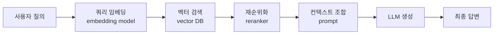

# RAG (Retrieval-Augmented Generation)

## 정의

RAG는 LLM(대형 언어 모델)의 생성 능력에 외부 지식 검색을 결합한 아키텍처 패턴이다. 모델의 파라미터에 고정된 지식만 사용하는 대신, 질의 시점에 외부 데이터 소스에서 관련 문서를 동적으로 검색한 뒤 이를 컨텍스트로 삼아 답변을 생성한다.

## 왜 필요한가

LLM은 학습 데이터 기준 시점 이후의 정보를 모른다(지식 차단, knowledge cutoff). 또한 파라미터 수가 아무리 많아도 사실 관계를 정확하게 암기하는 데는 한계가 있으며, 잘못된 사실을 그럴듯하게 생성하는 환각(hallucination) 문제가 발생한다. RAG는 이 두 가지 한계를 구조적으로 보완한다.

- **최신성**: 외부 데이터베이스를 실시간으로 갱신하면 모델 재학습 없이 최신 정보 제공 가능
- **정확성**: 검색된 문서를 근거로 답변하므로 환각 감소
- **추적 가능성**: 어떤 문서가 출처인지 인용 가능
- **도메인 특화**: 특정 사내 문서, 제품 매뉴얼, 법률 문서 등 공개되지 않은 지식 활용 가능

## 기본 파이프라인

위 흐름에서 각 단계는 독립적으로 교체·개선할 수 있다. 기본 구현에서 reranker는 생략 가능하며, 검색 결과를 바로 컨텍스트로 조합하기도 한다.

## 주요 구성요소

### 1. 임베딩 모델 (Embedding Model)

텍스트를 의미 벡터로 변환한다. 질의와 문서 모두 동일한 임베딩 모델로 벡터화해야 한다. 도메인에 따라 파인튜닝된 임베딩 모델이 범용 모델보다 성능이 높다. 자세한 내용은 [[embedding-models-for-rag]] 참조.

### 2. 벡터 DB (Vector Database)

문서 임베딩을 저장하고 근사 최근접 이웃(ANN) 검색으로 유사 문서를 빠르게 반환한다. 대표적으로 Pinecone, Weaviate, Qdrant, pgvector 등이 있다. 선택 기준은 [[vector-db-comparison]] 참조.

### 3. 청킹 전략 (Chunking)

원본 문서를 검색 단위로 분할하는 방법. 청크 크기, 오버랩, 분할 경계(문장/문단/시맨틱)에 따라 검색 품질이 크게 달라진다. [[chunking-strategies]] 참조.

### 4. 리트리버 (Retriever)

질의에 대해 관련 청크를 반환하는 컴포넌트. 밀집 검색([[dense-retrieval]])과 희소 검색([[sparse-retrieval-bm25]])을 결합한 하이브리드 방식([[hybrid-search-rrf]])이 단일 방식보다 일반적으로 우수하다.

### 5. 리랭커 (Reranker)

초기 검색 결과를 교차 인코더(cross-encoder)로 정밀 재순위화한다. 검색 속도와 정밀도 사이의 트레이드오프를 두 단계(recall 중심 ANN + precision 중심 reranker)로 해결한다. [[reranking-and-cross-encoders]] 참조.

## 기본 RAG에서 고도화 RAG로

기본 RAG는 단일 검색 - 단일 생성의 단순 구조다. 실무에서는 다음 방향으로 고도화된다.

| 고도화 방향 | 대표 기법 |
|-------------|-----------|
| 쿼리 개선 | [[query-transformation]], [[hyde-rag]], [[query-routing]] |
| 청킹 개선 | [[parent-document-retrieval]], [[late-chunking]], [[proposition-indexing]] |
| 검색 개선 | [[dense-sparse-hybrid-retrieval]], [[colbert-late-interaction]], [[approximate-nearest-neighbor]] |
| 자기 수정 | [[self-rag]], [[corrective-rag]], [[flare-retrieval]] |
| 멀티홉 | [[multi-hop-retrieval]], [[raptor-tree-retrieval]] |
| 그래프 기반 | [[knowledge-graph-rag]], [[graphrag-in-production]] |
| 에이전트 결합 | [[agentic-rag]], [[rag-agent-handoff]] |

[[rag-architecture-evolution-2026]]에서 2026년 기준 전체 발전 흐름을 조망할 수 있다.

## 평가

RAG 시스템은 검색 품질(retrieval)과 생성 품질(generation) 두 축으로 평가해야 한다. 주요 지표(Context Precision, Context Recall, Faithfulness, Answer Relevance)와 자동화 평가 프레임워크는 [[rag-evaluation-ragas]]와 [[rag-evaluation-metrics]] 참조.

## 한계와 주의사항

- 검색 실패 시 답변 품질이 급격히 하락 (garbage in, garbage out)
- 컨텍스트 윈도우 한계: 너무 많은 청크를 넣으면 오히려 성능 저하 (컨텍스트 rot, [[context-rot]])
- 보안·프라이버시: 민감 문서 접근 제어, 인젝션 공격 위험 ([[rag-security-privacy]])
- 할루시네이션 감소이지 제거가 아님 ([[rag-hallucination-reduction]])

## 관련 문서

- [[rag-pipeline]] - 파이프라인 구현 상세
- [[rag-indexing-pipeline]] - 인덱싱 파이프라인
- [[embedding-models-for-rag]] - 임베딩 모델 선택
- [[vector-db-comparison]] - 벡터 DB 비교
- [[chunking-strategies]] - 청킹 전략
- [[hybrid-search-rrf]] - 하이브리드 검색
- [[reranking-and-cross-encoders]] - 리랭킹
- [[rag-evaluation-ragas]] - 평가 프레임워크
- [[adaptive-rag]] - 적응형 RAG
- [[agentic-rag]] - 에이전트 결합 RAG
- [[rag-architecture-evolution-2026]] - 2026년 아키텍처 진화
