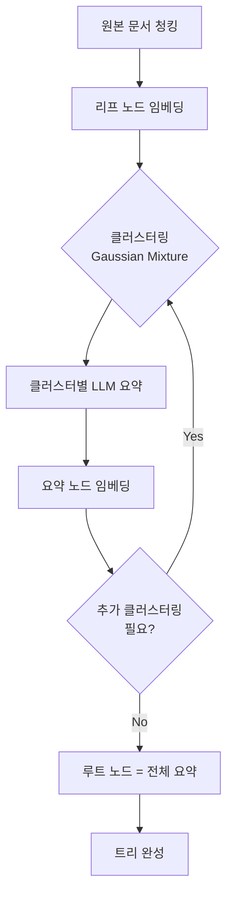
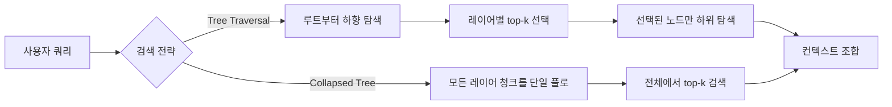

# RAPTOR 트리 검색

RAPTOR(Recursive Abstractive Processing for Tree-Organized Retrieval)는 문서 코퍼스를 **재귀적 클러스터링과 요약**을 통해 트리 구조로 인덱싱하고, 질의 시 해당 트리를 계층별로 탐색하는 RAG 기법이다. 2024년 스탠퍼드 연구팀이 발표했으며, 기존 청크 기반 검색이 갖는 **지역 정보 편향** 문제를 해소하기 위해 고안됐다.

## 왜 RAPTOR인가

일반적인 [[rag-pipeline]]에서 검색기는 고정 크기 청크를 임베딩한 뒤 코사인 유사도로 상위-k개를 반환한다. 이 방식은 단일 청크 안에서 충분히 답할 수 있는 **팩트성 질의**에는 잘 동작하지만, 여러 청크에 걸쳐 합산·비교·추론이 필요한 **멀티홉 질의**에서는 전체 맥락을 잡아내지 못한다.

RAPTOR는 이를 해결하기 위해 문서를 한 번 읽는 데 그치지 않고, **여러 추상화 수준의 요약 노드**를 트리로 구성해 검색 범위를 확장한다.

## 트리 구성 알고리즘

### 단계별 설명

1. **리프 노드 생성**: 문서를 [[chunking-strategies]]에 따라 청크로 분할하고 각 청크를 임베딩한다.
2. **클러스터링**: Gaussian Mixture Model(GMM)로 의미적으로 유사한 청크를 그룹화한다. 소프트 클러스터링이므로 한 청크가 여러 클러스터에 속할 수 있다.
3. **LLM 요약**: 각 클러스터 내 청크를 하나의 요약 텍스트로 압축한다. 이 요약이 부모 노드가 된다.
4. **반복**: 부모 노드들을 다시 클러스터링·요약해 상위 레이어를 구성한다.
5. **루트**: 반복이 수렴하면 전체 문서를 포괄하는 루트 노드가 생성된다.

## 트리 검색 전략

트리 완성 후 쿼리가 들어오면 두 가지 검색 방식 중 하나를 선택한다.

- **Tree Traversal**: 루트에서 시작해 각 레이어에서 가장 유사한 노드를 선택하며 아래로 내려간다. 넓은 주제 파악 후 세부 청크로 좁혀가므로 계층적 답변 생성에 유리하다.
- **Collapsed Tree**: 모든 레이어의 노드를 같은 수준으로 펼쳐 단일 검색 풀로 만든다. 구현이 단순하고 실험적으로 더 높은 성능을 보이는 경우가 많다.

## 성능 특성

| 항목 | 기존 청크 RAG | RAPTOR |
|------|--------------|--------|
| 단일 청크 질의 | 우수 | 동등 |
| 멀티홉 질의 | 부족 | 우수 |
| 인덱싱 비용 | 낮음 | 높음 (LLM 요약 필요) |
| 컨텍스트 범위 | 청크 수준 | 전체 문서 수준 |
| 추가 스토리지 | 없음 | 요약 노드만큼 증가 |

## 구현 시 고려사항

- **요약 LLM 선택**: 인덱싱 시 요약에 쓰는 LLM의 품질이 트리 전체 품질을 결정한다. 비용·성능 균형을 고려해 GPT-4o-mini나 Claude Haiku 수준을 권장한다.
- **클러스터 수 조정**: GMM의 클러스터 수는 데이터 크기·다양성에 따라 다르다. 너무 적으면 요약이 너무 일반화되고, 너무 많으면 트리 깊이가 불필요하게 깊어진다.
- **토큰 비용**: 인덱싱 단계에서 상당한 LLM 토큰이 소비된다. 정적 데이터셋에는 효과적이지만 실시간 갱신이 잦은 코퍼스에는 비효율적일 수 있다.
- **LangChain / LlamaIndex 지원**: 두 프레임워크 모두 RAPTOR 통합 모듈을 제공하므로 직접 구현 없이 빠르게 실험할 수 있다.

## 실무 적용 시나리오

- **긴 법률·계약 문서 QA**: 조항 간 관계와 전체 계약 의도를 동시에 파악해야 할 때
- **기술 문서 포털**: 여러 제품·버전 문서에서 공통 개념과 세부 스펙을 함께 검색할 때
- **학술 논문 코퍼스**: 개별 섹션(방법론)과 논문 간 공통 주제를 모두 처리할 때

## 관련 문서
- [[parent-document-retrieval]] -- 부모 문서 검색 (Parent Document Retrieval)

- [[rag-pipeline]] - RAPTOR가 삽입되는 전체 RAG 파이프라인
- [[chunking-strategies]] - 리프 노드 생성 시 사용하는 청킹 전략
- [[query-transformation]] - 쿼리 단에서 RAPTOR와 결합 가능한 기법
- [[self-rag]] - 검색 여부를 적응적으로 결정하는 다른 고급 RAG 기법
