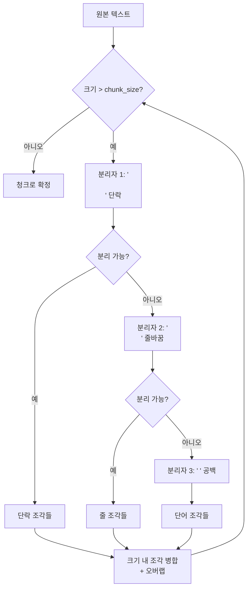

# 재귀적 문자 분할

## 정의

재귀적 문자 분할(recursive character text splitting)은 **분리자(separator)의 우선순위 목록**을 정의하고, 텍스트가 목표 크기보다 클 때 가장 의미 있는(큰 단위의) 분리자부터 시도하며 점진적으로 세밀하게 분할하는 청킹 전략이다.

단락 경계 -> 문장 경계 -> 단어 경계 -> 문자 순서로 재귀적으로 내려가면서, 텍스트 구조를 최대한 보존한 채 목표 청크 크기를 달성한다. LangChain의 `RecursiveCharacterTextSplitter`가 이 방식을 표준으로 구현해 널리 사용된다.



위 다이어그램은 재귀적으로 분리자를 시도하며 목표 크기를 달성하는 흐름을 나타낸다.

---

## 기본 원리

### 분리자 우선순위

기본 분리자 순서 (단위: 큰 것 -> 작은 것):

1. `"\n\n"` - 단락 구분 (가장 의미 있는 경계)
2. `"\n"` - 줄바꿈
3. `" "` - 단어 공백
4. `""` - 문자 단위 (마지막 수단)

이 순서로 시도해 해당 분리자로 충분히 작게 나눌 수 있으면 그것을 사용하고, 안되면 다음 단계로 내려간다.

### 재귀의 의미

"재귀적"이란 분할된 조각들에 대해 **같은 과정을 반복 적용**함을 뜻한다. 예를 들어 단락으로 나눈 조각이 여전히 크면, 그 조각에 다시 같은 분리자 우선순위 목록을 적용해 문장 단위로 나눈다.

---

## 구현

### 핵심 로직 직접 구현

```python
from typing import Callable

def recursive_character_splitter(
    text: str,
    separators: list[str],
    chunk_size: int,
    chunk_overlap: int,
    length_function: Callable[[str], int] = len,
) -> list[str]:
    """재귀적 문자 분할 핵심 로직."""
    final_chunks = []
    separator = separators[-1]  # 마지막 수단 분리자

    # 사용 가능한 분리자 탐색
    new_separators = []
    for i, sep in enumerate(separators):
        if sep == "" or sep in text:
            separator = sep
            new_separators = separators[i + 1:]
            break

    # 선택된 분리자로 분할
    splits = text.split(separator) if separator else list(text)
    splits = [s for s in splits if s]

    # 조각들을 chunk_size 이내로 병합
    good_splits = []
    current_doc = []
    current_len = 0

    for s in splits:
        s_len = length_function(s)

        if current_len + s_len + (len(separator) if current_doc else 0) > chunk_size:
            if current_doc:
                # 현재 모은 조각들 청크로 확정
                merged = separator.join(current_doc)
                final_chunks.append(merged)

                # 오버랩: 뒤에서 overlap만큼 유지
                while current_doc and current_len > chunk_overlap:
                    current_len -= length_function(current_doc[0])
                    current_doc.pop(0)

        if s_len > chunk_size:
            # 단일 조각이 너무 크면 재귀 적용
            if new_separators:
                sub_chunks = recursive_character_splitter(
                    s, new_separators, chunk_size, chunk_overlap, length_function
                )
                if current_doc:
                    final_chunks.append(separator.join(current_doc))
                    current_doc = []
                    current_len = 0
                final_chunks.extend(sub_chunks)
            else:
                current_doc.append(s)
                current_len += s_len
        else:
            current_doc.append(s)
            current_len += s_len + (len(separator) if len(current_doc) > 1 else 0)

    if current_doc:
        final_chunks.append(separator.join(current_doc))

    return final_chunks
```

### LangChain 표준 구현

```python
from langchain.text_splitter import RecursiveCharacterTextSplitter

# 기본 설정 (범용)
splitter = RecursiveCharacterTextSplitter(
    chunk_size=1000,
    chunk_overlap=200,
    length_function=len,           # 문자 수 기준
    separators=["\n\n", "\n", " ", ""],
)

# 토큰 수 기준으로 설정 (임베딩 모델 한계 준수)
import tiktoken

def token_length(text: str) -> int:
    enc = tiktoken.get_encoding("cl100k_base")
    return len(enc.encode(text))

token_splitter = RecursiveCharacterTextSplitter(
    chunk_size=512,
    chunk_overlap=64,
    length_function=token_length,
    separators=["\n\n", "\n", " ", ""],
)

chunks = splitter.split_text(long_document)
```

---

## 언어별 분리자 커스터마이징

### 마크다운 문서

```python
markdown_splitter = RecursiveCharacterTextSplitter(
    chunk_size=1000,
    chunk_overlap=100,
    separators=[
        "\n## ",    # H2 헤딩
        "\n### ",   # H3 헤딩
        "\n#### ",  # H4 헤딩
        "\n\n",     # 단락
        "\n",       # 줄바꿈
        " ",        # 공백
        "",         # 문자
    ],
)
```

### 코드 파일

```python
# Python 코드 분할 예시
python_splitter = RecursiveCharacterTextSplitter.from_language(
    language="python",  # LangChain이 언어별 분리자 제공
    chunk_size=2000,
    chunk_overlap=200,
)

# 내부적으로 사용하는 분리자:
# ["\nclass ", "\ndef ", "\n\tdef ", "\n\n", "\n", " ", ""]
```

### 한국어 특화

```python
korean_splitter = RecursiveCharacterTextSplitter(
    chunk_size=800,
    chunk_overlap=100,
    separators=[
        "\n\n",     # 단락
        "\n",       # 줄바꿈
        "다. ",     # 서술문 종결
        "요. ",     # 존댓말 종결
        "죠. ",     # 구어체 종결
        "까. ",     # 의문문 종결
        " ",        # 공백
        "",
    ],
)
```

---

## 고정 길이 청킹과의 비교

| 특성 | 고정 길이 | 재귀적 문자 분할 |
|------|----------|----------------|
| 문장 보존 | 거의 없음 | 대부분 보존 |
| 단락 보존 | 없음 | 보존 시도 |
| 구현 복잡도 | 매우 낮음 | 낮음 |
| 계산 비용 | 최저 | 매우 낮음 |
| 품질 | 낮음 | 중간 |
| 조정 파라미터 | 2개 | 3-4개 |

---

## 장단점

### 장점

- **구조 보존**: 단락/문장 경계를 최대한 존중
- **범용성**: 단 하나의 설정으로 대부분의 텍스트 형식에 대응
- **빠른 속도**: 임베딩 계산 없이 규칙 기반으로 동작
- **LangChain 기본값**: 에코시스템 내 가장 검증된 방법
- **언어별 분리자**: 마크다운, 코드, HTML 등 형식별 최적화 가능

### 단점

- **의미 무시**: 분리자 위치가 의미 경계와 항상 일치하지 않음
- **헤딩 컨텍스트 손실**: 섹션 제목이 청크에서 분리될 수 있음
- **수동 튜닝 필요**: 분리자, chunk_size, overlap 등 파라미터 경험적 설정 필요
- **구조 없는 텍스트에 취약**: 단락 구분 없는 텍스트는 단어 단위까지 분해

### 언제 선택하는가

- **빠른 프로토타입**: 품질보다 속도가 중요한 초기 개발
- **구조화된 문서**: 마크다운, HTML, 코드 등 명확한 구조가 있는 경우
- **비용 제약**: 의미적 청킹의 임베딩 비용을 감당할 수 없을 때
- **LangChain 기반 파이프라인**: 기존 생태계를 활용할 때

---

## 문서 타입별 권장 설정

```python
# 기술 블로그 / 마크다운 문서
BLOG_SPLITTER = RecursiveCharacterTextSplitter(
    chunk_size=1000, chunk_overlap=200,
    separators=["\n## ", "\n### ", "\n\n", "\n", " "],
)

# 법률 문서
LEGAL_SPLITTER = RecursiveCharacterTextSplitter(
    chunk_size=500, chunk_overlap=100,
    separators=["\n\n", "\n제", "\n항", "\n호", "\n", " "],
)

# 소스 코드
CODE_SPLITTER = RecursiveCharacterTextSplitter(
    chunk_size=2000, chunk_overlap=400,
    separators=["\nclass ", "\ndef ", "\n\n", "\n", " "],
)

# 일반 단문 (FAQ, 챗봇)
FAQ_SPLITTER = RecursiveCharacterTextSplitter(
    chunk_size=300, chunk_overlap=50,
    separators=["\n\n", "\n", "다. ", "요. ", " "],
)
```

---

## 관련 문서

- [[chunking-strategies]] - 전체 청킹 전략 비교
- [[fixed-length-chunking]] - 더 단순한 고정 길이 청킹
- [[semantic-chunking-strategies]] - 더 정교한 의미 기반 청킹
- [[propositional-chunking]] - 명제 단위 청킹 (LLM 활용)
- [[context-aware-chunking]] - 헤딩/메타데이터 보존 청킹
- [[parent-document-retrieval]] - 재귀 분할 결과를 부모-자식 구조로 활용
- [[rag-indexing-pipeline]] - 청킹을 포함한 전체 RAG 인덱싱 파이프라인
