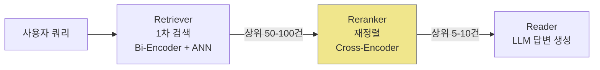

# 리랭킹과 크로스 인코더 (Reranking & Cross-Encoders)

## 개요

RAG(Retrieval-Augmented Generation) 파이프라인에서 **리랭킹(reranking)**은 1차 검색 결과를 정밀 재정렬하는 단계다. 단순 벡터 유사도로는 놓치는 의미적 뉘앙스를 포착해 최종 LLM에 전달되는 문서 품질을 끌어올린다.

## Retrieval 3단계 파이프라인



각 단계의 역할: **Retriever**는 전체 코퍼스에서 후보를 빠르게 추린다. **Reranker**는 후보를 정밀하게 재채점한다. **Reader(LLM)**는 최종 컨텍스트로 답변을 생성한다.

## Bi-Encoder vs Cross-Encoder

### Bi-Encoder (이중 인코더)

쿼리와 문서를 **독립적으로** 인코딩해 각각의 임베딩 벡터를 생성한다. 유사도는 코사인 유사도 또는 내적으로 계산한다.

- 문서 임베딩을 미리 계산해 FAISS 같은 ANN(Approximate Nearest Neighbor) 인덱스에 저장
- 쿼리 인코딩 1회 후 전체 인덱스와 비교 -> 수억 건도 밀리초 내 검색 가능
- 쿼리와 문서 간의 **교차 attention 없음** -> 미세한 의미 차이를 놓칠 수 있음

### Cross-Encoder (크로스 인코더)

쿼리와 문서를 **하나의 시퀀스로 결합**해 BERT 계열 모델에 입력한다.

```
[CLS] 쿼리 [SEP] 문서 [SEP] -> 관련성 점수 (0~1)
```

- 모든 레이어에서 쿼리-문서 교차 attention 수행 -> 높은 정밀도
- 문서 임베딩 사전 계산 불가 -> 후보 문서마다 개별 추론 필요
- 100개 후보에 대해 100회 추론 -> 속도가 느림 (Bi-Encoder 대비 50-100x)

### Late Interaction - ColBERT의 절충안

**Late Interaction(늦은 상호작용)**은 Bi-Encoder의 속도와 Cross-Encoder의 품질 사이의 sweet spot이다.

- 쿼리와 문서를 독립 인코딩하되, 토큰 수준 임베딩 **행렬**을 보존
- 검색 시 쿼리 토큰별로 문서 토큰과 MaxSim(최대 유사도) 집계
- 문서 토큰 임베딩을 인덱스에 저장하므로 ANN 검색 가능, 정밀도는 Cross-Encoder에 근접

## 비교 표

| 항목 | Bi-Encoder | Late Interaction (ColBERT) | Cross-Encoder |
|------|-----------|--------------------------|--------------|
| 인코딩 방식 | 독립 | 독립 (토큰 보존) | 결합 |
| 검색 속도 | 매우 빠름 (ANN) | 빠름 (ANN 가능) | 느림 (재추론) |
| 정밀도 | 낮음-중간 | 중간-높음 | 높음 |
| 메모리 사용 | 낮음 | 중간 (토큰 수 x 벡터) | 해당 없음 |
| 주 용도 | 1차 검색 | 1차 검색 + 재정렬 | 리랭킹 전용 |
| 대표 모델 | E5, BGE, OpenAI ada | ColBERT, ColBERT-v2 | ms-marco-MiniLM, BGE-reranker |

## 주요 리랭킹 모델

- **ms-marco-MiniLM-L-6-v2**: Microsoft MARCO 데이터셋으로 학습된 경량 크로스 인코더. 오픈소스 기본값
- **BGE-reranker-large**: BAAI의 고성능 리랭커. 한국어 포함 다국어 지원
- **Cohere Rerank**: API 형태 제공. 별도 인프라 없이 즉시 통합 가능
- **Jina Reranker**: 최대 8192 토큰 지원. 긴 문서 리랭킹에 유리
- **ColBERT-v2**: Late Interaction 방식. 정밀도와 속도의 균형

## 실전 파이프라인 설계

```python
# 1단계: Bi-Encoder로 top-100 후보 검색
candidates = bi_encoder.search(query, top_k=100)

# 2단계: Cross-Encoder로 top-10 재정렬
pairs = [(query, doc.text) for doc in candidates]
scores = cross_encoder.predict(pairs)
reranked = sorted(zip(candidates, scores), key=lambda x: x[1], reverse=True)[:10]

# 3단계: LLM에 top-10 전달
context = "\n\n".join([doc.text for doc, _ in reranked])
answer = llm.generate(query=query, context=context)
```

리랭킹 단계 추가만으로 RAG 정확도가 5-15%p 향상되는 사례가 보고된다. 특히 쿼리가 복잡하거나 문서 간 관련도 차이가 미묘할 때 효과가 크다.

## 리랭킹 도입 시 고려사항

- **레이턴시 예산**: Cross-Encoder는 후보 수에 비례해 레이턴시 증가. top-100 -> top-20 재정렬은 ~200ms 추가
- **후보 수 조정**: 리랭커 품질이 좋을수록 1차 검색에서 더 많은 후보를 뽑아도 됨
- **비용**: API 기반 리랭커(Cohere, Jina)는 요청당 비용 발생. 트래픽 규모 고려 필요
- **도메인 특화**: 일반 리랭커가 도메인 특화 데이터에서 성능 저하 시 파인튜닝 고려

## 관련 문서

- [[colbert-late-interaction]]
- [[embedding-models-for-rag]]
- [[hybrid-search-rrf]]
- [[rag-indexing-pipeline]]
- [[dense-retrieval]]
- [[approximate-nearest-neighbor]]
