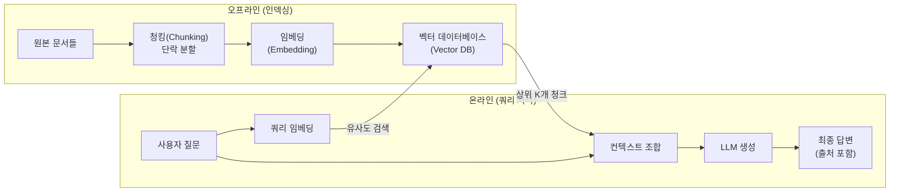
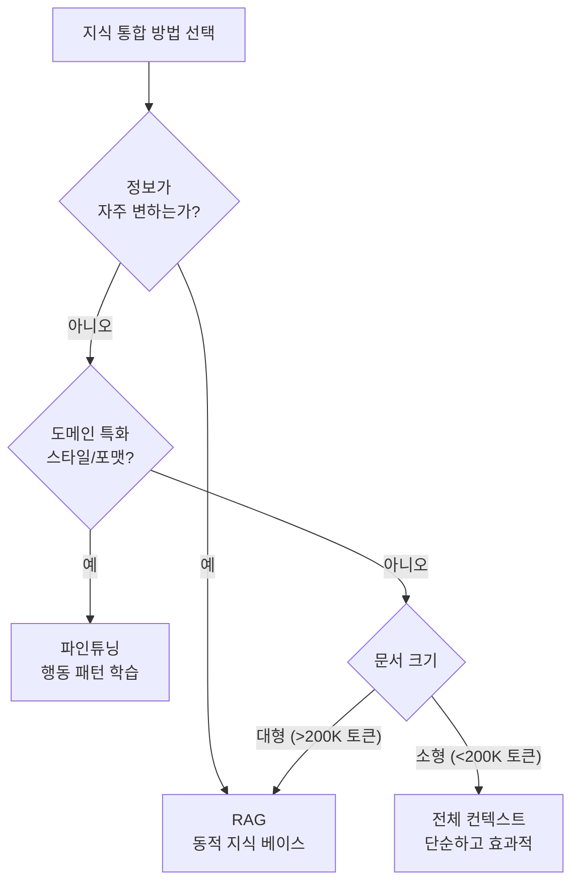
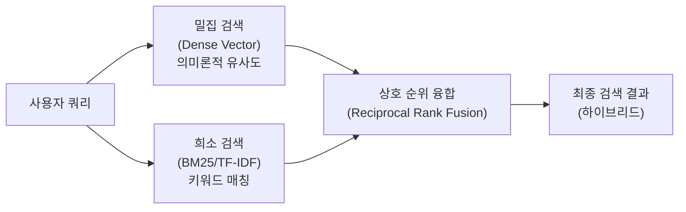
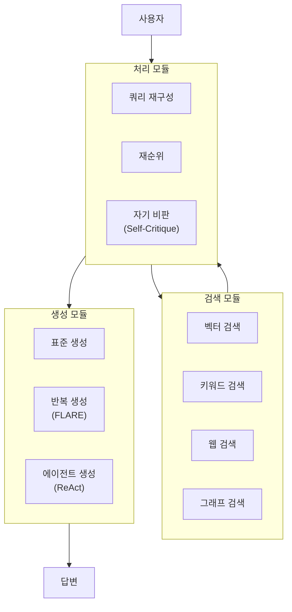
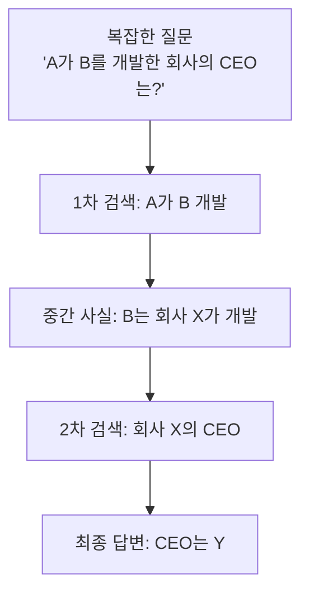

# 검색 증강 생성 (Retrieval-Augmented Generation, RAG)

## 개요

검색 증강 생성(Retrieval-Augmented Generation, RAG)은 LLM의 생성 능력과 외부 지식 검색 능력을 결합한 아키텍처 패턴이다. 2020년 Lewis et al.의 "Retrieval-Augmented Generation for Knowledge-Intensive NLP Tasks" 논문에서 처음 제안되었으며, 2023년 이후 LLM의 상용화와 함께 폭발적으로 채택되었다.

RAG의 핵심 동기는 LLM의 두 가지 근본적 한계를 해결하는 것이다:

1. **지식 단절(Knowledge Cutoff)**: 모델은 학습 시점 이후의 정보를 모른다
2. **환각(Hallucination)**: 모델이 없는 사실을 만들어내는 문제

RAG는 이를 **검색 → 증강 → 생성** 3단계 파이프라인으로 해결한다.



---

## 1. RAG의 동기와 필요성

### 파라메트릭 vs 비파라메트릭 지식

LLM은 두 종류의 지식을 갖는다:

| 지식 유형 | 저장 위치 | 업데이트 방법 | 한계 |
|---------|---------|------------|------|
| **파라메트릭** | 모델 가중치 | 재학습/파인튜닝 | 비용이 크고 느림 |
| **비파라메트릭** | 외부 데이터베이스 | 문서 추가/수정 | RAG로 활용 |

RAG는 비파라메트릭 지식을 실시간으로 활용하여 파라메트릭 지식의 한계를 보완한다.

### 언제 RAG가 필요한가

- 자주 변하는 정보 (뉴스, 가격, 법령)
- 기업 내부 문서 (코드베이스, 매뉴얼, 계약서)
- 긴 문서에서 특정 사실 추출
- 답변의 근거(출처) 제시가 필요한 상황
- LLM이 학습하지 않은 도메인 특화 지식

### RAG vs 파인튜닝 vs 긴 컨텍스트



---

## 2. Naive RAG (기본 RAG)

가장 단순한 형태. 위 다이어그램의 기본 파이프라인이다.

### 청킹 (Chunking)

문서를 LLM이 처리 가능한 크기로 분할:

```python
from langchain.text_splitter import RecursiveCharacterTextSplitter

splitter = RecursiveCharacterTextSplitter(
    chunk_size=512,        # 청크 최대 토큰/문자 수
    chunk_overlap=50,      # 청크 간 겹침 (문맥 유지)
    separators=["\n\n", "\n", ". ", " "],  # 분할 우선순위
)

chunks = splitter.split_text(document_text)
```

**청크 크기 트레이드오프**:
- 작을수록: 더 정밀한 검색, 맥락 손실 위험
- 클수록: 맥락 풍부, 노이즈 증가, 비용 상승

### 임베딩 생성

```python
from openai import OpenAI

client = OpenAI()

def embed_texts(texts: list[str], model: str = "text-embedding-3-small") -> list[list[float]]:
    """텍스트 배치를 임베딩 벡터로 변환."""
    response = client.embeddings.create(input=texts, model=model)
    return [item.embedding for item in response.data]
```

### 벡터 유사도 검색

```python
import numpy as np

def cosine_similarity(a: list[float], b: list[float]) -> float:
    """코사인 유사도 계산."""
    a_arr = np.array(a)
    b_arr = np.array(b)
    return float(np.dot(a_arr, b_arr) / (np.linalg.norm(a_arr) * np.linalg.norm(b_arr)))


def retrieve_top_k(
    query_embedding: list[float],
    chunk_embeddings: list[list[float]],
    chunks: list[str],
    k: int = 5,
) -> list[str]:
    """쿼리와 가장 유사한 청크 K개 반환."""
    scores = [cosine_similarity(query_embedding, emb) for emb in chunk_embeddings]
    top_indices = sorted(range(len(scores)), key=lambda i: scores[i], reverse=True)[:k]
    return [chunks[i] for i in top_indices]
```

### 생성 (Augmented Generation)

```python
def rag_answer(question: str, context_chunks: list[str]) -> str:
    """검색된 컨텍스트로 LLM 답변 생성."""
    context = "\n\n---\n\n".join(context_chunks)
    
    prompt = f"""다음 컨텍스트를 기반으로 질문에 답하시오.
컨텍스트에 없는 내용은 "제공된 문서에 해당 정보가 없습니다"라고 답하시오.

컨텍스트:
{context}

질문: {question}

답변:"""

    response = client.chat.completions.create(
        model="gpt-4.1",
        messages=[{"role": "user", "content": prompt}],
        temperature=0,
    )
    return response.choices[0].message.content
```

---

## 3. Advanced RAG

Naive RAG의 한계를 극복하는 개선 기법들.

### 3.1 쿼리 변환 (Query Transformation)

사용자의 원본 쿼리는 검색에 최적화되지 않은 경우가 많다.

**하이드(HyDE, Hypothetical Document Embedding)**:
```python
def hyde_expand(question: str) -> str:
    """가상 답변 문서를 생성하여 검색 쿼리로 사용."""
    response = client.chat.completions.create(
        model="gpt-4.1",
        messages=[{
            "role": "user",
            "content": f"다음 질문에 대한 가상의 답변 문단을 작성하시오 (정확도 불필요, 검색용):\n{question}"
        }],
    )
    return response.choices[0].message.content
```

**멀티 쿼리 (Multi-Query)**:
```python
def multi_query_expand(question: str, n: int = 3) -> list[str]:
    """하나의 질문을 여러 관점의 쿼리로 확장."""
    response = client.chat.completions.create(
        model="gpt-4.1",
        messages=[{
            "role": "user",
            "content": f"다음 질문을 {n}가지 다른 방식으로 재구성하시오 (JSON 배열):\n{question}"
        }],
        response_format={"type": "json_object"},
    )
    import json
    return json.loads(response.choices[0].message.content)["queries"]
```

### 3.2 재순위 (Re-ranking)

벡터 검색 결과를 LLM 또는 크로스 인코더로 재정렬:

```python
def rerank_chunks(
    query: str,
    candidates: list[str],
    top_k: int = 3,
) -> list[str]:
    """
    Cohere Rerank API를 사용한 재순위 예시.
    실제 사용 전 공식 문서에서 파라미터 확인 필요.
    """
    # cohere 클라이언트 사용 예시 (문서 확인 필요)
    # import cohere
    # co = cohere.Client(api_key)
    # results = co.rerank(query=query, documents=candidates, top_n=top_k)
    
    # 대안: LLM 기반 재순위
    prompt = f"""다음 후보 문서들을 질문과의 관련성 순으로 순위를 매기시오.
질문: {query}
문서들: {candidates}
관련성 높은 순서로 인덱스 목록 반환 (JSON):"""
    
    response = client.chat.completions.create(
        model="gpt-4o-mini",
        messages=[{"role": "user", "content": prompt}],
        response_format={"type": "json_object"},
    )
    import json
    ranked_indices = json.loads(response.choices[0].message.content)["ranked_indices"]
    return [candidates[i] for i in ranked_indices[:top_k]]
```

### 3.3 하이브리드 검색 (Hybrid Search)

밀집 벡터 검색(Dense)과 희소 키워드 검색(Sparse/BM25)을 결합:



**Reciprocal Rank Fusion (RRF):**
$$\text{RRF}(d) = \sum_{r \in R} \frac{1}{k + r(d)}$$

여기서 $k=60$이 실무에서 자주 쓰이는 기본값이다.

---

## 4. Modular RAG

RAG 파이프라인을 모듈화하여 태스크에 맞게 조합하는 아키텍처.



### Self-RAG (자기 반성 RAG)

모델 자체가 검색 필요 여부를 판단하고 출력을 비판하는 방식:

| 토큰 유형 | 역할 |
|---------|------|
| `[Retrieve]` | 검색 필요 여부 결정 |
| `[ISREL]` | 검색 결과 관련성 평가 |
| `[ISSUP]` | 생성 내용이 검색 결과로 지지되는지 평가 |
| `[ISUSE]` | 응답 유용성 평가 |

---

## 5. 정확성-신선도 균형

RAG 시스템 설계에서 핵심 트레이드오프:

| 차원 | 고정 지식 베이스 | 실시간 검색 |
|------|--------------|----------|
| 정확도 | 높음 (큐레이션됨) | 낮을 수 있음 |
| 신선도 | 낮음 (배치 업데이트) | 높음 (실시간) |
| 비용 | 낮음 | 높음 |
| 지연시간 | 낮음 | 높음 |
| 통제 | 높음 | 낮음 |

**청크 수명 관리:**

```python
import datetime

class TimestampedChunk:
    def __init__(self, text: str, source: str, created_at: datetime.datetime):
        self.text = text
        self.source = source
        self.created_at = created_at
        self.embedding = None

    @property
    def age_days(self) -> float:
        return (datetime.datetime.now() - self.created_at).days

    def is_stale(self, max_age_days: int = 30) -> bool:
        return self.age_days > max_age_days
```

---

## 6. 평가 지표

### RAGAS (RAG Assessment)

RAG 파이프라인 평가를 위한 프레임워크. 주요 지표:

| 지표 | 정의 | 측정 대상 |
|------|------|---------|
| **Faithfulness** | 답변이 컨텍스트에 근거하는가 | 환각 측정 |
| **Answer Relevance** | 답변이 질문에 관련되는가 | 응답 품질 |
| **Context Precision** | 검색된 컨텍스트가 관련 있는가 | 검색 품질 |
| **Context Recall** | 필요한 정보가 검색됐는가 | 검색 완전성 |

```python
# ragas 사용 전 공식 문서 확인 필요 (버전별 API 변경 있음)
# from ragas import evaluate
# from ragas.metrics import faithfulness, answer_relevancy

# 개념적 평가 코드 (실제 API는 문서 확인)
def evaluate_rag_output(
    question: str,
    answer: str,
    contexts: list[str],
    ground_truth: str,
) -> dict:
    """RAG 출력 평가 (개념적 구현)."""
    # 실제 구현은 ragas 라이브러리 공식 문서 참조
    return {
        "faithfulness": "컨텍스트 지지 비율",
        "answer_relevancy": "질문-답변 관련성",
        "context_precision": "검색 정밀도",
        "context_recall": "검색 재현율",
    }
```

---

## 7. 벡터 데이터베이스 비교

| 항목 | Chroma | Pinecone | Weaviate | pgvector |
|------|--------|----------|---------|---------|
| 배포 | 로컬/클라우드 | 클라우드 전용 | 셀프호스팅/클라우드 | PostgreSQL 확장 |
| 규모 | 중소형 | 대형 | 대형 | 중소형 |
| 하이브리드 검색 | 제한적 | 예 | 예 | 예 |
| 메타데이터 필터링 | 예 | 예 | 예 (GraphQL) | 예 |
| 오픈소스 | 예 | 아니오 | 예 | 예 |

---

## 8. 실무 구현 전략

### RAG 파이프라인 완성 예제

```python
from dataclasses import dataclass
from typing import Optional
import anthropic

@dataclass
class RAGConfig:
    chunk_size: int = 512
    chunk_overlap: int = 50
    top_k: int = 5
    embedding_model: str = "text-embedding-3-small"
    generation_model: str = "claude-sonnet-4-6"
    rerank: bool = False


class SimpleRAGPipeline:
    def __init__(self, config: RAGConfig):
        self.config = config
        self.client_openai = None  # OpenAI 클라이언트
        self.client_anthropic = anthropic.Anthropic()
        self.chunks: list[str] = []
        self.embeddings: list[list[float]] = []

    def index(self, documents: list[str]) -> None:
        """문서를 청킹하고 임베딩하여 인덱싱."""
        from openai import OpenAI
        self.client_openai = OpenAI()

        # 청킹 (단순 구현)
        for doc in documents:
            step = self.config.chunk_size - self.config.chunk_overlap
            for i in range(0, len(doc), step):
                chunk = doc[i: i + self.config.chunk_size]
                if chunk.strip():
                    self.chunks.append(chunk)

        # 배치 임베딩
        batch_size = 100
        for i in range(0, len(self.chunks), batch_size):
            batch = self.chunks[i: i + batch_size]
            resp = self.client_openai.embeddings.create(
                input=batch, model=self.config.embedding_model
            )
            self.embeddings.extend([item.embedding for item in resp.data])

    def query(self, question: str) -> dict:
        """쿼리에 대한 RAG 답변 반환."""
        import numpy as np

        # 쿼리 임베딩
        q_resp = self.client_openai.embeddings.create(
            input=[question], model=self.config.embedding_model
        )
        q_emb = np.array(q_resp.data[0].embedding)

        # 유사도 검색
        emb_matrix = np.array(self.embeddings)
        scores = emb_matrix @ q_emb / (
            np.linalg.norm(emb_matrix, axis=1) * np.linalg.norm(q_emb) + 1e-8
        )
        top_indices = scores.argsort()[::-1][: self.config.top_k]
        retrieved = [self.chunks[i] for i in top_indices]

        # 생성
        context = "\n\n---\n\n".join(retrieved)
        message = self.client_anthropic.messages.create(
            model=self.config.generation_model,
            max_tokens=1024,
            system="제공된 컨텍스트를 기반으로만 답변하시오. 컨텍스트에 없는 내용은 명시하시오.",
            messages=[{
                "role": "user",
                "content": f"컨텍스트:\n{context}\n\n질문: {question}",
            }],
        )

        return {
            "answer": message.content[0].text,
            "sources": retrieved,
            "num_chunks_retrieved": len(retrieved),
        }
```

---

## 9. RAG의 변형 패턴

### 9.1 에이전트 RAG (Agentic RAG)

에이전트가 동적으로 검색 전략을 결정하는 방식. [[agentic-rag]] 참조.

### 9.2 멀티모달 RAG

텍스트 외 이미지, 표, 차트에서도 검색. [[multimodal-rag]] 참조.

### 9.3 멀티홉 검색 (Multi-hop Retrieval)

여러 단계의 검색을 거쳐 복잡한 질문을 해결. [[multi-hop-retrieval]] 참조.



### 9.4 그래프 RAG (Graph RAG)

단순 벡터 검색 대신 지식 그래프(Knowledge Graph) 기반으로 엔티티 관계를 탐색하여 더 구조화된 검색 수행. Microsoft GraphRAG가 대표적.

---

## 10. RAG 파이프라인 진단 체크리스트

| 단계 | 점검 항목 | 해결 방법 |
|------|---------|---------|
| 청킹 | 청크 경계가 문맥을 끊는가 | 의미 단위 청킹 (Semantic Chunking) |
| 임베딩 | 도메인에 맞는 임베딩 모델인가 | 도메인 파인튜닝된 임베딩 |
| 검색 | 관련 청크가 빠지는가 | 하이브리드 검색, 재순위 |
| 생성 | 환각이 발생하는가 | Faithfulness 제약, 온도 낮추기 |
| 평가 | 정량적 지표가 있는가 | RAGAS 도입 |

---

## 관련 문서

- [[rag-pipeline]] - RAG 파이프라인 심층 구현 가이드
- [[agentic-rag]] - 에이전트 기반 동적 RAG
- [[multimodal-rag]] - 멀티모달 문서에서의 RAG
- [[multi-hop-retrieval]] - 다단계 검색 전략
- [[scaling-laws-overview]] - RAG vs 긴 컨텍스트 트레이드오프
- [[reasoning-llm]] - 추론 모델과 RAG 결합 전략
