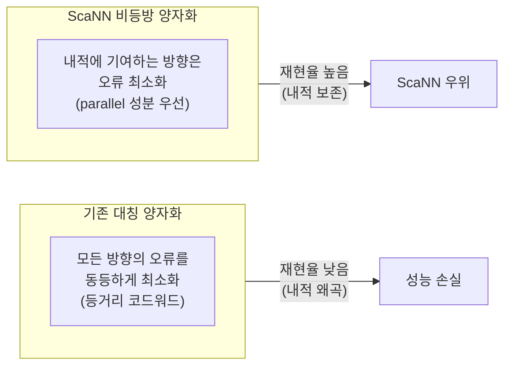
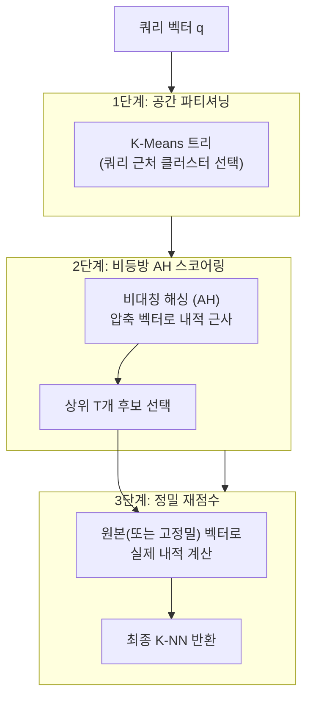

# ScaNN - Google 정량화 ANN

ScaNN(Scalable Nearest Neighbors)은 Google Research가 개발한 고성능 [[approximate-nearest-neighbor]] 검색 라이브러리다. 2020년 NeurIPS에서 발표된 논문 "Accelerating Large-Scale Inference with Anisotropic Vector Quantization"을 기반으로 하며, Google 내부 검색 인프라(Google Search, YouTube, Google Photos 등)에서 수십억 규모의 벡터 검색에 활용된다. ANN-Benchmarks에서 지속적으로 최상위 재현율-속도 트레이드오프를 기록하는 라이브러리다.

## 핵심 기여: 비등방 벡터 양자화

ScaNN의 차별점은 **비등방 양자화(Anisotropic Vector Quantization)**다. 기존 양자화가 벡터를 가장 가까운 코드워드로 단순 매핑하는 반면, ScaNN은 내적(inner product) 검색에서 중요한 방향의 오류를 더 적게 허용하도록 양자화를 설계한다.



핵심 수학: 쿼리 $q$와 데이터베이스 벡터 $x$의 내적 $q \cdot x$를 최대화하는 검색에서, 양자화 오류 $x - \hat{x}$의 $q$ 방향 성분이 검색 결과를 왜곡한다. ScaNN은 이 방향의 오류를 우선적으로 줄이는 비등방 손실 함수로 코드북을 학습한다.

## 검색 파이프라인



**3단계 파이프라인:**
1. **공간 파티셔닝**: K-Means 트리로 쿼리 근방의 관련 파티션만 선택 (전체의 일부만 탐색)
2. **비등방 해싱(AH) 스코어링**: 압축된 벡터 표현으로 빠른 내적 근사, 상위 T개 후보 추림
3. **정밀 재점수**: 원본 벡터로 실제 거리 재계산, 최종 K개 반환

## 주요 특성

| 항목 | 특성 |
|------|------|
| 구현 언어 | C++ (Python 바인딩) |
| 지원 거리 | 코사인(Cosine), 내적(Dot Product), 유클리드(Euclidean) |
| 인덱스 구조 | 트리 + 양자화 조합 |
| GPU 지원 | TensorFlow/JAX 연산 활용 가능 |
| 배치 처리 | 효율적인 배치 쿼리 지원 |
| 훈련 필요 | 예 (K-Means 클러스터링 + 코드북 학습) |

## 파라미터 체계

```python
import scann

# ScaNN 인덱스 구축
searcher = (
    scann.scann_ops_pybind.builder(dataset, num_neighbors=10, distance_measure="dot_product")
    # 1단계: 파티셔닝
    .tree(
        num_leaves=2000,           # 파티션 수 (sqrt(n) 근사)
        num_leaves_to_search=100,  # 탐색할 파티션 수 (정확도 조정)
        training_sample_size=250_000
    )
    # 2단계: 양자화 스코어링
    .score_ah(
        dimensions_per_block=2,    # AH 블록 크기
        anisotropic_quantization_threshold=0.2  # 비등방 양자화 임계값
    )
    # 3단계: 재점수
    .reorder(reordering_num_neighbors=100)  # 재점수할 후보 수
    .build()
)

# 검색
neighbors, distances = searcher.search(query)
neighbors_batch, distances_batch = searcher.search_batched(queries)
```

## ANN-Benchmarks 성능

ScaNN은 ann-benchmarks.com의 glove-100-angular(코사인 유사도) 등 주요 벤치마크에서 지속적으로 최상위 성능을 기록한다. 재현율 90%에서 초당 쿼리 처리량(QPS)이 다른 라이브러리 대비 2-10배 높은 경우가 많다.

단, 이는 단일 스레드 CPU 벤치마크 기준이며 실제 서비스 환경에서는 시스템 구성, 벡터 분포, 하드웨어에 따라 차이가 있다.

## Google 내부 활용

ScaNN은 Google의 여러 제품에서 활용된다:

- **Google Search**: 의미론적 검색(semantic search) 후보 생성
- **YouTube**: 영상 추천 임베딩 검색
- **Google Photos**: 이미지 유사도 검색
- **Vertex AI Matching Engine**: Google Cloud의 관리형 벡터 검색 서비스 기반 기술

## ALBERT/Vertex AI 연동

Google Vertex AI의 Vector Search(구 Matching Engine) 서비스는 ScaNN 기반으로 구현되어 있으며, 완전 관리형 서비스로 제공된다. 수십억 벡터를 밀리초 단위 레이턴시로 검색하는 엔터프라이즈 수준의 가용성을 제공한다.

## 경쟁 라이브러리와 비교

| 라이브러리 | 알고리즘 | 강점 | 약점 |
|-----------|---------|------|------|
| ScaNN | 비등방 양자화 + 트리 | 내적 검색 재현율, 처리량 | 코사인 외 거리 최적화 부족 |
| [[hnsw-graph-index|HNSW]] | 그래프 | 범용 거리, 동적 추가 | 메모리 사용량, 구축 시간 |
| [[ivf-pq-vector-index|IVF-PQ]] | 역인덱스 + PQ | 대규모 메모리 효율 | 재현율 (nprobe 조정 필요) |
| [[diskann-microsoft|DiskANN]] | 그래프 + SSD | 십억 규모 디스크 | 빌드 시간, 복잡성 |

## 한계

- 정적 인덱스: 벡터 추가/삭제 지원이 제한적
- 내적(dot product)/코사인 최적화 중심: 유클리드 거리에서는 상대적 이점 감소
- 훈련 데이터 필요: K-Means 클러스터링을 위한 대표 샘플 필요
- 에코시스템 통합: FAISS만큼 광범위한 벡터 DB 통합이 아직 덜 됨

## 관련 문서

- [[approximate-nearest-neighbor]] - ANN 검색 전반 개요
- [[hnsw-graph-index]] - 그래프 기반 ANN
- [[ivf-pq-vector-index]] - 역인덱스 + 곱 양자화
- [[diskann-microsoft]] - 디스크 기반 십억 규모 ANN
- [[annoy-spotify]] - 트리 기반 ANN
- [[vector-db-comparison]] - 벡터 DB 시스템 비교
- [[dense-retrieval]] - 밀집 벡터 검색 전반
