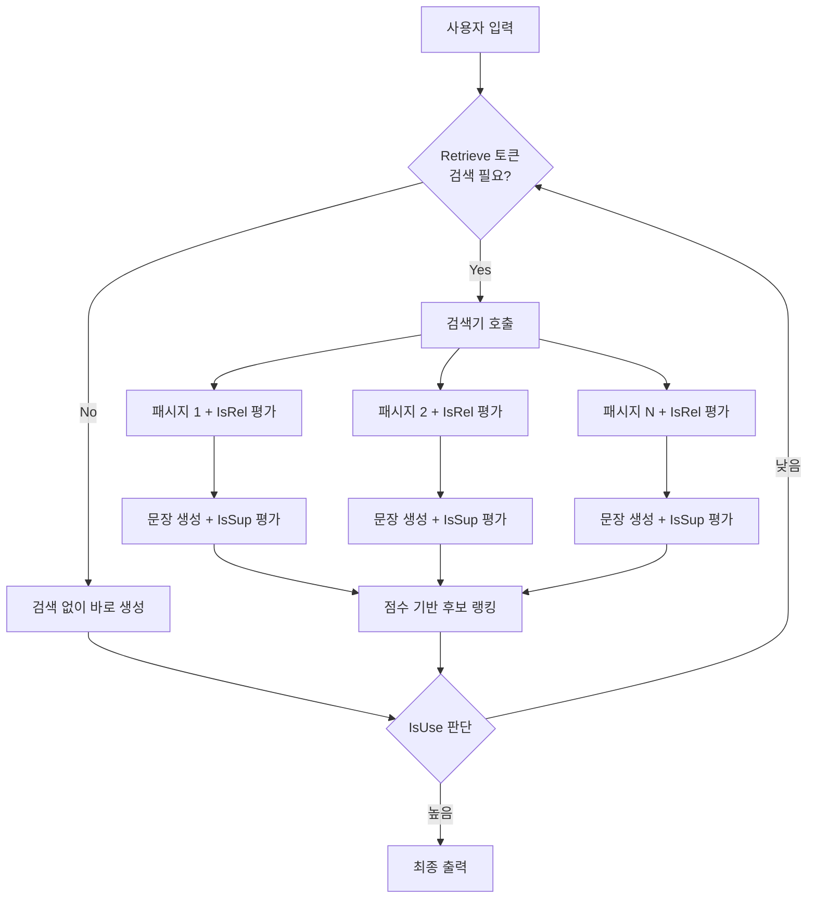
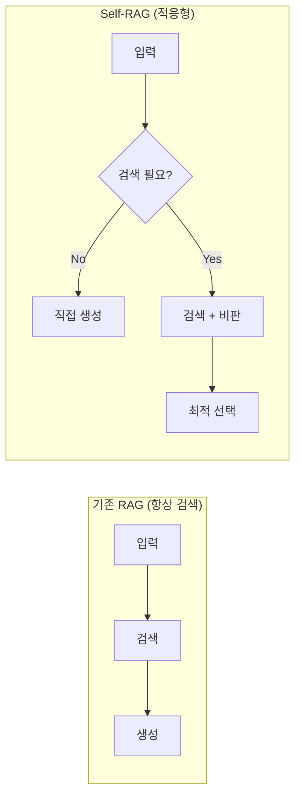

# Self-RAG

Self-RAG(Self-Reflective Retrieval-Augmented Generation)는 LLM이 **특수 리플렉션 토큰(reflection token)**을 생성하며 스스로 검색 여부, 검색 결과 관련성, 출력 품질을 판단하는 RAG 프레임워크다. 2023년 워싱턴대학교 연구팀이 발표했으며, 기존 [[rag-pipeline]]이 **모든 질의에 무조건 검색을 수행**하는 비효율을 해소하는 데 초점을 맞췄다.

## 핵심 아이디어: 리플렉션 토큰

Self-RAG의 핵심은 모델 어휘에 **4종의 특수 토큰**을 추가하고, 파인튜닝을 통해 모델이 이 토큰을 상황에 맞게 생성하도록 훈련하는 것이다.

| 토큰 | 역할 | 생성 위치 |
|------|------|-----------|
| `[Retrieve]` | "지금 검색이 필요한가?" 판단 | 입력 직후 |
| `[IsRel]` | 검색 결과가 질의와 관련 있는가 | 각 패시지 앞 |
| `[IsSup]` | 생성 문장이 패시지 내용을 지지하는가 | 생성 문장 뒤 |
| `[IsUse]` | 최종 응답이 유용한가 | 전체 응답 뒤 |

이 토큰들이 모델 출력 스트림 안에 자연스럽게 삽입되므로, 별도의 분류기나 외부 모듈 없이 **단일 모델이 추론과 자기비판을 동시에 수행**한다.

## 추론 흐름

### 세그먼트별 병렬 생성

검색 결과가 여러 패시지일 때, Self-RAG는 각 패시지에 대해 **독립적인 출력 후보**를 생성한다. 이후 `[IsRel]`, `[IsSup]`, `[IsUse]` 점수를 조합한 **가중 점수**로 후보를 랭킹하고 최적 응답을 선택한다.

## 훈련 방식

Self-RAG 모델은 두 단계로 학습된다:

1. **비평가(Critic) 학습**: GPT-4 같은 강력한 모델로 기존 데이터셋에 리플렉션 토큰 레이블을 자동 부착한다.
2. **생성기(Generator) 학습**: 레이블이 붙은 데이터셋으로 Llama-2 등을 파인튜닝해 리플렉션 토큰을 자연스럽게 생성하도록 한다.

이 과정에서 검색기 자체는 동결(frozen)되며, 모델 가중치만 업데이트된다.

## 기존 RAG와 비교

- **불필요한 검색 제거**: 단순 인사, 명확한 팩트 질의 등은 검색 없이 빠르게 응답
- **신뢰도 측정 내재화**: 외부 평가기 없이 모델 스스로 할루시네이션 위험을 판단
- **제어 가능한 추론**: 추론 시 `[IsRel]`/`[IsSup]` 가중치를 조정해 정밀도-재현율 트레이드오프를 선택적으로 제어

## [[agentic-rag]]와의 관계

[[agentic-rag]]는 에이전트가 외부 도구와 다단계 계획으로 검색을 수행하는 반면, Self-RAG는 **단일 LLM 내부에서 검색 제어 로직이 완결**된다. 두 기법은 상호 보완적이며, 에이전트 루프 안의 서브루틴으로 Self-RAG 모델을 사용하는 하이브리드도 가능하다.

## 한계와 주의사항

- **파인튜닝 의존**: Self-RAG는 리플렉션 토큰 생성 능력이 학습된 모델에서만 동작한다. GPT-4o 같은 API 전용 모델에는 직접 적용 불가.
- **추론 지연**: 각 패시지별 후보를 병렬로 생성하므로 단일 패스 RAG보다 연산량이 많다.
- **비평 품질**: 비평가 레이블의 품질에 훈련 모델 전체가 의존하므로 레이블 오류가 전파될 수 있다.
- **오픈소스 구현 제한**: 공개된 Self-RAG 모델(selfrag/selfrag-llama2-7b 등)은 특정 도메인에 치우쳐 있어 범용 사용 시 재훈련이 필요하다.

## 실무 적용 포인트

- 팩트 기반 QA, 의학·법률 정보 검색처럼 **할루시네이션 비용이 높은** 도메인에 적합
- 검색 횟수를 줄여야 하는 **레이턴시 민감** 서비스에 유리
- 소규모 LLM을 Self-RAG로 파인튜닝하면 검색 없이 추론하는 대형 모델과 경쟁력 있는 품질 달성 가능

## 관련 문서

- [[agentic-rag]] - 에이전트 기반 다단계 검색 전략
- [[rag-pipeline]] - Self-RAG가 대체하거나 강화하는 표준 RAG 파이프라인
- [[adaptive-rag]] - 쿼리 복잡도에 따라 전략을 외부에서 결정하는 대안적 접근
- [[corrective-rag]] - 검색 결과 품질을 외부 평가기로 보정하는 관련 기법
