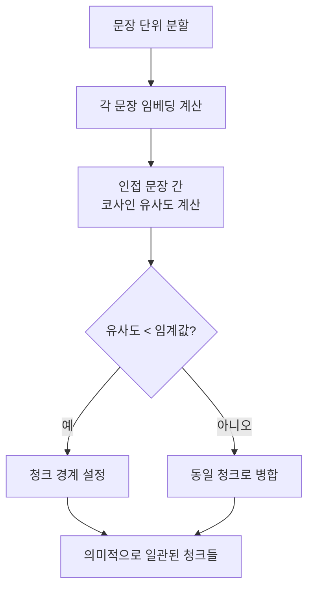

# 의미적 청킹 전략

## 정의

의미적 청킹(semantic chunking)은 텍스트를 **임베딩 유사도의 급격한 변화 지점**에서 분할하는 청킹 전략이다. 고정 길이 청킹이 기계적으로 자르는 것과 달리, 토픽(화제)이 바뀌는 경계를 감지해 의미론적으로 일관성 있는 청크를 생성한다.

핵심 아이디어: 연속된 문장들의 임베딩 유사도가 **급격히 낮아지는 지점**이 토픽 전환점이며, 그 지점이 청크 경계가 된다.



위 다이어그램은 문장 임베딩 유사도 기반으로 청크 경계를 동적으로 결정하는 흐름이다.

---

## 알고리즘 상세

### 단계 1: 문장 분리

```python
import re

def split_into_sentences(text: str) -> list[str]:
    """텍스트를 문장 단위로 분리."""
    # 한국어/영어 혼용 문장 분리 패턴
    sentences = re.split(r"(?<=[.!?])\s+|(?<=[다요죠])\s+", text.strip())
    return [s.strip() for s in sentences if s.strip()]
```

### 단계 2: 문장 임베딩 계산

```python
import numpy as np
from sentence_transformers import SentenceTransformer

def embed_sentences(sentences: list[str], model_name: str = "BAAI/bge-m3") -> np.ndarray:
    """각 문장의 임베딩 벡터 계산."""
    model = SentenceTransformer(model_name)
    return model.encode(sentences, normalize_embeddings=True)
```

### 단계 3: 인접 유사도 계산 및 임계값 적용

```python
from scipy.spatial.distance import cosine

def calculate_breakpoints(
    embeddings: np.ndarray,
    threshold_percentile: float = 85.0,
) -> list[int]:
    """유사도가 낮아지는 청크 경계 인덱스 반환."""
    distances = []
    for i in range(len(embeddings) - 1):
        dist = cosine(embeddings[i], embeddings[i + 1])
        distances.append(dist)

    if not distances:
        return []

    # 거리의 상위 X 퍼센타일을 임계값으로 사용
    threshold = np.percentile(distances, threshold_percentile)

    breakpoints = [
        i + 1  # 다음 문장부터 새 청크
        for i, dist in enumerate(distances)
        if dist > threshold
    ]
    return breakpoints
```

### 단계 4: 청크 생성

```python
def semantic_chunking(
    text: str,
    model_name: str = "BAAI/bge-m3",
    threshold_percentile: float = 85.0,
    min_chunk_size: int = 50,
    max_chunk_size: int = 1000,
) -> list[str]:
    """의미적 청킹 전체 파이프라인."""
    sentences = split_into_sentences(text)
    if len(sentences) <= 1:
        return sentences

    embeddings = embed_sentences(sentences, model_name)
    breakpoints = calculate_breakpoints(embeddings, threshold_percentile)

    # 청크 조립
    chunks = []
    start = 0
    for bp in breakpoints:
        chunk = " ".join(sentences[start:bp])
        if len(chunk) >= min_chunk_size:
            if len(chunk) > max_chunk_size:
                # 너무 큰 청크는 재분할
                chunks.extend(fallback_split(chunk, max_chunk_size))
            else:
                chunks.append(chunk)
        start = bp

    # 마지막 청크
    last_chunk = " ".join(sentences[start:])
    if last_chunk:
        chunks.append(last_chunk)

    return chunks


def fallback_split(text: str, max_size: int) -> list[str]:
    """최대 크기를 초과하는 청크를 단순 분할."""
    return [text[i:i+max_size] for i in range(0, len(text), max_size)]
```

---

## 임계값 전략

임계값 설정은 의미적 청킹의 품질을 결정하는 핵심 파라미터다.

### 퍼센타일 기반 임계값

```python
# 보수적 (많은 청크): 70th percentile
# 균형적 (일반 권장): 85th percentile
# 공격적 (적은 청크): 95th percentile

breakpoints_conservative = calculate_breakpoints(embeddings, threshold_percentile=70)
breakpoints_balanced = calculate_breakpoints(embeddings, threshold_percentile=85)
breakpoints_aggressive = calculate_breakpoints(embeddings, threshold_percentile=95)
```

### 그래디언트 기반 임계값

단순 퍼센타일 대신 거리 변화율(그래디언트)이 큰 지점을 경계로 삼는 방법:

```python
def gradient_breakpoints(distances: list[float]) -> list[int]:
    """거리 변화율이 큰 지점을 경계로 설정."""
    if len(distances) < 2:
        return []

    gradients = np.gradient(distances)
    mean_grad = np.mean(np.abs(gradients))
    std_grad = np.std(np.abs(gradients))
    threshold = mean_grad + std_grad

    return [
        i + 1
        for i, g in enumerate(gradients)
        if abs(g) > threshold
    ]
```

---

## 슬라이딩 윈도우 변형

단일 문장이 아닌 여러 문장의 임베딩 평균으로 비교하는 방식. 노이즈에 더 강건하다:

```python
def sliding_window_semantic_chunking(
    sentences: list[str],
    embeddings: np.ndarray,
    window_size: int = 3,
    threshold_percentile: float = 85.0,
) -> list[int]:
    """슬라이딩 윈도우 평균 임베딩으로 경계 탐지."""
    distances = []
    n = len(embeddings)

    for i in range(window_size, n - window_size):
        # 현재 위치 앞뒤 윈도우 평균 임베딩
        left_window = embeddings[max(0, i-window_size):i]
        right_window = embeddings[i:min(n, i+window_size)]

        left_mean = left_window.mean(axis=0)
        right_mean = right_window.mean(axis=0)

        dist = cosine(left_mean, right_mean)
        distances.append((i, dist))

    if not distances:
        return []

    threshold = np.percentile([d for _, d in distances], threshold_percentile)
    return [i for i, d in distances if d > threshold]
```

---

## 장단점

### 장점

- **의미 일관성**: 하나의 청크 = 하나의 토픽 -> 임베딩 품질 향상
- **자연스러운 경계**: 문장 중간에서 자르지 않음
- **가변 크기**: 토픽 길이에 따라 청크 크기가 자동 조정됨
- **노이즈 감소**: 무관한 내용이 같은 청크에 묶이지 않아 검색 정밀도 향상

### 단점

- **임베딩 계산 비용**: 모든 문장을 임베딩해야 하므로 고정 길이 청킹보다 훨씬 느림
- **임계값 튜닝 필요**: 문서 도메인마다 최적 임계값이 다름
- **짧은 문서에서의 과분할**: 문장이 적을 때 부정확한 경계 탐지
- **메모리**: 모든 문장의 임베딩을 메모리에 유지해야 함

### 비용-품질 트레이드오프

```
고정 길이 <-- 비용 낮음        품질 낮음 -->
재귀적 분할 <-- 비용 낮음      품질 중간 -->
의미적 청킹 <-- 비용 중간      품질 높음  -->
명제 단위   <-- 비용 높음      품질 매우 높음 -->
에이전트 청킹 <-- 비용 매우 높음  품질 최고 -->
```

---

## LangChain 구현

LangChain은 v0.2부터 의미적 청킹을 기본 지원한다:

```python
from langchain_experimental.text_splitter import SemanticChunker
from langchain_openai.embeddings import OpenAIEmbeddings
from langchain_community.embeddings import HuggingFaceEmbeddings

# OpenAI 임베딩 사용
embeddings = OpenAIEmbeddings()
chunker = SemanticChunker(
    embeddings,
    breakpoint_threshold_type="percentile",  # percentile, standard_deviation, interquartile
    breakpoint_threshold_amount=85,
)

# 오픈소스 임베딩 사용
oss_embeddings = HuggingFaceEmbeddings(model_name="BAAI/bge-m3")
oss_chunker = SemanticChunker(
    oss_embeddings,
    breakpoint_threshold_type="standard_deviation",
    breakpoint_threshold_amount=1.5,
)

chunks = chunker.split_text(document)
```

---

## 실무 적용 지침

### 도메인별 권장 임계값

| 문서 유형 | 권장 임계값 | 이유 |
|-----------|-----------|------|
| 학술 논문 | 80th percentile | 섹션 단위 명확한 분리 |
| 뉴스 기사 | 85th percentile | 단락 전환 빈번 |
| 소설/에세이 | 90th percentile | 주제 변화가 점진적 |
| 법률 문서 | 75th percentile | 조항 단위 분리 중요 |
| 코드 + 문서 혼합 | 70th percentile | 코드 블록과 설명 분리 |

### 하이브리드 청킹

의미적 청킹과 고정 길이 청킹을 조합:

```python
def hybrid_chunking(
    text: str,
    max_chunk_size: int = 1000,
    min_chunk_size: int = 100,
) -> list[str]:
    """의미 경계 우선, max_size 초과 시 고정 길이로 재분할."""
    semantic_chunks = semantic_chunking(text, max_chunk_size=max_chunk_size * 2)

    final_chunks = []
    for chunk in semantic_chunks:
        if len(chunk) <= max_chunk_size:
            final_chunks.append(chunk)
        else:
            # 너무 큰 청크는 재귀적으로 분할
            sub_chunks = semantic_chunking(chunk, threshold_percentile=70)
            final_chunks.extend(sub_chunks)

    return [c for c in final_chunks if len(c) >= min_chunk_size]
```

---

## 관련 문서

- [[chunking-strategies]] - 청킹 전략 전체 개요
- [[fixed-length-chunking]] - 고정 길이 청킹 (베이스라인)
- [[recursive-character-splitting]] - 재귀적 문자 분할
- [[propositional-chunking]] - 더 정밀한 명제 단위 청킹
- [[agentic-chunking]] - 에이전트 기반 최고 품질 청킹
- [[context-aware-chunking]] - 문서 구조 인식 청킹
- [[late-chunking]] - 청킹 후 임베딩 대신 전체 후 분할하는 대안
- [[raptor-tree-retrieval]] - 의미적 청킹을 활용한 계층적 RAG
