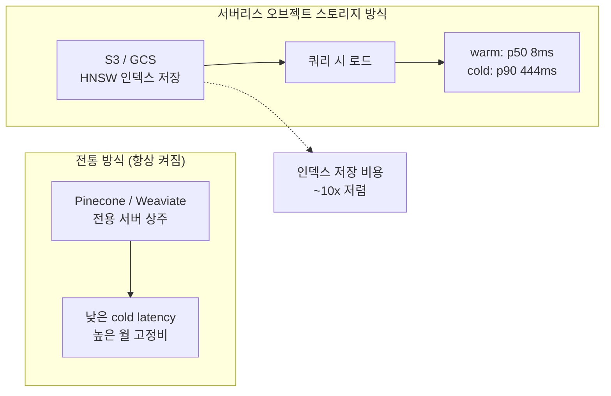
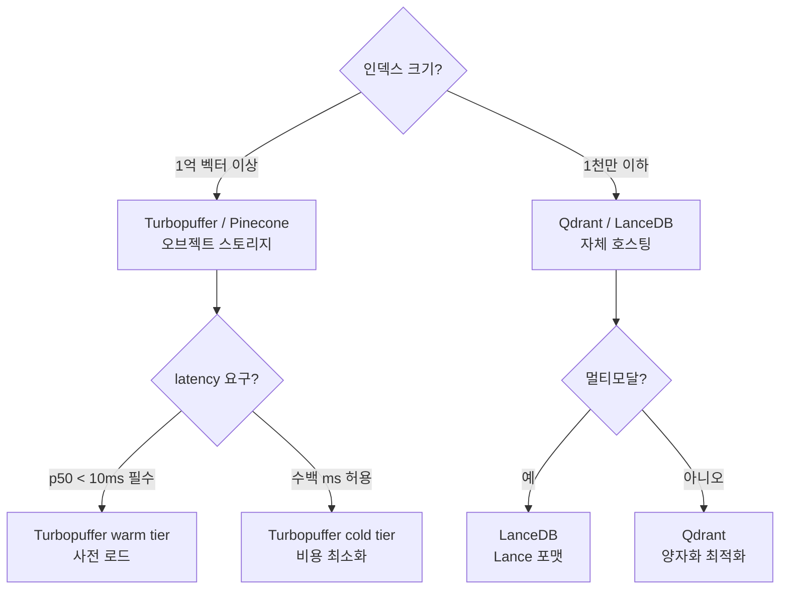

# Serverless Object-Storage Vector DBs (Turbopuffer 등)

벡터(vector) + BM25를 S3/GCS 기반 오브젝트 스토리지(object storage)에 저장해 TB급 인덱스(index) 비용을 수십 배 낮춘 벡터 데이터베이스(vector database) 카테고리. 상주 서버(always-on server) 없이 쿼리(query)가 들어올 때만 컴퓨팅 자원을 사용하는 "serverless" 설계가 핵심이다.

## 왜 지금 중요한가

Turbopuffer가 오브젝트 스토리지 기반 하이브리드 검색(hybrid search)으로 p50 8ms(warm), p90 444ms(cold) 지연(latency)을 달성하면서 1M+ 컨텍스트(context) 시대의 "first-stage retrieval" 기본값이 됐다. Qdrant는 양자화(quantization), LanceDB는 in-process 멀티모달(multimodal) 검색으로 틈새를 공고히 하며 "disk-first vector DB" 트렌드가 굳어졌다.

## 아키텍처 비교

위 다이어그램은 항상 켜진 전통 방식과 쿼리 시에만 비용이 발생하는 서버리스 방식의 트레이드오프를 보여준다.

## 주요 플레이어

| 제품 | 저장 방식 | 특징 | 라이선스 |
|------|-----------|------|----------|
| **Turbopuffer** | S3 위 HNSW(Hierarchical Navigable Small World) | 하이브리드(벡터+BM25), 제로 상주 비용 | 상용 |
| **Qdrant** | 디스크 + 메모리 양자화 | Rust 기반, 자체 호스팅 가능, 스칼라·PQ 양자화 | Apache 2.0 |
| **LanceDB** | Lance 컬럼 포맷(columnar format) | in-process, 멀티모달, Python/Rust SDK | Apache 2.0 |
| **Pinecone** | 전용 서버리스 | 관리형(managed), 빠른 온보딩 | 상용 |
| **Weaviate** | 디스크+메모리 | GraphQL, 하이브리드, 자체 호스팅 | BSD-3 |

## 서버리스 벡터 DB의 핵심 기술 요소

### HNSW on Object Storage
전통적인 HNSW 그래프는 메모리에 상주해야 빠른 검색이 가능하지만, Turbopuffer는 그래프 노드(node)를 S3에 분산 저장하고 쿼리 시 필요한 레이어(layer)만 로드하는 방식으로 cold-start를 허용하는 대신 상주 비용을 제거한다.

### 하이브리드 검색 (Hybrid Search)
벡터 유사도(cosine/dot product)와 BM25 키워드 검색을 결합한 Reciprocal Rank Fusion(RRF) 또는 가중합으로 최종 랭킹을 결정한다. 의미적 검색(semantic search)만으로는 놓치는 정확한 용어 매칭을 보완한다.

## 운영 관점에서의 선택 기준

이 의사결정 트리는 인덱스 규모, 지연 요구사항, 멀티모달 여부에 따라 제품을 선택하는 기준을 보여준다.

## 실무 체크리스트

- **cold-start 허용 여부**: 서버리스는 첫 쿼리가 수백 ms 지연될 수 있음. SLA(Service Level Agreement)에서 허용되는지 확인
- **인덱스 업데이트 빈도**: 오브젝트 스토리지 방식은 실시간 업데이트(upsert)보다 배치(batch) 인덱스에 유리
- **하이브리드 검색 필요성**: 코드/전문 용어가 많은 도메인은 BM25 병행이 리콜(recall)을 크게 향상
- **재랭커(reranker) 연동**: 1단계 검색 후 cross-encoder 재랭커로 정밀도 보완 고려

## 관련 문서

- [[ai-hot-topics-2026-04|2026년 4월 AI 개발 핫토픽 100선]]
- [[graphrag-in-production|GraphRAG / LightRAG / LazyGraphRAG in Production]]
- [[embedding-leaderboard-shakeup-2026|Qwen3 / Voyage-4 Embedding Leaderboard Shakeup]]
- [[temporal-knowledge-graph-memory|Zep / Graphiti Temporal Knowledge Graph Memory]]
