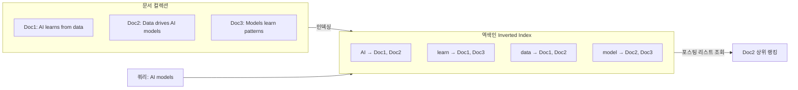

# 희소 검색 (Sparse Retrieval / BM25)

## 정의

희소 검색(sparse retrieval)은 문서를 **고차원 희소 벡터(sparse vector)**로 표현해 검색하는 방식이다. 대부분의 차원값이 0이고, 실제 등장한 단어(term)에만 0이 아닌 값이 부여된다. 고전적 정보 검색(IR)의 핵심 패러다임으로, TF-IDF와 BM25가 대표적이다.

## TF-IDF 원리

TF-IDF(Term Frequency-Inverse Document Frequency)는 단어의 중요도를 두 가지 요소로 측정한다.

- **TF (Term Frequency)**: 특정 문서 내에서 단어가 등장하는 빈도. 자주 등장할수록 중요
- **IDF (Inverse Document Frequency)**: 전체 문서 컬렉션에서 단어가 드물수록 정보량이 높음

$$\text{TF-IDF}(t, d) = \text{TF}(t, d) \times \log\frac{N}{df(t)}$$

여기서 $N$은 전체 문서 수, $df(t)$는 단어 $t$가 등장하는 문서 수다.

## BM25 알고리즘

BM25(Best Match 25)는 TF-IDF의 한계를 보완한 확률적 검색 모델이다. Okapi 검색 시스템에서 개발됐으며 오늘날도 Elasticsearch, Lucene의 기본 랭킹 알고리즘이다.

$$\text{BM25}(q, d) = \sum_{t \in q} \text{IDF}(t) \cdot \frac{f(t,d) \cdot (k_1 + 1)}{f(t,d) + k_1 \left(1 - b + b \cdot \frac{|d|}{\text{avgdl}}\right)}$$

**핵심 개선사항:**

| 개선점 | 설명 | 파라미터 |
|--------|------|---------|
| TF 포화(saturation) | 단어가 많이 등장해도 점수가 선형 증가하지 않음 — 로그 형태로 수렴 | $k_1 \in [1.2, 2.0]$ |
| 문서 길이 정규화 | 긴 문서는 TF가 자연스럽게 높으므로 평균 문서 길이로 보정 | $b \in [0, 1]$ |

**파라미터 가이드:**
- $k_1 = 1.5$: TF 포화 속도. 높을수록 TF 증가에 민감
- $b = 0.75$: 문서 길이 정규화 강도. 0이면 정규화 없음, 1이면 완전 정규화

## Inverted Index 구조



역색인(inverted index)은 단어 → 해당 단어가 등장하는 문서 목록(posting list) 매핑이다. 쿼리 단어들의 posting list를 빠르게 교집합/합집합 처리해 후보 문서를 찾는다.

**구성 요소:**
- **Dictionary**: 어휘집 (단어 → 인덱스 오프셋)
- **Posting List**: 각 단어에 대한 (문서 ID, 빈도, 위치) 목록
- **Skip Pointers**: 긴 posting list의 빠른 탐색을 위한 포인터

## Dense Retrieval 대비 장점

| 기준 | 희소 검색 (BM25) | 밀집 검색 (Dense) |
|------|-----------------|-----------------|
| 정확한 키워드 매칭 | 우수 (exact match) | 약함 |
| 희귀 용어 검색 | 우수 (IDF로 높은 가중치) | 약함 (임베딩 공간 희소) |
| 설명 가능성 | 높음 (어느 단어가 기여했는지 명확) | 낮음 (블랙박스) |
| 신규 도메인 적응 | 추가 학습 불필요 | 파인튜닝 필요 |
| 계산 비용 | 낮음 (역색인 조회) | 높음 (ANN 검색) |
| 의미적 유사도 | 없음 | 핵심 강점 |
| 동의어 처리 | 불가 | 우수 |

## 한계와 완화 전략

**구조적 한계:**
- 동의어: "자동차"와 "차량"을 다른 단어로 취급
- 형태론적 변형: 어간이 다른 같은 의미의 단어 미연결
- 의미적 유사도 부재: 문맥 이해 없이 단어 빈도만 집계

**완화 전략:**
- **형태소 분석(tokenization)**: 어간 추출(stemming), 표제어 추출(lemmatization)
- **동의어 사전**: Query Expansion으로 동의어 추가
- **하이브리드 검색**: Dense와 Sparse를 결합해 상호 보완

## 하이브리드 검색에서의 역할

현대 RAG 파이프라인에서 희소 검색은 단독으로 사용되기보다 **하이브리드 검색(hybrid search)** 구성요소로 활용된다.

```
쿼리 → BM25 (정확 매칭) ─┐
                            ├→ RRF 점수 통합 → 최종 랭킹
쿼리 → Dense (의미 매칭) ─┘
```

RRF(Reciprocal Rank Fusion)로 두 방식의 순위를 통합하면 개별 방식보다 일관적으로 높은 성능을 보인다. BM25는 정확한 용어 일치(예: 제품 코드, 고유명사, API 이름)에서 Dense를 압도하므로 하이브리드에서도 필수적 역할을 한다.

> "BM25는 30년 된 알고리즘이지만 많은 실무 RAG 시스템에서 Dense Retrieval을 단독으로 사용하는 것보다 BM25 + Dense 하이브리드가 더 강력하다."

## 관련 문서

- [[hybrid-search-rrf]] - RRF 기반 하이브리드 검색 상세
- [[dense-retrieval]] - 밀집 검색과 임베딩 기반 유사도
- [[embedding-models-for-rag]] - RAG용 임베딩 모델 선택 가이드
- [[contextual-retrieval]] - Anthropic의 컨텍스트 기반 검색 보강 기법
