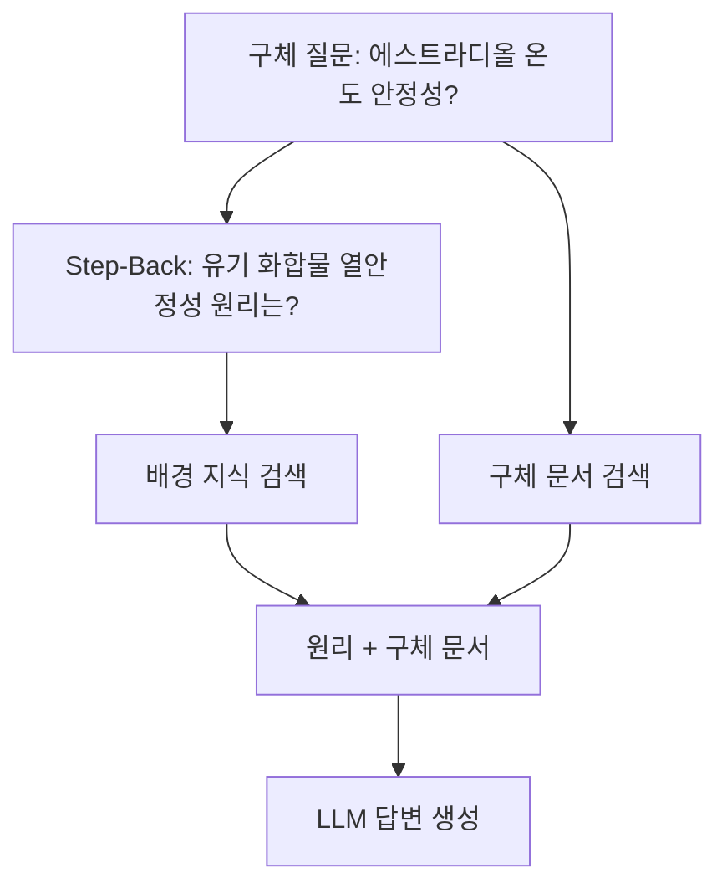

# 스텝백 프롬프팅

Zheng et al. (2023)이 제안한 쿼리 변환 기법. 구체적 질문을 **더 추상적인 상위 원리/개념 질문**으로 변환하여 관련성 높은 배경 지식을 먼저 검색한 후, 원래 질문에 답하는 패턴.

## [[hyde-rag|HyDE]]와의 차이

| 기법 | 방향 | 효과 |
|------|------|------|
| HyDE | 구체 -> 가상 답변 생성 | 쿼리-문서 격차 해소 |
| Step-Back | 구체 -> 추상 질문 변환 | **배경 지식 확보** |
| [[rag-fusion|RAG Fusion]] | 하나 -> 다중 변형 | 검색 다양성 확보 |

## 효과적인 태스크

- **과학 질문**: 구체 실험 -> 일반 원리 검색
- **시간 추론**: 특정 날짜 -> 시대 배경 검색
- **인과 추론**: 구체 현상 -> 일반 메커니즘 검색

## 관련 문서

- [[query-transformation]] -- 쿼리 변환 기법
- [[hyde-rag]] -- HyDE
- [[rag-fusion]] -- RAG 퓨전
- [[advanced-rag-patterns]] -- Advanced RAG 패턴
