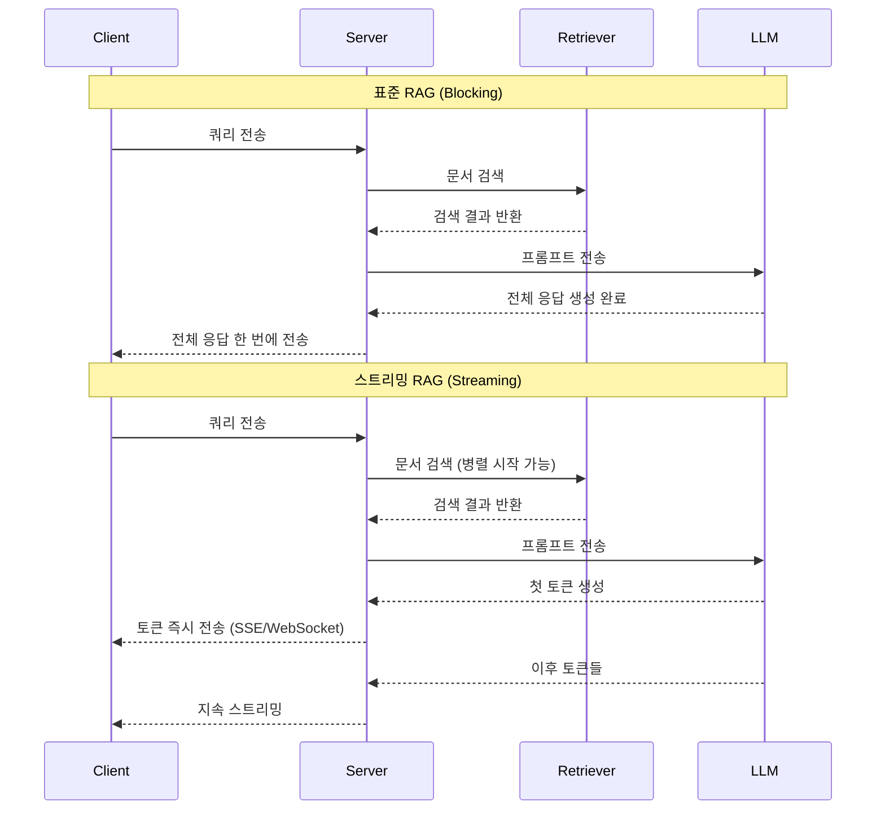
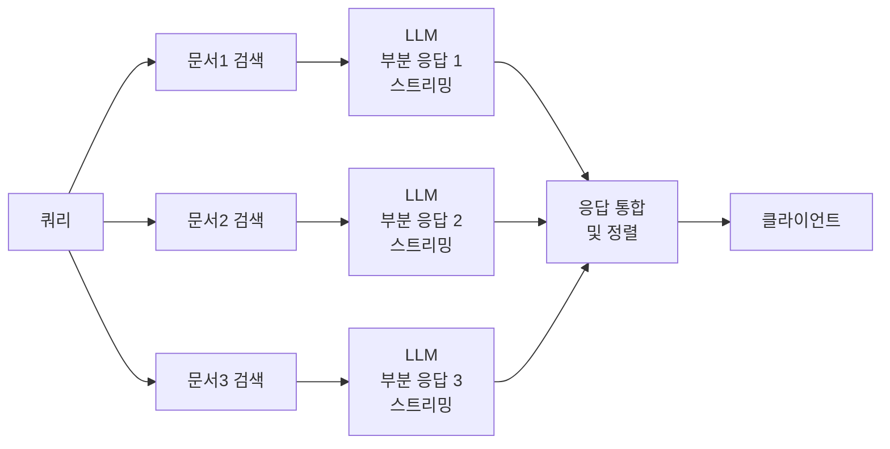

# 스트리밍 RAG (Streaming RAG)

## 개요

스트리밍 RAG(Streaming RAG)는 검색(Retrieval)과 생성(Generation)을 파이프라인으로 순차 실행하되, **생성 결과를 토큰 단위로 실시간 스트리밍**하여 사용자가 체감하는 첫 응답 지연(Time-to-First-Token, TTFT)을 최소화하는 아키텍처 패턴이다.

표준 RAG에서는 검색 완료 -> 컨텍스트 조립 -> LLM 생성 완료 -> 전체 응답 전송 순서로 진행되어 수 초의 지연이 발생한다. 스트리밍 RAG는 LLM이 첫 토큰을 생성하는 즉시 클라이언트로 전달함으로써 체감 응답성을 크게 개선한다.

## 표준 RAG vs 스트리밍 RAG



## [[token-streaming-sse]] 기반 전송

스트리밍 RAG의 클라이언트-서버 통신은 주로 [[token-streaming-sse]](Server-Sent Events)를 통해 구현된다. SSE는 HTTP를 그대로 사용하면서 서버가 클라이언트에게 이벤트를 푸시할 수 있어 설정이 단순하다.

표준 이벤트 스트림 형식:
```
data: {"type": "retrieval_start", "query": "..."}

data: {"type": "retrieval_complete", "doc_count": 5}

data: {"type": "token", "content": "안"}

data: {"type": "token", "content": "녕"}

data: {"type": "done", "usage": {"input_tokens": 1200, "output_tokens": 87}}
```

검색 상태, 생성 토큰, 완료 신호를 구분된 이벤트 타입으로 전송하면 프런트엔드에서 단계별 UI 피드백(스피너 -> 문서 로딩 표시 -> 타이핑 애니메이션)을 구현할 수 있다.

## 스트리밍 RAG 아키텍처 변형

### 1. Sequential Streaming (기본)

가장 단순한 형태. 검색 완료 후 생성 스트리밍 시작. 검색 지연이 TTFT에 그대로 더해진다.

- TTFT = 검색 지연 + LLM 첫 토큰 지연
- 구현 복잡도: 낮음

### 2. Speculative Retrieval

쿼리를 받는 즉시 LLM에게 쿼리를 바탕으로 응답 초안을 스트리밍하게 하고, 병렬로 검색을 수행한다. 검색이 완료되면 응답을 검색 결과로 보강하거나 수정한다.

- TTFT = LLM 첫 토큰 지연 (검색 지연 비차단)
- 위험: 초안이 사실과 다를 수 있음, 수정 시 UX 복잡

### 3. Chunked Retrieval Streaming

문서를 검색하면서 각 문서가 도착할 때마다 그 문서에 대한 LLM 응답을 부분적으로 스트리밍한다. 문서가 많거나 크기가 클 때 유용하다.



## 출처(Citation) 스트리밍 처리

스트리밍 환경에서 출처 표시는 까다롭다. LLM이 "문서 A에 따르면..."이라고 출력하는 시점에 이미 해당 문서 정보를 클라이언트가 알고 있어야 하기 때문이다. 두 가지 접근이 있다:

1. **선행 출처 전송**: 검색 완료 직후 `retrieval_complete` 이벤트로 출처 목록을 먼저 전송하고, 생성 스트림에서 참조 번호만 사용
2. **후행 출처 첨부**: 생성 완료 후 `done` 이벤트에 최종 출처 매핑 전송, 프런트엔드에서 소급 렌더링

## [[rag-pipeline]] 내에서의 위치

스트리밍 RAG는 [[rag-pipeline]]의 생성 단계를 비동기 스트리밍으로 교체하는 아키텍처 변형이다. 검색 단계(인덱싱, 쿼리 변환, 리랭킹)는 그대로 유지되며, 검색 결과가 LLM에 전달되는 시점 이후부터 스트리밍이 시작된다.

## 구현 시 주의사항

- **오류 처리**: 스트림 중간에 오류 발생 시 이미 전송된 토큰을 회수할 수 없다. `error` 이벤트를 즉시 전송하고 클라이언트가 UI를 복구하도록 설계한다
- **백프레셔(Backpressure)**: 클라이언트가 토큰을 소화하는 속도보다 LLM이 생성하는 속도가 빠를 수 있다. 서버사이드 버퍼링 또는 플로우 컨트롤이 필요하다
- **부분 응답 캐싱**: 동일 쿼리에 대해 스트리밍 응답을 캐싱하려면 전체 응답 완료 후 캐싱하거나, 스트림을 녹화해두는 방식을 사용한다

## 관련 문서

- [[rag-pipeline]] - 스트리밍이 적용되는 전체 RAG 파이프라인
- [[token-streaming-sse]] - Server-Sent Events 기반 토큰 스트리밍 메커니즘
- [[adaptive-rag]] - 쿼리 복잡도에 따라 검색 전략을 동적으로 선택하는 패턴
- [[flare-retrieval]] - 생성 중 필요 시 추가 검색을 트리거하는 인터리브드 패턴
