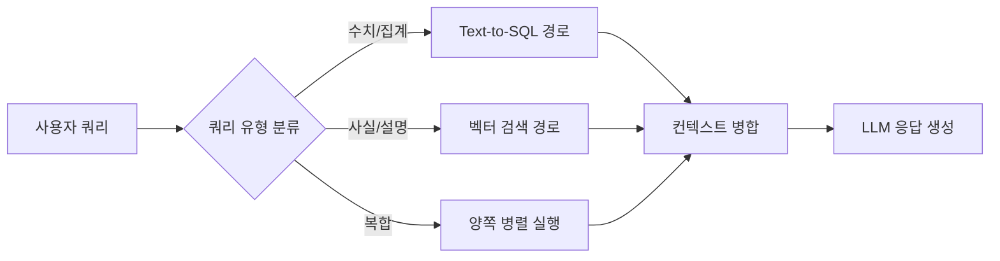

# 테이블 RAG (Table RAG)

테이블 RAG(Table RAG)는 **정형 데이터(테이블, 스프레드시트, 데이터베이스)와 비정형 텍스트를 통합한 RAG 시스템**이다. 대부분의 기업 지식은 순수 텍스트가 아니라 Excel, 데이터베이스, PDF 내 표 형태로 존재한다. 표준 벡터 검색만으로는 이런 정형 데이터를 효과적으로 다루기 어려워, 별도의 테이블 이해 및 질의 메커니즘이 필요하다.

## 왜 테이블은 어려운가

테이블은 일반 텍스트와 다른 특성을 가진다.

- **행/열 관계**: "3분기 서울 지점 매출"이라는 질문에는 행과 열을 교차 탐색해야 한다
- **집계 연산**: 합계, 평균, 최대값 등 수치 연산이 필요하다
- **스키마 이해**: 컬럼명과 데이터 타입을 파악해야 올바른 해석이 가능하다
- **컨텍스트 의존**: 같은 셀 값도 행/열 헤더 없이는 의미가 불분명하다

표준 임베딩 모델은 이런 2차원 구조를 효과적으로 포착하지 못한다.

## 핵심 접근법

### Text-to-SQL

자연어 질문을 SQL 쿼리로 변환하여 데이터베이스에 직접 질의한다.

```mermaid
flowchart TD
    Q[자연어 질문\n"지난달 서울 매출 합계는?"] --> SCHEMA[스키마 정보 추출\n테이블명, 컬럼명, 타입]
    SCHEMA --> SQL_GEN[LLM: Text-to-SQL 생성\nSELECT SUM 등]
    SQL_GEN --> EXEC[SQL 실행\n데이터베이스]
    EXEC --> RESULT[결과 집합\n숫자/테이블]
    RESULT --> GEN[자연어 응답 생성\nLLM]
    GEN --> ANS[최종 답변]
```

Text-to-SQL의 품질은 스키마 컨텍스트 품질에 크게 의존한다. 테이블명과 컬럼명이 의미를 잘 반영할수록 성능이 높다.

### 테이블 직렬화 (Table Serialization)

표를 일정한 텍스트 형식으로 변환해 벡터 임베딩과 LLM 컨텍스트에 활용한다.

| 직렬화 방식 | 예시 | 장단점 |
|------------|------|--------|
| Markdown | `\| 지점 \| 매출 \|` | 가독성 높음, 토큰 효율 낮음 |
| CSV | `서울, 1200만` | 간결, 구조 파악 어려움 |
| 자연어 설명 | "서울 지점의 매출은 1200만원이다" | LLM 친화적, 정보 손실 가능 |
| HTML | `<table>...` | 웹 문서와 호환, 복잡 |

행별로 자연어 문장으로 변환하는 방식이 임베딩 품질과 LLM 이해도 측면에서 균형이 좋다.

### 테이블-텍스트 하이브리드 검색



[[rag-pipeline]]의 쿼리 라우팅 레이어에서 수치 집계가 필요한 질문은 SQL 경로로, 개념적 설명이 필요한 질문은 벡터 검색으로 분기한다.

## 테이블 청킹 전략

전체 테이블을 하나의 청크로 처리하면 토큰 한도를 초과하기 쉽다.

**행 단위 청킹**: 테이블을 행별로 분리. 헤더를 각 청크에 반복 포함하여 독립성을 유지한다.

**의미적 행 그룹화**: 동일 범주(예: 같은 지역, 같은 기간)를 묶어 청킹. 집계 쿼리에 더 적합하다.

**하이브리드 인덱싱**: 원본 테이블은 관계형 DB에 보존하고, 행별 텍스트 요약만 벡터 DB에 인덱싱한다. 벡터 검색으로 관련 행을 찾은 뒤 DB에서 정확한 값을 조회한다.

## [[rag-for-structured-data]]와의 관계

테이블 RAG는 [[rag-for-structured-data]]의 핵심 사례다. 정형 데이터 RAG는 테이블 외에도 JSON, XML, 그래프 데이터까지 포함하는 더 넓은 개념이며, 테이블 RAG는 그중 가장 일반적인 형태다.

## 실무 도전 과제

**스키마 변동**: 프로덕션 DB의 스키마가 자주 바뀌면 프롬프트에 주입하는 스키마 정보도 지속적으로 갱신해야 한다.

**SQL 실행 안전성**: LLM이 생성한 SQL이 예상치 못한 데이터를 수정하거나 삭제할 수 있다. 읽기 전용(read-only) 접속 권한을 부여하는 것이 필수다.

**숫자 단위 불일치**: "매출"이 만원 단위인지 원 단위인지 모델이 파악하지 못하면 틀린 결과를 낸다. 스키마에 단위 정보를 명시하거나 프롬프트로 안내해야 한다.

## 관련 문서

- [[rag-pipeline]] - 테이블 RAG가 통합되는 기본 파이프라인 구조
- [[rag-for-structured-data]] - 정형 데이터 전반을 다루는 상위 개념
- [[query-routing]] - 테이블 쿼리와 텍스트 쿼리를 분기하는 라우팅 기법
- [[hybrid-search-rrf]] - 정형/비정형 검색 결과를 결합하는 RRF 기법
