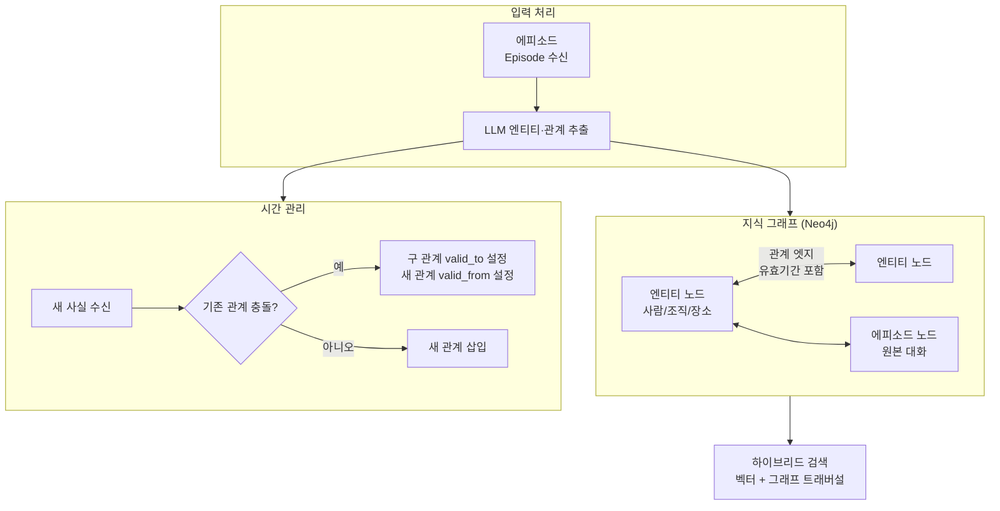
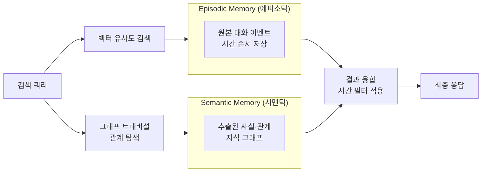

# Zep / Graphiti Temporal Knowledge Graph Memory

엔티티(entity)와 관계(relation)에 유효 기간(validity period)을 부여해 "사실이 언제 참이었는가"를 추적하는 지식 그래프(knowledge graph) 기반 에이전트 메모리(agent memory). 단순 벡터 검색으로는 답하기 어려운 "6개월 전 사용자가 말한 직장은?"과 같은 시간적 추론(temporal reasoning) 쿼리에 특화된다.

## 왜 중요한가

LongMemEval 벤치마크(benchmark)에서 GPT-4o 기준 Zep 63.8% vs Mem0 49.0%로 15pt 격차를 기록하며 "시간 추론이 필요한 엔터프라이즈(enterprise) 메모리"의 de facto 표준으로 부상했다. Graphiti는 2026년 1분기에 Neo4j와 공식 파트너십을 맺으며 지식 그래프 메모리(Knowledge Graph Memory) 카테고리를 열었다.

## 핵심 개념: Bi-temporal 모델

일반 지식 그래프는 사실이 "지금도 참인가"만 저장하지만, Zep/Graphiti의 bi-temporal(이중시간) 모델은 두 가지 시간축을 분리해 관리한다:

| 시간축 | 의미 | 예시 |
|--------|------|------|
| **Valid Time (유효 시간)** | 현실에서 사실이 참인 기간 | 사용자가 A사에 근무: 2022-01 ~ 2025-06 |
| **Transaction Time (트랜잭션 시간)** | 시스템이 그 사실을 알게 된 시점 | 대화에서 언급된 날짜: 2024-03-15 |

이를 통해 "2024년 3월에 사용자가 말한 현재 직장은?" 같은 복합 시간 쿼리가 가능해진다.

## Graphiti 아키텍처

Graphiti는 Zep의 오픈소스 지식 그래프 엔진으로, Neo4j를 백엔드로 사용한다.



이 다이어그램은 에피소드(대화 단위) 입력이 엔티티·관계로 추출되고, 시간 충돌 처리 후 그래프에 저장되는 흐름을 보여준다.

## Episodic + Semantic 하이브리드 메모리

Zep은 두 종류의 메모리를 통합 관리한다:



에피소딕 메모리는 "무슨 일이 있었나"(what happened), 시맨틱 메모리는 "무엇이 참인가"(what is true)를 담당한다. Zep은 이 두 레이어를 단일 검색 인터페이스로 통합한다.

## Zep vs Mem0 비교

| 항목 | Zep (Graphiti 기반) | Mem0 |
|------|---------------------|------|
| **LongMemEval 정확도** | 63.8% | 49.0% |
| **메모리 구조** | 지식 그래프 (Neo4j) | 벡터 DB + 선택적 그래프 |
| **시간 추론** | 강점 (bi-temporal) | 제한적 |
| **지연(Latency)** | 상대적으로 높음 | 91% 감소 (LOCOMO 기준) |
| **토큰 비용** | 높음 | 90% 감소 (LOCOMO 기준) |
| **설치 복잡도** | Neo4j 필요 | 다양한 벡터 DB 선택 |
| **최적 사용처** | 엔터프라이즈 CRM/복잡한 관계 | 빠른 개인화, 비용 최적화 |

## 실무 적용 패턴

### Zep에 적합한 시나리오
- **고객 지원(customer support)**: "고객이 지난 분기에 불만 제기한 내용과 현재 문의의 연관성 파악"
- **의료 기록**: "환자가 6개월 전에 복용하던 약과 현재 처방의 상호작용 확인"
- **세일즈(sales) CRM**: "잠재 고객이 1년 전에 언급한 예산 제약이 현재도 유효한가"

### 적합하지 않은 시나리오
- 단순 FAQ 챗봇 (벡터 검색으로 충분)
- 실시간 응답이 최우선인 서비스 (지연 페널티)
- 관계 구조보다 단순 사실 기억이 중요한 경우

## 핵심 API 패턴 (Graphiti)

```python
from graphiti_core import Graphiti

client = Graphiti(neo4j_uri, neo4j_user, neo4j_password)

# 에피소드 추가 (대화 → 그래프 자동 추출)
await client.add_episode(
    name="사용자 대화 2026-04-15",
    episode_body="나는 지난달까지 A사에 다녔는데 이제 B사로 이직했어.",
    source_description="채팅 대화",
)

# 시간 필터 포함 검색
results = await client.search(
    query="현재 직장",
    num_results=5,
    # 현재 시점에 유효한 사실만 반환
)
```

## 대표 레퍼런스

- [Zep: A Temporal Knowledge Graph Architecture for Agent Memory (arXiv 2501.13956)](https://arxiv.org/abs/2501.13956)
- [Graphiti GitHub (getzep/graphiti)](https://github.com/getzep/graphiti)
- [Zep Platform](https://www.getzep.com/)
- [Zep Blog: A Temporal Knowledge Graph Architecture for Agent Memory](https://blog.getzep.com/zep-a-temporal-knowledge-graph-architecture-for-agent-memory/)
- [Graphiti: Knowledge Graph Memory for an Agentic World (Neo4j Blog)](https://neo4j.com/blog/developer/graphiti-knowledge-graph-memory/)

## 관련 문서
- [[memory-augmented-generation]] -- Memory-Augmented Generation (MAG)

- [[ai-hot-topics-2026-04|2026년 4월 AI 개발 핫토픽 100선]]
- [[mem0-universal-memory-layer|Mem0 Universal Memory Layer]]
- [[embedding-leaderboard-shakeup-2026|Qwen3 / Voyage-4 Embedding Leaderboard Shakeup]]
- [[letta-stateful-agent-runtime|Letta (MemGPT) Stateful Agent Runtime]]
- [[agent-memory-systems|에이전트 메모리 시스템]]
- [[graphrag-in-production|GraphRAG / LightRAG / LazyGraphRAG in Production]]
