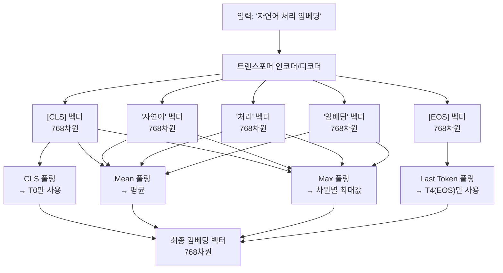
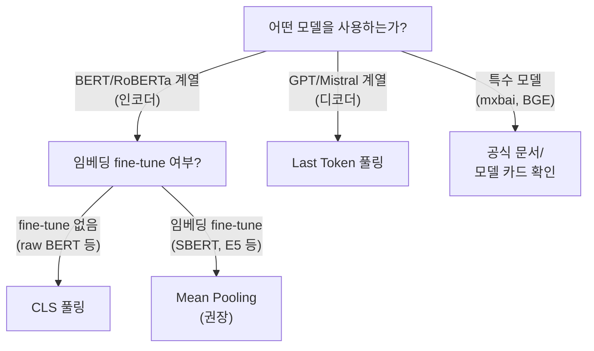

# 임베딩 풀링 전략 비교

## 개요

텍스트 임베딩 모델은 입력 텍스트의 각 토큰에 대해 벡터를 생성한다. 그러나 최종 임베딩은 일반적으로 **단일 고정 크기 벡터**여야 한다. **풀링(pooling)**은 가변 길이의 토큰 시퀀스 벡터를 하나의 벡터로 집약하는 방법이다.

풀링 전략은 임베딩 품질에 직접적인 영향을 미치며, 모델 아키텍처(인코더 vs 디코더)와 학습 방식에 따라 최적 전략이 달라진다.



동일한 인코더 출력에서 어떻게 집약하느냐에 따라 임베딩 품질이 달라진다.

---

## 주요 풀링 전략

### 1. CLS 토큰 풀링 (CLS Token Pooling)

**원리**: BERT 계열 모델에서 첫 번째 특수 토큰 `[CLS]`의 표현만 사용한다.

**수식**: $\mathbf{e} = h_{[CLS]}$

**작동 원리**: BERT는 사전학습 시 NSP(Next Sentence Prediction) 태스크를 위해 `[CLS]` 토큰이 전체 시퀀스의 요약 표현을 담도록 설계되었다. 어텐션 메커니즘을 통해 모든 토큰의 정보가 `[CLS]`에 집약된다.

**장점**:
- 계산이 단순하고 빠름
- 특정 태스크용 헤드를 붙이기 쉬움 (분류 등)

**단점**:
- 임베딩 fine-tuning 없이는 의미 유사도에 약함 (원래 NSP용으로 학습)
- 긴 시퀀스에서 정보 손실 가능

**사용 모델**: [[mxbai-embed-large]] (v1), [[bge-m3-embedding]] (Dense 부분), SimCSE

---

### 2. Mean Pooling (평균 풀링)

**원리**: 모든 토큰(또는 패딩 제외 실제 토큰)의 벡터를 평균낸다.

**수식**: $\mathbf{e} = \frac{1}{N} \sum_{i=1}^{N} h_i$ (패딩 마스크 적용)

```python
import torch
from transformers import AutoTokenizer, AutoModel

def mean_pooling(model_output, attention_mask):
    token_embeddings = model_output.last_hidden_state
    # 패딩 토큰 마스킹
    input_mask_expanded = attention_mask.unsqueeze(-1).expand(token_embeddings.size()).float()
    # 마스크 적용 후 합산 / 토큰 수
    return torch.sum(token_embeddings * input_mask_expanded, 1) / torch.clamp(
        input_mask_expanded.sum(1), min=1e-9
    )
```

**장점**:
- 모든 토큰의 정보를 균등하게 반영
- 임베딩 fine-tuning 후 의미 유사도 태스크에서 CLS보다 일반적으로 우수
- Sentence-BERT (SBERT) 이후 사실상 표준

**단점**:
- 긴 시퀀스에서 중요하지 않은 토큰(불용어 등)이 노이즈로 작용할 수 있음
- 토큰 간 중요도 차이 미반영

**사용 모델**: [[nomic-embed-text]], [[e5-text-embeddings]], [[instructor-embedding-model]], [[sentence-transformer]], [[gte-text-embeddings]]

---

### 3. Max Pooling (최대 풀링)

**원리**: 각 차원(dimension)에서 모든 토큰 중 최대값을 선택한다.

**수식**: $e_d = \max_{i=1}^{N} h_{i,d}$ (d번째 차원)

**장점**:
- 시퀀스에서 해당 차원에서 가장 두드러진 특성을 포착
- 특정 키워드나 핵심 개념 강조에 유리할 수 있음

**단점**:
- 텍스트 임베딩에서는 Mean Pooling보다 대부분 열등
- 이론적 근거가 약하고 실무에서 잘 사용되지 않음

**주 사용처**: 이미지 분류(CNN), 문서 분류 일부 케이스

---

### 4. Last Token Pooling (마지막 토큰 풀링)

**원리**: 디코더(GPT 계열) 모델에서 마지막 토큰(EOS 또는 마지막 실제 토큰)의 표현을 사용한다.

**수식**: $\mathbf{e} = h_N$ (N: 마지막 실제 토큰)

**왜 디코더에서는 마지막 토큰인가**:
인과적 어텐션(causal attention)을 사용하는 디코더 모델은 각 토큰이 이전 토큰만 볼 수 있다. 따라서 **마지막 토큰만이 전체 시퀀스를 "본" 유일한 토큰**이다.

```python
def last_token_pooling(model_output, attention_mask):
    last_hidden_state = model_output.last_hidden_state
    # attention_mask에서 각 시퀀스의 마지막 실제 토큰 위치 찾기
    sequence_lengths = attention_mask.sum(dim=1) - 1
    batch_size = last_hidden_state.shape[0]
    return last_hidden_state[torch.arange(batch_size), sequence_lengths]
```

**사용 모델**: e5-mistral-7b-instruct, LLM2Vec, GTE-Qwen2-7B, SFR-Embedding-Mistral

---

### 5. Weighted Mean Pooling (가중 평균 풀링)

**원리**: 각 토큰에 학습 가능한 가중치(또는 규칙 기반 가중치)를 부여해 평균낸다.

**유형**:
- **위치 가중치**: 앞쪽 토큰에 더 높은 가중치
- **어텐션 기반 가중치**: 별도의 어텐션 헤드로 토큰 중요도 학습
- **IDF 기반**: 역문서빈도를 가중치로 사용

**사용 모델**: 일부 특수 임베딩 모델, WKPCA(Weighted Key PCA) 방식

---

## 풀링 전략 비교 요약

| 전략 | 계산 비용 | 의미 유사도 | 분류 | 긴 문서 | 권장 아키텍처 |
|------|---------|-----------|------|---------|-------------|
| CLS | 최저 | 보통 (fine-tune 필요) | 좋음 | 약함 | 인코더 (BERT) |
| Mean | 낮음 | 좋음 | 좋음 | 보통 | 인코더 (BERT, RoBERTa) |
| Max | 낮음 | 나쁨 | 보통 | 보통 | 주로 비권장 |
| Last Token | 낮음 | 좋음 | 좋음 | 좋음 | 디코더 (GPT, Mistral) |
| Weighted Mean | 중간 | 좋음 | 좋음 | 좋음 | 인코더 (특수 모델) |

---

## 아키텍처별 권장 풀링



---

## 실무 가이드

### 풀링 전략 선택 체크리스트

1. **모델 공식 문서 확인 최우선**: 대부분의 임베딩 모델은 최적 풀링 전략을 명시한다
2. **인코더 모델 + fine-tuning 없음** → CLS 시도
3. **인코더 모델 + 의미 유사도 특화** → Mean Pooling 기본
4. **디코더/LLM 기반 모델** → Last Token
5. **Sentence-Transformers 라이브러리 사용 시** → 자동으로 올바른 풀링 적용

### Sentence-Transformers에서 풀링 확인

```python
from sentence_transformers import SentenceTransformer

model = SentenceTransformer("intfloat/e5-large-v2")
# 모델 풀링 레이어 확인
for module in model.modules():
    print(type(module).__name__, module)
```

---

## 관련 문서

- [[mean-vs-cls-pooling]] - Mean vs CLS 심층 비교
- [[embedding-models-for-rag]] - 임베딩 모델별 풀링 전략 정리
- [[bert]] - CLS 토큰의 기원
- [[contextual-embeddings]] - 풀링 이전 토큰 표현
- [[sentence-transformer]] - Mean Pooling 표준화에 기여한 프레임워크
- [[nomic-embed-text]] - Mean Pooling 사용 예시
- [[bge-m3-embedding]] - CLS 기반 Dense + 어휘 가중치 병행
- [[e5-text-embeddings]] - Mean Pooling 사용
- [[mxbai-embed-large]] - CLS Pooling 사용
