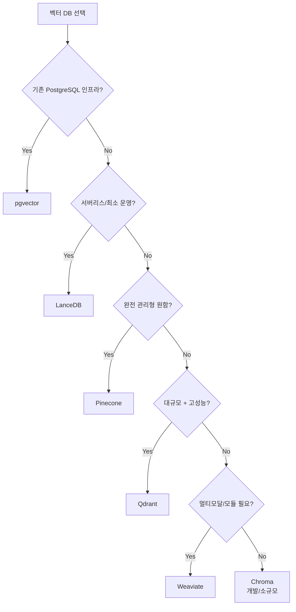

# 벡터 데이터베이스 비교 (Vector Database Comparison)

## 개요

벡터 데이터베이스(Vector Database)는 고차원 벡터를 효율적으로 저장하고 근사 최근접 이웃(ANN, Approximate Nearest Neighbor) 검색을 제공하는 특수 목적 데이터베이스다. RAG 파이프라인에서 임베딩된 청크를 저장하고 검색하는 핵심 인프라다.

## 핵심 인덱스 구조

### HNSW (Hierarchical Navigable Small World)

가장 널리 사용되는 ANN 인덱스. 계층적 그래프 구조로 빠른 검색 가능.

- 검색 복잡도: O(log n)
- 삽입 속도: 중간 (그래프 업데이트 비용)
- 메모리: 그래프 저장으로 상대적으로 많음
- 사용: Weaviate, Qdrant, Chroma 기본

### IVF (Inverted File Index)

클러스터링 기반. 쿼리와 가까운 클러스터만 탐색.

- Faiss의 IVF, 대규모 데이터에 효율적
- 빌드 시간 긴 편, 재학습 필요

### DiskANN / Vamana

Microsoft 연구. 디스크 기반 ANN으로 메모리 절감.

- SSD를 DRAM처럼 활용, 수십억 벡터 처리 가능
- Azure Cognitive Search, Weaviate(옵션)에서 사용

## 주요 벡터 DB 비교 (6개)

| 항목 | Pinecone | Weaviate | Qdrant | Chroma | pgvector | LanceDB |
|------|---------|---------|--------|--------|---------|---------|
| 운영 형태 | 매니지드 전용 | 셀프/클라우드 | 셀프/클라우드 | 셀프/클라우드 | PostgreSQL 확장 | 서버리스 |
| 인덱스 | 자체 | HNSW | HNSW | HNSW | HNSW/IVF | DiskANN/IVF |
| 하이브리드 검색 | O | O | O (SPLADE) | 제한적 | pg_trgm 결합 | O |
| 멀티테넌시 | Namespace | Multi-tenant | Collection | Collection | Schema | Table |
| 필터링 | O | O | O (페이로드) | O | WHERE 절 | O |
| 스케일 | 완전 관리형 | 클러스터 | 분산 모드 | 단일 노드 중심 | PostgreSQL | 서버리스 |
| 오픈소스 | X | O (Apache) | O (Apache) | O (Apache) | O | O (Apache) |
| 비용 | 높음 | 중간 | 중간 | 낮음 | PostgreSQL 비용 | 낮음 |

## 각 DB 상세

### Pinecone

완전 관리형 벡터 DB 선구자. 설정 없이 즉시 사용 가능.

- `serverless` 티어: 사용량 기반 과금, 소규모 적합
- Namespace: 논리적 데이터 분리 (멀티테넌시 지원)
- 자체 인덱스 알고리즘 비공개
- 가장 비쌈, 벤더 종속

### Weaviate

오픈소스 + 관리형 클라우드 옵션. 모듈 아키텍처로 다기능.

- 내장 임베딩 모듈 (`text2vec-openai`, `text2vec-cohere` 등)
- GraphQL API, REST API 지원
- 하이브리드 검색 내장, alpha 파라미터로 조율
- BQ(Binary Quantization), PQ(Product Quantization) 지원

### Qdrant

Rust로 구현. 고성능, 풍부한 필터링.

- 페이로드(payload): 메타데이터 필터링 강력
- 벡터 타입 다양: Dense, Sparse, Multi-vector
- Named Vectors: 하나의 레코드에 복수 벡터 저장
- SPLADE 등 학습된 희소 벡터 네이티브 지원

### Chroma

가장 쉽게 시작할 수 있는 개발자 친화적 DB. 로컬 Python 라이브러리로 시작 가능.

```python
import chromadb
client = chromadb.Client()  # 인메모리 즉시 시작
collection = client.create_collection("my_docs")
```

- 프로덕션 대규모 환경에는 한계 있음
- LangChain/LlamaIndex 기본 통합

### pgvector

PostgreSQL 확장. 기존 PostgreSQL 인프라 활용.

- 기존 관계형 데이터와 벡터를 동일 DB에서 관리
- SQL JOIN으로 메타데이터 필터링
- 인덱스: `ivfflat`, `hnsw` (pgvector 0.5+)
- 대규모 벡터 검색보다 중소규모에 적합

### LanceDB

Lance 컬럼형 포맷 기반 서버리스 벡터 DB.

- 서버 없이 S3/로컬 파일 시스템에 직접 저장
- DuckDB와 통합하여 SQL 분석 가능
- 버전 관리(versioning) 내장
- 임베딩 파이프라인과 통합 용이

## 선택 가이드



## 관련 문서

- [[hybrid-search-rrf]] - 하이브리드 검색 구현
- [[embedding-models-for-rag]] - 임베딩 생성 모델
- [[rag-indexing-pipeline]] - E2E 인덱싱 파이프라인
- [[serverless-vector-dbs]] - 서버리스 벡터 DB 최신 동향
