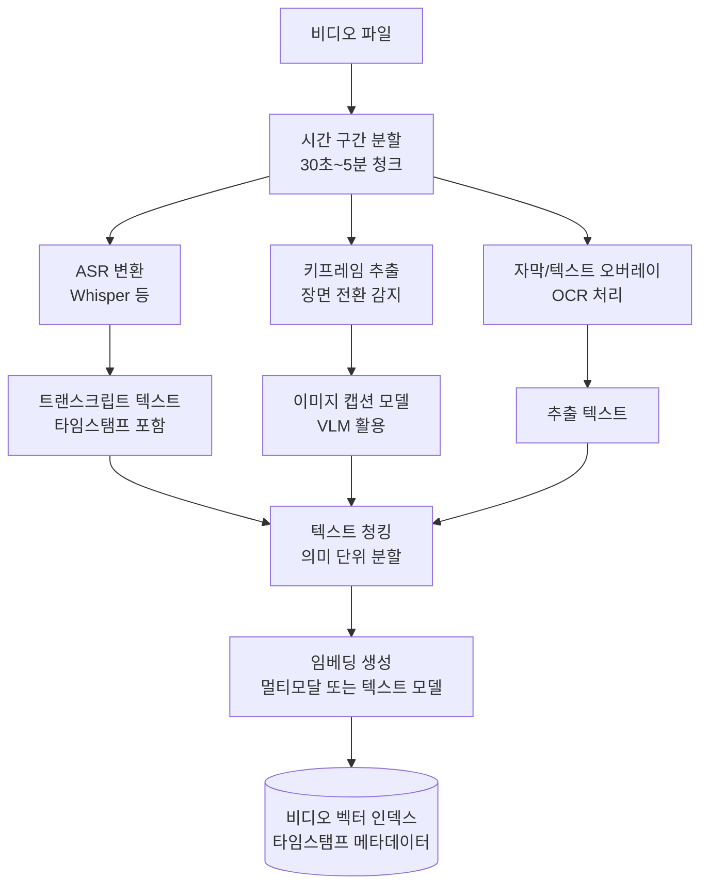
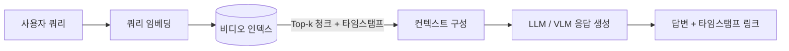

# 비디오 RAG (Video RAG)

비디오 RAG(Video RAG)는 **동영상 콘텐츠를 음성(ASR), 시각(키프레임), 의미(자동 캡션) 등 여러 모달리티로 분해하고 인덱싱하여 자연어 쿼리로 검색하는 멀티모달 RAG 시스템**이다. 강의, 뉴스, 회의 녹화, 광고, 기술 데모 등 비디오 형태의 지식이 급증하면서, 텍스트 RAG와 구별되는 비디오 특화 파이프라인이 요구된다.

## 비디오의 정보 계층

비디오는 동일한 시간 축 위에 여러 정보 스트림이 중첩된다.

| 모달리티 | 정보 예시 | 인덱싱 방법 |
|---------|----------|------------|
| 음성(Speech) | 강사 설명, 인터뷰 내용 | ASR(자동 음성 인식) → 텍스트 변환 |
| 시각(Vision) | 슬라이드, 제품 시연, 표정 | 키프레임 추출 + 이미지 캡션 모델 |
| 텍스트 오버레이 | 자막, 자막 그래픽, 워터마크 | OCR(광학 문자 인식) |
| 오디오 이벤트 | 박수, 경고음 | 오디오 분류 모델 |

실용적인 시스템에서는 보통 ASR + 키프레임 + 자막 조합을 우선 구현한다.

## 인덱싱 파이프라인

각 청크에는 **원본 비디오 ID, 시작/종료 타임스탬프, 모달리티 출처**가 메타데이터로 저장된다. 검색 결과를 영상의 특정 구간으로 바로 딥링크하기 위해서다.

## 검색 및 응답 생성

응답에 타임스탬프(예: "3:42에 해당 내용이 나옵니다")를 포함하면 사용자가 관련 구간으로 바로 이동할 수 있어 UX가 크게 개선된다.

## 핵심 기술 요소

**ASR 모델 선택**
OpenAI Whisper가 현재 가장 범용적으로 쓰인다. 다국어 지원, 오프라인 실행, 타임스탬프 단위 정렬이 주요 강점이다. 실시간 처리에는 Whisper의 경량 변형(Whisper-tiny, Whisper-base)을 고려한다.

**키프레임 추출 전략**
- 고정 간격(예: 5초마다 1프레임): 단순하지만 중요 장면을 놓칠 수 있다
- 장면 전환(scene change) 감지: PySceneDetect 등 라이브러리를 활용. 실질적인 내용 변화 구간만 캡처한다
- 텍스트 슬라이드 감지: 강의 비디오에서 슬라이드가 바뀌는 시점을 감지해 캡처

**비전-언어 모델 (VLM)**
[[vision-language-model-architectures]]는 이미지를 텍스트로 기술하거나 이미지와 텍스트 쿼리를 동시에 처리한다. CLIP 임베딩을 사용하면 텍스트와 이미지를 동일한 벡터 공간에서 검색할 수 있어, "파란색 그래프가 나오는 슬라이드"와 같은 시각적 쿼리도 처리 가능하다.

## 멀티모달 임베딩의 필요성

텍스트 임베딩만 사용하면 시각 정보가 손실된다. 이상적인 시스템은 다음 두 레이어를 유지한다.

- **텍스트 레이어**: ASR 트랜스크립트 + 캡션을 텍스트 임베딩으로 인덱싱 (검색 범용성)
- **이미지 레이어**: 키프레임을 CLIP 등 멀티모달 임베딩으로 인덱싱 (시각적 쿼리 지원)

두 레이어의 결과를 RRF(Reciprocal Rank Fusion)로 병합하면 텍스트와 시각 쿼리 모두 커버된다.

## 비디오 RAG와 [[rag-pipeline]]의 차이

표준 [[rag-pipeline]]과 비교하면 전처리(인덱싱) 단계가 훨씬 복잡하고 비용이 높다. ASR, 키프레임 추출, 캡션 생성은 모두 컴퓨팅 집약적 작업이다. 긴 비디오를 실시간으로 처리하려면 비동기 인덱싱 파이프라인이 필수적이다.

## 관련 문서

- [[rag-pipeline]] - 비디오 RAG가 확장하는 기본 RAG 구조
- [[vision-language-model-architectures]] - 키프레임 캡션 생성과 멀티모달 임베딩에 사용하는 VLM
- [[multimodal-rag]] - 텍스트 외 이미지, 오디오 등을 통합하는 RAG 일반론
- [[chunking-strategies]] - 비디오 트랜스크립트의 시간 기반 청킹 전략
