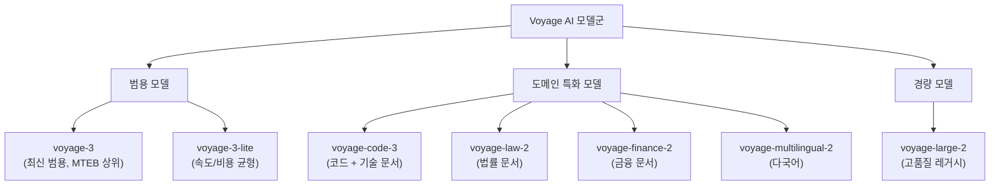

# Voyage AI 임베딩 모델군

Voyage AI는 고품질 텍스트 임베딩 모델과 재랭킹 모델을 API로 제공하는 스타트업이다. 특히 **도메인 특화 임베딩**(코드, 법률, 금융, 의료)에서 경쟁 우위를 가지며, 8K 토큰의 긴 컨텍스트 지원과 MTEB 벤치마크 상위권 성능으로 주목받았다. Anthropic의 Claude 문서에서 공식 임베딩 파트너로 언급될 만큼 RAG 분야에서 확고한 위치를 차지하고 있다.

## 모델 패밀리 구성



## 주요 모델 사양

| 모델 | 차원 | 최대 토큰 | 특화 영역 | 용도 |
|------|------|---------|---------|------|
| voyage-3 | 1024 | 32K | 범용 | 일반 RAG, 의미 검색 |
| voyage-3-lite | 512 | 32K | 범용 | 비용 효율 파이프라인 |
| voyage-code-3 | 1024 | 32K | 코드 | 코드베이스 검색, 기술 Q&A |
| voyage-law-2 | 1024 | 16K | 법률 | 법률 문서 검색, 판례 |
| voyage-finance-2 | 1024 | 32K | 금융 | 금융 보고서, 애널리스트 노트 |
| voyage-multilingual-2 | 1024 | 32K | 다국어 | 크로스-링귀얼 검색 |

## 도메인 특화 모델의 원리

범용 임베딩 모델은 도메인 특화 언어(법률 전문 용어, 코드 구문, 금융 약어)를 일반 텍스트와 동일한 가중치로 처리한다. Voyage AI의 도메인 특화 모델은:

1. **도메인 데이터 사전학습**: 법률 문서, 코드 저장소, 금융 보고서 등 도메인 특화 코퍼스로 추가 사전학습
2. **도메인 특화 파인튜닝**: 해당 도메인의 검색/매칭 태스크로 대조 학습(contrastive learning)
3. **도메인 용어 임베딩 품질**: 동의어, 약어, 전문 용어 간 의미적 관계를 범용 모델보다 정확하게 표현

**예시**: 법률 문서에서 "tortious interference"와 "intentional interference with contractual relations"가 동일 개념임을 범용 모델보다 훨씬 잘 포착한다.

## voyage-code-3: 코드 임베딩

코드베이스 검색([[code-rag]])에서 특히 강점을 보이는 모델이다:

- **다중 언어 코드**: Python, JavaScript, TypeScript, Go, Rust, Java 등 50개 이상 프로그래밍 언어
- **코드-자연어 정렬**: 코드 스니펫과 자연어 설명을 같은 공간에 임베딩 (자연어 쿼리로 코드 검색 가능)
- **함수/클래스 단위 임베딩**: 코드 구조를 인식하여 의미 단위로 임베딩
- **기술 문서**: API 문서, README, 주석 포함 기술 문서에서 강점

```python
import voyageai

vo = voyageai.Client(api_key="YOUR_API_KEY")

# 코드 임베딩
code_snippets = [
    "def binary_search(arr, target): ...",
    "function binarySearch(arr, target) { ... }",
]
doc_embeddings = vo.embed(
    code_snippets,
    model="voyage-code-3",
    input_type="document"
).embeddings

# 자연어 쿼리로 코드 검색
query_embedding = vo.embed(
    ["이진 탐색 구현"],
    model="voyage-code-3",
    input_type="query"
).embeddings[0]
```

## Voyage Rerank

임베딩 검색 후 교차 인코더 기반 재랭킹 모델도 제공한다:

```python
# 검색 후 재랭킹
documents = ["doc1 텍스트", "doc2 텍스트", "doc3 텍스트"]
reranking = vo.rerank(
    query="검색 쿼리",
    documents=documents,
    model="rerank-2",
    top_k=3
)
for result in reranking.results:
    print(f"relevance_score: {result.relevance_score}, document: {result.document}")
```

## MTEB 성능

Voyage AI 모델들은 MTEB(Massive Text Embedding Benchmark)에서 지속적으로 상위권을 유지한다. 특히:

- **코드 검색(Code Search)**: voyage-code-2/3가 CodeSearchNet 등에서 최상위 수준
- **법률 검색**: voyage-law-2가 LegalBench 기반 RAG 태스크에서 강점
- **일반 검색(Retrieval)**: voyage-3가 BEIR 벤치마크에서 경쟁력 있는 성능

최신 순위는 [[embedding-leaderboard-shakeup-2026]] 참조.

## Anthropic Claude와의 연계

Anthropic의 공식 문서와 Claude 튜토리얼에서 Voyage AI가 권장 임베딩 솔루션으로 등장한다. Claude + Voyage AI 조합의 RAG 파이프라인이 Anthropic 공식 예제로 제공된다.

```python
import anthropic
import voyageai

# Voyage로 임베딩, Claude로 응답 생성
vo = voyageai.Client()
client = anthropic.Anthropic()

# 문서 임베딩 (오프라인 인덱싱)
doc_embeddings = vo.embed(docs, model="voyage-3", input_type="document").embeddings

# 검색 후 Claude에 주입
query_emb = vo.embed([query], model="voyage-3", input_type="query").embeddings[0]
# ... 벡터 검색으로 관련 문서 찾기 ...
response = client.messages.create(
    model="claude-opus-4-5",
    messages=[{"role": "user", "content": f"Context: {retrieved_docs}\n\nQ: {query}"}]
)
```

## 가격 정책

토큰 수 기반 과금. 도메인 특화 모델이 범용 모델보다 일반적으로 비싸다. 배치 처리 시 대량 할인 제공. 최신 가격은 voyage.ai 공식 문서 확인 필요.

## 경쟁 모델 비교

| 모델 | 제공사 | 도메인 특화 | 최대 토큰 | 특징 |
|------|--------|-----------|---------|------|
| voyage-3 | Voyage AI | 없음/범용 | 32K | MTEB 상위 |
| voyage-code-3 | Voyage AI | 코드 | 32K | 코드 검색 최강 |
| [[cohere-embed-v4|Embed v4]] | Cohere | 없음/범용 | 512 | 멀티모달, 다국어 |
| text-embedding-3-large | OpenAI | 없음 | 8K | Matryoshka 지원 |
| text-embedding-004 | Google | 없음 | 2K | Gemini 생태계 |

코드, 법률, 금융 도메인에서는 도메인 특화 모델 검토가 필수적이며, Voyage AI는 이 영역에서 가장 완성도 높은 옵션 중 하나다.

## 관련 문서

- [[embedding-models-for-rag]] - RAG용 임베딩 모델 전반
- [[cohere-embed-v4]] - Cohere 임베딩 (멀티모달 대안)
- [[embedding-finetuning]] - 도메인 특화 임베딩 파인튜닝
- [[embedding-leaderboard-shakeup-2026]] - 최신 임베딩 벤치마크 현황
- [[code-rag]] - 코드베이스 RAG 파이프라인
- [[dense-retrieval]] - 밀집 벡터 검색
- [[reranking-and-cross-encoders]] - 재랭킹 기법
- [[matryoshka-embeddings]] - 가변 차원 임베딩
