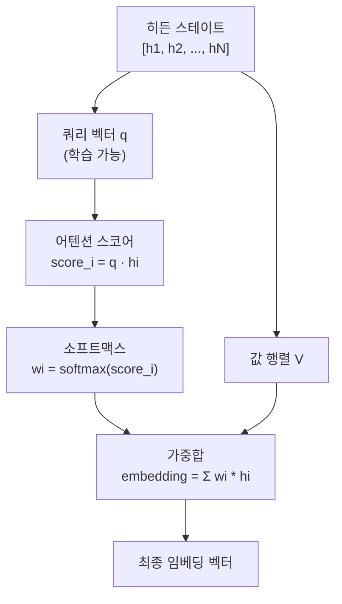

# 어텐션 풀링 전략 (가중치 기반)

## 정의

어텐션 풀링(attention pooling 또는 weighted attention pooling)은 시퀀스의 각 토큰 히든 스테이트에 **학습된 가중치**를 곱해 가중합으로 임베딩을 생성하는 풀링 방식이다. 단순 평균(mean pooling)이 모든 토큰을 동등하게 취급하는 것과 달리, 어텐션 풀링은 **위치별, 의미별 중요도를 학습**해 더 풍부한 문장 표현을 만든다.



위 다이어그램은 어텐션 쿼리 벡터가 각 토큰의 중요도를 계산하고 가중합으로 임베딩을 만드는 흐름을 나타낸다.

---

## 기본 원리

### 수학적 정의

입력 시퀀스의 히든 스테이트 행렬 $H \in \mathbb{R}^{N \times d}$가 주어졌을 때:

$$e_i = \tanh(W_a h_i + b_a)$$
$$\alpha_i = \text{softmax}(v^T e_i)$$
$$\text{embedding} = \sum_{i=1}^{N} \alpha_i h_i$$

여기서:
- $W_a \in \mathbb{R}^{d_a \times d}$: 어텐션 가중치 행렬 (학습 가능)
- $v \in \mathbb{R}^{d_a}$: 컨텍스트 벡터 (학습 가능)
- $\alpha_i$: 각 토큰의 정규화된 중요도 가중치

### 다중 헤드 어텐션 풀링

단일 쿼리 벡터 대신 복수의 헤드를 사용해 여러 관점에서 토큰 중요도를 측정할 수 있다:

$$\text{embedding} = \text{Concat}(\text{head}_1, ..., \text{head}_k) W^O$$

각 헤드는 다른 "관점"의 중요도를 학습하며, 최종 임베딩은 이들의 연결(concatenation)이다.

---

## 구현

### 단순 어텐션 풀링

```python
import torch
import torch.nn as nn
from transformers import AutoTokenizer, AutoModel

class AttentionPooling(nn.Module):
    def __init__(self, hidden_dim: int, attention_dim: int = 256):
        super().__init__()
        self.attention_fc = nn.Linear(hidden_dim, attention_dim)
        self.context_vector = nn.Parameter(torch.randn(attention_dim))

    def forward(
        self,
        hidden_states: torch.Tensor,   # (batch, seq_len, hidden_dim)
        attention_mask: torch.Tensor,  # (batch, seq_len)
    ) -> torch.Tensor:
        # 어텐션 스코어 계산
        e = torch.tanh(self.attention_fc(hidden_states))  # (batch, seq_len, attn_dim)
        scores = torch.matmul(e, self.context_vector)     # (batch, seq_len)

        # 패딩 토큰 마스킹 (매우 작은 값으로)
        scores = scores.masked_fill(attention_mask == 0, -1e9)

        # 소프트맥스로 정규화
        weights = torch.softmax(scores, dim=-1)  # (batch, seq_len)

        # 가중합
        embedding = torch.bmm(
            weights.unsqueeze(1),  # (batch, 1, seq_len)
            hidden_states          # (batch, seq_len, hidden_dim)
        ).squeeze(1)               # (batch, hidden_dim)

        return embedding


class EmbeddingModelWithAttentionPooling(nn.Module):
    def __init__(self, model_name: str):
        super().__init__()
        self.encoder = AutoModel.from_pretrained(model_name)
        hidden_dim = self.encoder.config.hidden_size
        self.pooling = AttentionPooling(hidden_dim)

    def forward(self, input_ids, attention_mask):
        outputs = self.encoder(
            input_ids=input_ids,
            attention_mask=attention_mask
        )
        return self.pooling(outputs.last_hidden_state, attention_mask)
```

### 다중 헤드 어텐션 풀링

```python
class MultiHeadAttentionPooling(nn.Module):
    def __init__(self, hidden_dim: int, num_heads: int = 4):
        super().__init__()
        self.num_heads = num_heads
        head_dim = hidden_dim // num_heads
        # 각 헤드별 독립적인 어텐션 파라미터
        self.attention_fc = nn.Linear(hidden_dim, num_heads)

    def forward(self, hidden_states: torch.Tensor, attention_mask: torch.Tensor) -> torch.Tensor:
        # (batch, seq_len, num_heads)
        scores = self.attention_fc(hidden_states)
        scores = scores.masked_fill(
            attention_mask.unsqueeze(-1) == 0, -1e9
        )
        weights = torch.softmax(scores, dim=1)  # (batch, seq_len, num_heads)

        # 헤드별 가중합 후 연결
        # (batch, num_heads, hidden_dim/num_heads) 효과
        weighted = torch.einsum("bsh,bsd->bhd", weights, hidden_states)
        # (batch, hidden_dim)
        return weighted.reshape(weighted.size(0), -1)
```

---

## 특성과 동작

### 어텐션 가중치 시각화

어텐션 풀링의 핵심 장점 중 하나는 **어떤 토큰이 임베딩에 기여했는지 해석 가능**하다는 점이다:

```python
def visualize_attention_weights(
    model: AttentionPooling,
    tokens: list[str],
    hidden_states: torch.Tensor,
    attention_mask: torch.Tensor
) -> dict:
    e = torch.tanh(model.attention_fc(hidden_states))
    scores = torch.matmul(e, model.context_vector)
    scores = scores.masked_fill(attention_mask == 0, -1e9)
    weights = torch.softmax(scores, dim=-1)

    return {
        token: weight.item()
        for token, weight in zip(tokens, weights[0])
    }
```

예를 들어 질문 "서울의 인구는 얼마인가?"에서는 "서울", "인구"에 높은 가중치가 부여되고 "의", "는" 같은 조사에는 낮은 가중치가 부여되는 경향이 있다.

### 위치 편향 학습

어텐션 풀링은 위치별 편향도 학습할 수 있다. 예를 들어 요약 태스크에서 학습된 모델은 시퀀스 앞부분(주제문)에 높은 가중치를 부여하는 경향을 보이기도 한다.

---

## 풀링 전략 비교

| 전략 | 계산 방식 | 학습 가능 파라미터 | 해석 가능성 |
|------|-----------|-------------------|-------------|
| Mean pooling | 균등 평균 | 없음 | 낮음 |
| Max pooling | 각 차원 최대값 | 없음 | 낮음 |
| CLS pooling | CLS 토큰 직접 사용 | 없음 (사전학습 의존) | 낮음 |
| Last token pooling | 마지막 토큰 사용 | 없음 | 낮음 |
| **어텐션 풀링** | **학습된 가중합** | **있음 (어텐션 파라미터)** | **높음** |

---

## 장단점

### 장점

- **표현력**: 토큰 중요도를 태스크에 맞게 학습 -> 다운스트림 성능 향상
- **해석 가능성**: 어텐션 가중치로 어떤 토큰이 임베딩에 기여했는지 확인 가능
- **유연성**: 단일/다중 헤드, 쿼리 벡터 구성 등 다양한 변형 가능
- **태스크 적응**: 다른 태스크에 fine-tuning 시 풀링 파라미터도 함께 적응

### 단점

- **추가 파라미터**: 어텐션 레이어만큼의 파라미터 추가 필요
- **훈련 데이터 의존**: 충분한 라벨 데이터 없이는 mean pooling보다 나쁠 수 있음
- **구현 복잡도**: 단순 mean/CLS 풀링보다 구현이 복잡
- **추론 오버헤드**: 추가 행렬 연산 필요 (미미하지만 존재)

---

## 실무 적용 패턴

### fine-tuning 시 권장 설정

```python
# 어텐션 풀링 파라미터는 더 높은 학습률 적용 권장
optimizer = torch.optim.AdamW([
    {"params": model.encoder.parameters(), "lr": 2e-5},
    {"params": model.pooling.parameters(), "lr": 1e-4},  # 10배 높은 LR
])
```

### 정보 검색 vs. 의미 유사도

- **정보 검색 태스크**: 핵심 키워드 토큰에 집중하는 단일 헤드 어텐션 효과적
- **의미 유사도 태스크**: 여러 의미 측면을 포착하는 다중 헤드 어텐션 효과적
- **분류 태스크**: CLS 토큰 + 가벼운 어텐션 풀링 조합이 흔히 사용됨

---

## 관련 문서

- [[token-pooling-strategies]] - 전체 풀링 전략 비교표
- [[mean-vs-cls-pooling]] - Mean vs CLS 풀링 심층 비교
- [[last-token-pooling-decoder]] - 디코더 LLM의 마지막 토큰 풀링
- [[embedding-models-for-rag]] - RAG 임베딩 모델 선택 가이드
- [[embedding-finetuning]] - 임베딩 모델 파인튜닝 전략
