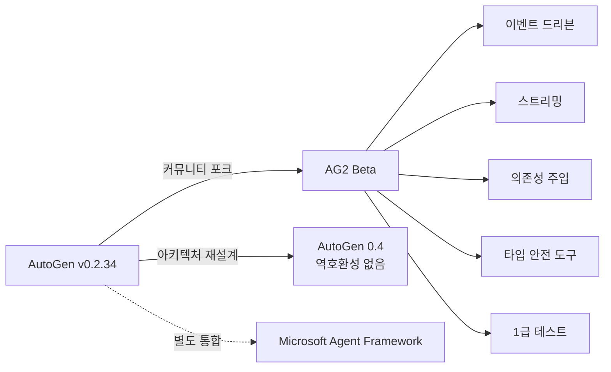

## 개요

AG2는 Microsoft의 AutoGen 프로젝트가 "오픈소스 AgentOS"를 표방하며 완전히 재브랜딩한 멀티에이전트 프레임워크다. 단순 이름 변경이 아닌, 이벤트 드리븐 아키텍처와 멀티 프로바이더 LLM 지원을 중심으로 처음부터 다시 작성되었다. AG2 Beta(`autogen.beta`)가 이 새로운 아키텍처의 핵심이며, 대화 기반(Conversable Agents) 에이전트 간 구조화된 대화를 통한 협업이 설계 철학이다. [[orchestrator-worker-pattern|오케스트레이터-워커 패턴]]보다 동적인 대화 기반 오케스트레이션을 채택하며, [[multi-agent-orchestration|멀티에이전트 오케스트레이션]]의 창발적(emergent) 경로 탐색 측면에서 연구 맥락에서 자주 참조된다.

## 핵심 특징

- **이벤트 드리븐 아키텍처**: 기존 동기식 패턴을 대체하는 반응형 워크플로우
- **Conversable Agents**: 구조화된 대화를 통한 에이전트 간 통신 및 협업
- **다양한 교환 패턴**: 그룹 채팅, 스웜(Swarm), 1:1 에이전트 교환
- **멀티 프로바이더 LLM**: 유연한 모델 선택이 가능한 멀티 프로바이더 지원
- **의존성 주입**: 타입 정의된 도구와 의존성 주입 패턴
- **1급 테스트 프레임워크**: 체계적 검증을 위한 내장 테스트 기능
- **스트리밍 지원**: 반응형 워크플로우를 위한 네이티브 스트리밍

## 기술 상세

### AutoGen에서 AG2로의 분리 (2024년 11월)

2024년 11월 11일, AutoGen의 원본 개발자들이 Microsoft 저장소에서 코드를 분기하여 ag2ai GitHub 조직 아래에서 재출시했다. "AG2는 AutoGen 0.2.34이며, 새로운 프레임워크가 아니라 새로운 이름으로 계속되는 것"이다. 기존 AutoGen 코드는 수정 없이 작동한다.

이 분리로 세 갈래 경로가 생겼다:
- **AG2**: 커뮤니티 포크, 원본 개발자들이 유지보수 (MIT 라이선스)
- **Microsoft AutoGen 0.4**: 완전 아키텍처 재설계, 역호환성 없음
- **[[microsoft-agent-framework]]**: Semantic Kernel + AutoGen 통합, 엔터프라이즈 최적화

### 에이전트 교환 패턴

| 패턴 | 설명 | 용도 |
|---|---|---|
| 1:1 교환 | 두 에이전트 간 직접 대화 | 단순 위임, 검토 |
| 그룹 채팅 | 다수 에이전트의 토론/합의 | 멀티 관점 문제 해결 |
| 스웜 | 동적 에이전트 풀에서 작업 분배 | 대규모 병렬 처리 |

### 설계 원칙

- **대화 기반 오케스트레이션**: 워크플로우가 사전에 규정되지 않고 에이전트 간 대화에서 동적으로 창발(emergent)한다. "솔루션 경로를 사전에 알 수 없을 때" 특히 효과적이다.
- **네이티브 코드 실행**: Docker 기반 보안 컨테이너에서 Python을 격리 실행하는 네이티브 샌드박스 제공 (다른 프레임워크와의 핵심 차별점)
- **이벤트 드리븐 상호작용**: 기존 폴링/동기 패턴을 이벤트 기반으로 전환
- **2계층 API**: Core API(저수준 메시지/에이전트 제어)와 AgentChat API(고수준 추상화)를 모두 제공

### GroupChat 관리

GroupChat에서 발화자 선택을 제어하는 세 가지 방식:
- **LLM 추론**: 모델이 맥락에 따라 다음 발화자를 결정
- **라운드로빈**: 순서대로 돌아가며 발화
- **커스텀 로직**: 사용자 정의 규칙으로 발화자 선택

### AutoGen Studio

비기술 사용자를 위한 드래그앤드롭 시각 인터페이스로, 에이전트 워크플로우를 시각적으로 구성할 수 있다. 로컬에서 무료로 실행 가능하다.

### AG2 vs 다른 프레임워크

| 항목 | AG2 | [[crewai]] | [[microsoft-agent-framework]] |
|---|---|---|---|
| 오케스트레이션 | 대화 기반 | 역할 기반 | 그래프 기반 |
| 아키텍처 | 이벤트 드리븐 | 작업 드리븐 | 워크플로우 그래프 |
| 라이선스 | MIT | MIT + Commercial | MIT |
| 엔터프라이즈 | 커뮤니티 중심 | AMP 플랫폼 | Azure 통합 |
| 언어 | Python만 | Python만 | Python, JS/TS |
| 코드 실행 | Docker 네이티브 샌드박스 | 직접 설정 필요 | 내장 |
| 시각 도구 | AutoGen Studio | 없음 | 없음 |

### 실전 벤치마크

| 지표 | AG2 | CrewAI |
|------|-----|--------|
| 초기 설정 시간 | ~45분 | ~20분 |
| 3-에이전트 워크플로우 코드 | ~60줄 | ~40줄 |
| 5-에이전트 파이프라인 실행 | ~78초 | ~62초 |
| 월간 설치 수 | ~100,000 | ~1,300,000 |

### 적합한 사용 사례

AG2는 **복잡한 기술 작업, 코드 실행 워크플로우, 동적 멀티에이전트 협상**에 최적화되어 있다. 연구와 프로토타이핑에 이상적이나, 프로덕션 배포에는 엔터프라이즈 보안 기능 부재, 공식 관찰성(observability) 플랫폼 부재, 문서 일관성 부족 등의 한계가 있다.

## 관련 문서

- [[microsoft-agent-framework]] - Semantic Kernel + AutoGen 통합 (Microsoft 측 후속)
- [[crewai]] - 역할 기반 멀티에이전트 오케스트레이션
- [[a2a-protocol]] - 에이전트 간 통신 프로토콜
- [[orchestrator-worker-pattern]] - 오케스트레이터-워커 패턴
