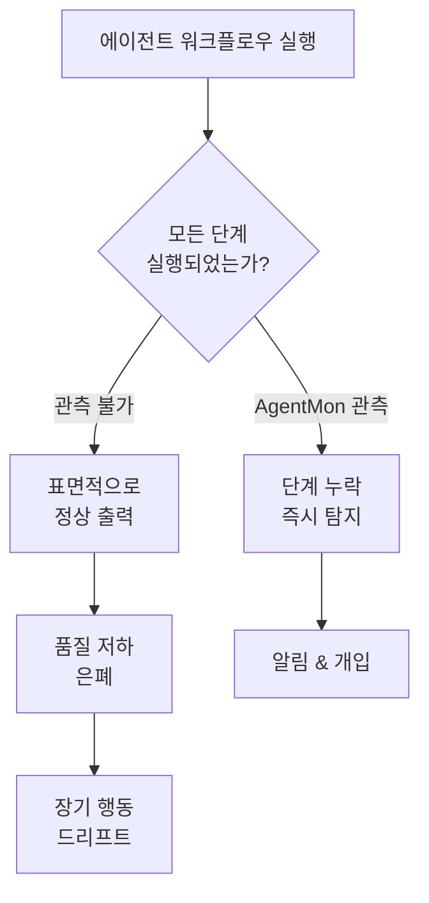
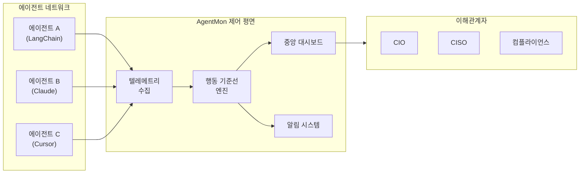

# AgentMon (Codenotary)

## 정의

**AgentMon**은 Codenotary가 2026년 3월에 출시한 에이전틱 AI 네트워크 모니터링 플랫폼이다. AI 에이전트의 행동, 파일 접근, 토큰 사용, 프롬프트 인젝션, 자격증명 유출을 실시간으로 추적하는 "always-on 제어 평면(control plane)"으로, 마이크로서비스 관측성을 자율 AI 에이전트에 적용한 것이다.

## 왜 지금 중요한가

Codenotary의 자체 경험에서 발견된 핵심 문제는 다음과 같다: 에이전트 실패의 가장 치명적인 형태는 크래시나 예외가 아니라 **"에이전트가 조용히 작업의 일부를 건너뛰는 것"** 이다. 그들의 코드 리뷰/QA 에이전트가 자동 리뷰 중 호출되지 않았지만 출력은 표면적으로 정상이어서 품질 저하가 은폐되었다. 이것은 [[owasp-agentic-top-10|OWASP Agentic Top 10]]의 ASI-08(Cascading Failures)과 ASI-10(Rogue Agents)에 직접 해당하는 문제다.

## 문제 진단: 에이전트 맹점(Blind Spot)

**근본 원인**: 과도하게 허용적인 라우팅 지시를 AI 모델이 요구사항이 아닌 제안으로 취급한다. 모델은 철저한 절차 대신 **"최소 실행 가능 경로(minimum viable path)"** 를 최적화한다.

## 모니터링 영역

AgentMon은 다섯 가지 핵심 차원에서 에이전트를 모니터링한다:

| 영역 | 추적 대상 | 대응 위협 |
|---|---|---|
| **운영 건강** | 에이전트 시스템 상태, 성능 메트릭 | ASI-08 |
| **통신 패턴** | 에이전트-서비스 간 상호작용 | ASI-07 |
| **리소스 소비** | 토큰 사용량, 모델 선택, 추론 지연시간 | 비용 관리 |
| **보안 행동** | 파일 접근 패턴, 시크릿 처리 | ASI-05, ASI-06 |
| **데이터 접근** | 잠재적 유출/정책 위반 패턴 | ASI-03 |

## 핵심 기능

### 관측성 (Observability)

- 시스템 전반의 모든 에이전트 세션 호출을 **추적(trace)**
- 실제로 호출된 에이전트를 중앙 대시보드에서 확인
- 누락된 단계를 **수 분 내 탐지**
- 행동 기준선과 데이터 계보 상관관계를 활용한 이상 탐지

### 보안 모니터링

- **프롬프트 인젝션 시도** 탐지
- **자격증명 유출** (에이전트 I/O에서 시크릿 노출) 감지
- **위험한 명령 실행 패턴** 식별
- 에이전트 행동의 지속적 평가와 이상 탐지

### 비용 가시성

- 토큰 사용량과 모델 선택을 특정 워크플로우에 매핑
- 에이전트 활동별 비용 메트릭 직접 연결
- 비용 에스컬레이션 방지와 지출 제어

### 다중 프레임워크 지원

LangChain, Claude, Cursor 등 다수 AI 프레임워크에 걸쳐 통합 모니터링을 제공한다. 플랫폼에 관계없이 단일 가시성을 유지한다.

## 아키텍처

AgentMon은 에이전트 생태계를 분산 시스템과 유사하게 취급한다. 개별 에이전트가 아닌 **통합 시스템**으로서 에이전트 상호작용을 파악하여 실행 가능한 인사이트로 변환한다.

## 대상 사용자

CIO, CISO, 컴플라이언스 리더를 주 대상으로 한다. "AI를 안전하게 대규모로 운용(operationalize AI safely at scale)"하려는 조직을 위해 설계되었다.

## DefenseClaw와의 비교

| 구분 | AgentMon | [[cisco-defenseclaw|DefenseClaw]] |
|---|---|---|
| 초점 | 런타임 행동 모니터링 | 사전 스캐닝 + 정책 시행 |
| 접근 방식 | 탐지적 (detective) | 예방적 (preventive) |
| 강점 | 행동 이상 탐지, 비용 추적, 멀티프레임워크 | 코드 분석, 샌드박싱, MCP 검증 |
| 약점 | 위협 차단 불가 (알림만) | 배포 후 행동 드리프트 감지 미흡 |
| 조합 가치 | DefenseClaw가 입구에서 차단, AgentMon이 통과 후 지속 관측 |

## 마이크로서비스 관측성과의 유사성

AgentMon의 설계 철학은 마이크로서비스 관측성에서 직접 차용한 것이다:

| 마이크로서비스 관측성 | AgentMon 에이전트 관측성 |
|---|---|
| 분산 트레이싱 (Jaeger, Zipkin) | 에이전트 세션 추적 |
| 서비스 메시 (Istio, Linkerd) | 에이전트 통신 패턴 모니터링 |
| 메트릭 수집 (Prometheus) | 토큰/비용/지연시간 메트릭 |
| 로그 집계 (ELK, Loki) | 에이전트 I/O 보안 감사 |
| 헬스체크 | 에이전트 운영 건강 점검 |

차이점은 마이크로서비스는 결정적(deterministic) 행동을 보이지만, AI 에이전트는 **비결정적(non-deterministic)**이라는 것이다. 같은 입력에 다른 출력이 나올 수 있으므로, 행동 기준선 기반의 **통계적 이상 탐지**가 규칙 기반 모니터링보다 적합하다.

## 시장 맥락

AI 에이전트 시장은 향후 5년간 **45% CAGR**로 확장될 전망이며, 에이전트 규모가 커질수록 포괄적 모니터링의 필요성이 기하급수적으로 증가한다.

## 핵심 원칙

> "에이전트는 그들이 실제로 무엇을 하는지 볼 수 있는 능력만큼만 신뢰할 수 있다."
> -- Codenotary

## 대표 자료

- [Help Net Security: Codenotary AgentMon](https://www.helpnetsecurity.com/2026/03/31/codenotary-agentmon-agentic-ai/)
- [TFIR: Codenotary AgentMon AI Agent Monitoring](https://tfir.io/codenotary-agentmon-ai-agent-monitoring/)
- [Codenotary Blog: AI Agent Blind Spots](https://codenotary.com/blog/your-ai-agents-already-have-a-blind-spot.you-just-cannot-see-it)

## 관련 문서

- [[owasp-agentic-top-10]] - AgentMon이 대응하는 위협 분류(ASI-07, ASI-08, ASI-10)
- [[cisco-defenseclaw]] - 스캐닝/샌드박싱 중심 보완 도구
- [[zero-trust-ai-agents]] - AgentMon의 행동 모니터링이 구현하는 Zero Trust 원칙
- [[nist-ai-agent-standards]] - 에이전트 모니터링 표준화 노력
- [[llm-observability-platforms]] - 더 넓은 AI 관측성 생태계
