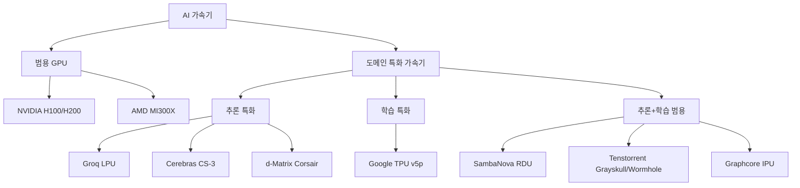
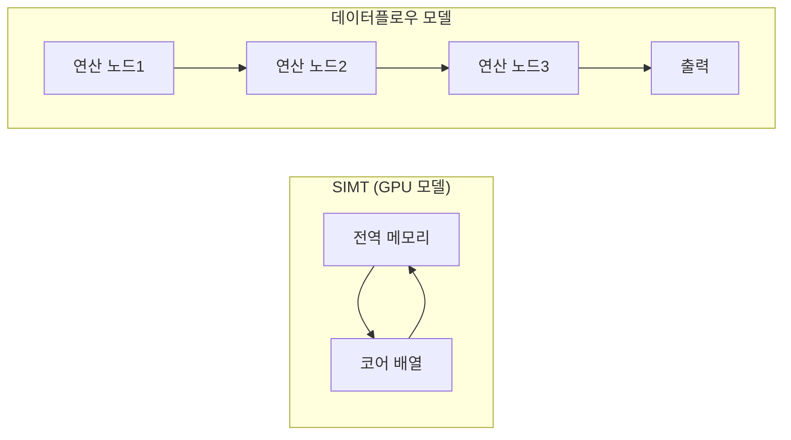
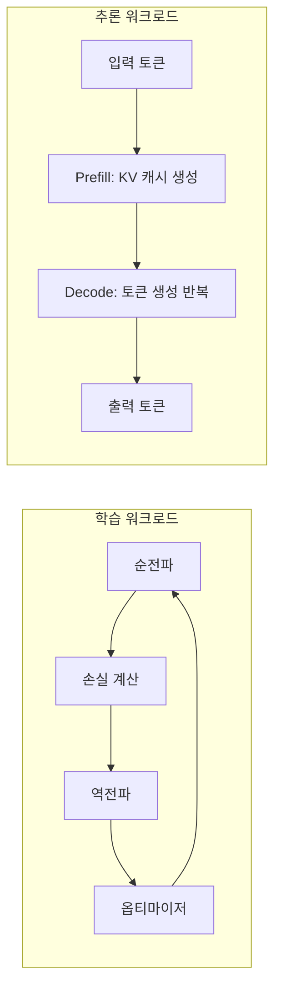
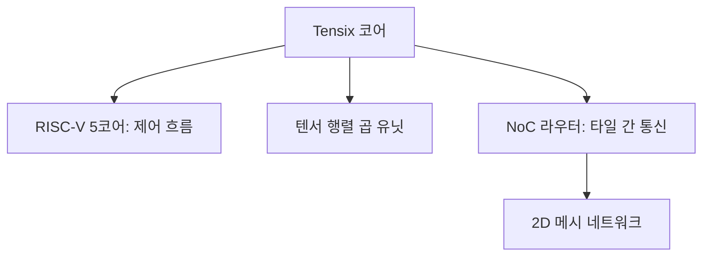
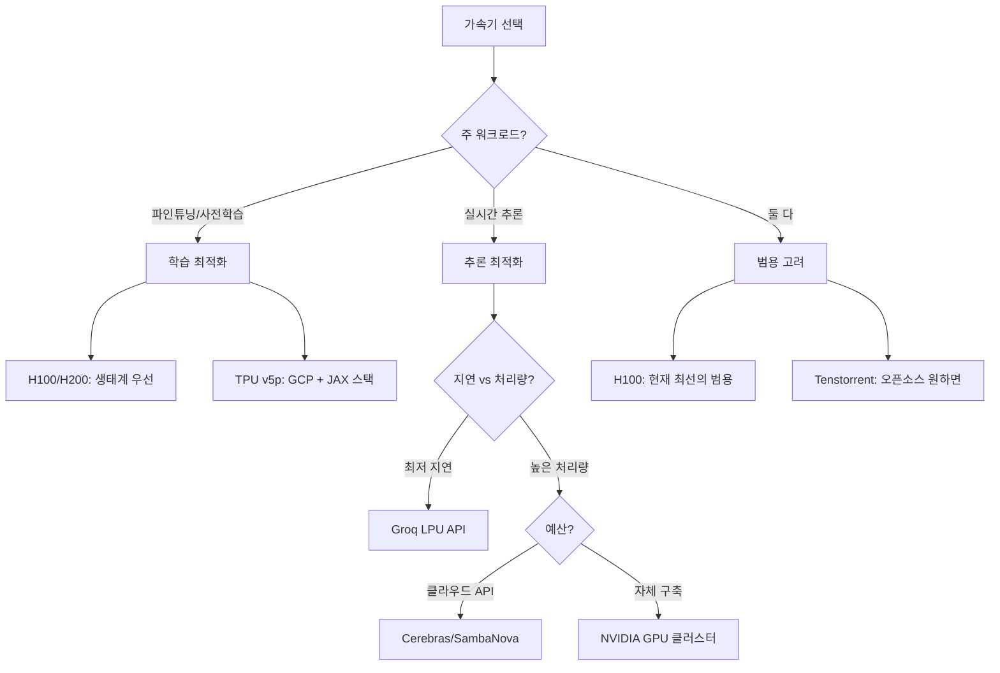

# AI 가속기 (AI Accelerators)

AI 가속기(AI Accelerator)는 딥러닝 학습(training)과 추론(inference) 워크로드를 범용 CPU보다 수십~수천 배 빠르게 처리하기 위해 설계된 특수 목적 프로세서 계열이다. 2012년 AlexNet이 GPU 병렬 연산의 잠재력을 증명한 이후, GPU 외에도 TPU·LPU·RDU·WSE 등 다양한 아키텍처가 등장해 각기 다른 트레이드오프를 제시하고 있다.

## AI 가속기 생태계 전체 지형

위 계층은 가속기를 범용 GPU와 도메인 특화(DSA: Domain-Specific Architecture)로 크게 나누고, DSA를 다시 추론 특화/학습 특화/범용 세 축으로 분류한다.

## 핵심 아키텍처 패러다임

### SIMT (Single Instruction Multiple Threads) - GPU 전통 모델

NVIDIA GPU가 채택한 방식. 수천 개의 CUDA 코어가 동일 명령을 서로 다른 데이터에 동시 실행한다.

- **장점**: 범용성, 풍부한 소프트웨어 생태계(CUDA, cuDNN, cuBLAS)
- **단점**: 메모리 대역폭(bandwidth) 병목 — 계산 대비 데이터 이동 비용이 큼
- **대표 칩**: NVIDIA A100/H100/H200, AMD MI300X

핵심 지표:
- **FLOPS**: 단순 연산 성능 (H100 SXM: BF16 989 TFLOPS)
- **HBM 대역폭**: 메모리 ↔ 컴퓨트 간 이동 속도 (H100: 3.35 TB/s)
- **NVLink/NVSwitch**: GPU 간 고속 연결 (H100 NVSwitch: 900 GB/s 양방향)

### 데이터플로우 아키텍처 (Dataflow Architecture)

데이터가 정적으로 배치된 연산 그래프를 따라 흐르는 구조. 제어 흐름(control flow)이 아닌 데이터 의존성이 실행 순서를 결정한다.

데이터플로우 모델의 핵심 이점은 **온-칩 메모리 재사용**이다. 중간 결과를 DRAM에 내보내지 않고 근접 연산 노드로 직접 전달해 메모리 대역폭 소모를 최소화한다.

- **SambaNova RDU**: 데이터플로우 기반 학습+추론 통합
- **Graphcore IPU**: Bulk Synchronous Parallel(BSP) 데이터플로우
- **Tenstorrent Grayskull/Wormhole**: 텐서 타일 기반 데이터플로우

### 웨이퍼-스케일 통합 (Wafer-Scale Integration)

Cerebras가 개척한 방식. 표준 다이(die) 수십 개를 패키지로 연결하는 대신 단일 실리콘 웨이퍼 전체를 하나의 칩으로 사용한다.

- **Cerebras WSE-3**: 900,000개 코어, 44 GB 온-칩 SRAM, 21 PB/s 온-칩 대역폭
- DRAM 접근 없이 거대 모델의 레이어 전체를 온-칩에 보유 가능
- 단점: 수율(yield) 문제, 단일 제품군에 묶임

### LPU (Language Processing Unit) - 순차 추론 특화

Groq가 개발한 아키텍처. LLM의 토큰-by-토큰 자기회귀 디코딩(autoregressive decoding) 특성에 최적화된 구조.

- **결정론적 실행**: 스케줄러/캐시 미스 없이 컴파일 타임에 실행 타이밍이 고정
- **SRAM-first**: DRAM 대신 대용량 SRAM 배열을 컴퓨트 가까이 배치
- **낮은 지연**: 단일 쿼리 기준 TTFT(Time-To-First-Token) 최소화에 강점
- [[groq-cloud-api]] 참조

## 주요 가속기 비교표

| 가속기 | 제조사 | 아키텍처 유형 | 주 용도 | 메모리 구조 | 특이점 |
|--------|--------|--------------|---------|------------|--------|
| H100 SXM | NVIDIA | SIMT GPU | 학습 + 추론 | HBM3 80GB | NVLink 4세대, Transformer Engine |
| H200 SXM | NVIDIA | SIMT GPU | 학습 + 추론 | HBM3e 141GB | H100 대비 메모리 1.76x |
| MI300X | AMD | SIMT GPU | 학습 + 추론 | HBM3 192GB | 3D 스택 통합, ROCm |
| TPU v5p | Google | 행렬 곱 특화 | 학습 특화 | HBM2e | Pod 내 ICI 고속 상호연결 |
| CS-3 (WSE-3) | Cerebras | 웨이퍼 스케일 | 추론 특화 | 44 GB SRAM | 온-칩 대역폭 21 PB/s |
| LPU (GroqChip) | Groq | LPU 데이터플로우 | 추론 특화 | SRAM 기반 | 결정론적 실행, 최저 지연 |
| RDU | SambaNova | 데이터플로우 | 학습 + 추론 | HBM + 온-칩 | 소프트웨어 정의 하드웨어 |
| Corsair | d-Matrix | 디지털 인-메모리 | 추론 특화 | DRAM-내장 컴퓨트 | 메모리-컴퓨트 통합 |
| Grayskull | Tenstorrent | 텐서 타일 | 학습 + 추론 | DRAM | RISC-V + Tensix 코어 |
| Wormhole | Tenstorrent | 텐서 타일 | 학습 + 추론 | GDDR6/HBM | 8코어 RISC-V, 고속 Ethernet |

## 학습 가속기 vs 추론 가속기

학습(training)과 추론(inference) 워크로드는 하드웨어 요구사항이 근본적으로 다르다.

### 학습 요구사항
- **FP16/BF16 고정밀도**: 그라디언트 누적 오차 방지
- **대형 배치**: 통계적 안정성 (배치 크기 1,024~65,536)
- **통신 대역폭**: 다중 칩 그라디언트 집계 (AllReduce)
- **메모리 용량**: 파라미터 + 그라디언트 + 옵티마이저 상태 (모델 크기의 3~12x)

### 추론 요구사항
- **낮은 지연(latency)**: TTFT, TPOT(Time-Per-Output-Token)
- **높은 처리량(throughput)**: 동시 요청 처리 (배치 추론)
- **양자화 지원**: INT4/INT8 연산으로 메모리 절감
- **KV 캐시 관리**: Prefill 결과를 Decode 단계에서 재사용

---

**결정적 차이**: 학습은 **연산 집약적(compute-bound)**, 추론은 **메모리 대역폭 집약적(memory-bandwidth-bound)** 경향이 강하다. 디코딩 단계에서 배치 크기 1이면 FLOPS 대부분이 낭비되고 메모리 대역폭이 병목이 된다.

## TPU (Tensor Processing Unit) - Google의 행렬 곱 가속기

Google이 내부 추론 워크로드에서 출발해 학습까지 확장한 ASIC(Application-Specific Integrated Circuit).

- **MXU (Matrix Multiply Unit)**: 128×128 systolic array로 행렬 곱 가속
- **세대별 진화**: TPU v1(2016 추론) → v2(2017 학습 지원) → v4(2021) → v5p(2023)
- **Pod 연결**: ICI(Inter-Chip Interconnect)로 4,096칩을 단일 컴퓨팅 공간으로 연결
- **Cloud TPU**: Google Cloud에서 [[gemini-models]] 학습 기반 인프라로 사용

## 디지털 인-메모리 컴퓨팅 (In-Memory Computing)

d-Matrix의 Corsair가 채택한 방식. 기존 폰 노이만 병목(데이터를 메모리에서 CPU로 이동하는 비용)을 메모리 안에서 연산 수행으로 우회한다.

- 가중치(weight)를 DRAM에 저장한 채 근처 연산 유닛에서 곱셈 수행
- 메모리 버스 대역폭 소모 최소화 → 추론 에너지 효율 향상
- 현재는 추론 전용, 특히 양자화(INT8/INT4) 배포에 강점
- [[d-matrix-corsair]] 참조

## Tenstorrent와 Tensix 코어

Tenstorrent(짐 켈러 창업)의 Tensix 코어는 하나의 타일 안에 RISC-V 프로세서 + 텐서 연산 유닛 + 라우터를 통합한다.

- Grayskull: 120 Tensix, PCIe
- Wormhole: 80 Tensix, 고속 Ethernet(100 GbE) NoC
- 오픈소스 소프트웨어 스택(TT-Metalium, TT-NN) 제공
- [[tenstorrent-grayskull]] 참조

## SambaNova RDU (Reconfigurable Dataflow Unit)

SambaNova의 RDU는 컴파일 타임에 모델의 데이터플로우 그래프를 하드웨어에 매핑한다.

- **소프트웨어 정의**: PyTorch 모델을 컴파일러가 HW 실행 계획으로 변환
- **학습+추론 통합**: 동일 칩에서 전환 가능
- **자연어 특화 클라우드**: SambaNova Cloud에서 Llama/DeepSeek 추론 서비스 운영
- [[sambanova-systems-cloud]] 참조

## 성능 지표 해석 가이드

| 지표 | 의미 | 학습 중요도 | 추론 중요도 |
|------|------|------------|------------|
| TFLOPS (BF16) | 초당 부동소수점 연산 수 | 높음 | 중간 |
| HBM 대역폭 (TB/s) | DRAM-칩 간 데이터 이동 속도 | 중간 | 매우 높음 |
| 온-칩 메모리 용량 | SRAM/캐시 크기 | 중간 | 높음 |
| MFU (Model FLOP Utilization) | 이론 대비 실제 FLOPS 활용률 | 핵심 | 참고 |
| TTFT (ms) | 첫 토큰까지 지연 | 해당 없음 | 핵심 |
| TPOT (ms/tok) | 토큰당 생성 시간 | 해당 없음 | 핵심 |

MFU는 학습 효율의 핵심 지표다. H100 클러스터에서 Llama-3 405B를 학습할 때 MFU 38-42%가 현실적 목표치다.

## 클라우드 추론 서비스로서의 가속기

실무에서 직접 하드웨어를 구매하지 않고 API를 통해 각 가속기를 활용할 수 있다.

| 서비스 | 기반 가속기 | 강점 |
|--------|------------|------|
| [[groq-cloud-api]] | GroqChip LPU | 최저 지연, 고속 토큰 생성 |
| [[cerebras-cloud-inference]] | Cerebras WSE | 온-칩 메모리, 거대 배치 |
| [[sambanova-systems-cloud]] | SambaNova RDU | 데이터플로우 추론 효율 |
| [[d-matrix-corsair]] | d-Matrix Corsair | 인-메모리 컴퓨팅 |
| [[tenstorrent-grayskull]] | Tenstorrent HW | 오픈소스 스택 |

## 소프트웨어 생태계와 채택 장벽

GPU(NVIDIA) 생태계가 압도적인 이유는 하드웨어 성능만이 아니다.

- **CUDA 생태계**: cuDNN, cuBLAS, NCCL 등 수십 년 축적
- **PyTorch/JAX 통합**: GPU는 네이티브, 대안 칩은 컴파일러 레이어 필요
- **전문 인력**: CUDA 프로그래머 >> 기타 가속기 전문가

대안 가속기의 채택 전략:
1. **컴파일러 자동화**: PyTorch/JAX 프론트엔드 → 벡엔드 컴파일러 (XLA, MLIR)
2. **특정 워크로드 집중**: 추론만, 특정 모델 크기만 지원
3. **오픈소스 스택**: Tenstorrent TT-Metalium, Groq GroqAPI

## 실무 선택 가이드

## 관련 문서

- [[groq-cloud-api]] - Groq LPU 기반 클라우드 추론 API
- [[cerebras-cloud-inference]] - Cerebras 웨이퍼-스케일 추론 서비스
- [[sambanova-systems-cloud]] - SambaNova RDU 클라우드 플랫폼
- [[d-matrix-corsair]] - d-Matrix 인-메모리 컴퓨팅 가속기
- [[tenstorrent-grayskull]] - Tenstorrent Tensix 코어 아키텍처
- [[inference]] - LLM 추론 최적화 개요
- [[gemini-models]] - TPU 기반 학습의 대표 사례
