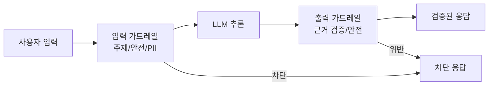

## 개요

AI 에이전트 가드레일은 [[llm-security-owasp|LLM]]의 입출력에 프로그래밍 가능한 안전장치를 적용하는 프레임워크다. 대표적으로 NVIDIA의 **NeMo Guardrails**는 대화 흐름 제어와 주제 관리에 특화되어 있고, **Guardrails AI**는 LLM 출력의 구조화 검증과 데이터 품질 보장에 초점을 둔다. 프로덕션 에이전트에서 환각 방지, 주제 이탈 차단, PII 보호, 탈옥 방지 등을 구현하는 핵심 인프라다.

## 핵심 특징

### NeMo Guardrails

NVIDIA가 개발한 오픈소스 가드레일 프레임워크로, 에이전트 AI 앱의 안전성, 신뢰성, 정렬을 유지하는 미들웨어 레이어다.

**가드레일 유형**:
- **주제 제어(Topical)**: 대화가 허용된 주제 범위 내에 머무르도록 필터링
- **안전성(Safety)**: 유해 콘텐츠, 편향, 비윤리적 응답 차단
- **보안(Security)**: 탈옥 시도, 프롬프트 인젝션 방지
- **PII 감지**: 개인정보가 포함된 입출력 자동 탐지 및 마스킹
- **RAG 근거 검증**: 검색 결과에 기반한 응답인지 확인

**Colang**: NeMo 전용 도메인 특화 언어(DSL)로, 코드 작성 없이 가드레일 정책을 선언적으로 정의할 수 있다.

### Guardrails AI

LLM 출력의 구조화 검증에 특화된 오픈소스 프레임워크:

- **Guard 클래스**: 검증 파이프라인의 핵심 단위. 입력/출력에 다수의 Validator를 체이닝
- **Validator 생태계**: 정규식, 타입 체크, 의미 검증 등 다양한 검증기 제공
- **자동 재시도**: 검증 실패 시 LLM에 수정 요청을 자동으로 재전송

## 기술 상세

### NeMo Guardrails 아키텍처

### 프레임워크 통합

NeMo Guardrails는 주요 에이전트 프레임워크와 직접 통합된다:
- **LangChain / LangGraph**: 체인 내 가드레일 노드로 삽입
- **LlamaIndex**: 쿼리 파이프라인에 가드레일 추가
- **멀티에이전트 배포**: 에이전트 간 통신에도 가드레일 적용 가능

### NVIDIA NIM 마이크로서비스

콘텐츠 안전, 주제 제어, 탈옥 감지 모델이 NIM 마이크로서비스로 패키징되어 GPU 가속 저지연 추론을 지원한다. Nemotron 모델 기반의 사전 학습된 안전 모델이 Hugging Face와 NVIDIA 카탈로그에서 제공된다.

### 가드레일 프레임워크 전체 비교

| 프레임워크 | 주요 기능 | 지연 시간 | 적용 대상 |
|-----------|----------|----------|----------|
| **NeMo Guardrails** | 대화 흐름 제어, 주제 관리 | 50-200ms | 토픽 제한, 도구 접근 제어 |
| **Guardrails AI** | 구조화 출력 검증 | <50ms | 콘텐츠 검사, PII 탐지 |
| **Pydantic + Instructor** | 스키마 검증 | <5ms | 타입 안전 구조화 출력 |
| **Lakera Guard** | 보안 스크리닝 | <30ms | 프롬프트 인젝션, 공격 탐지 |
| **LLM Guard** | 입출력 스캐닝 | 50-150ms | 셀프 호스팅 콘텐츠 필터링 |

### 다층 방어(Defense-in-Depth) 아키텍처

프로덕션 시스템은 계층화된 보호를 구현한다:

| 레이어 | 기능 | 도구 예시 |
|--------|------|----------|
| Layer 1 | 입력 스크리닝 (인젝션 차단) | Lakera / LLM Guard |
| Layer 2 | 대화 흐름 제어 (주제/행동 제한) | NeMo Guardrails |
| Layer 3 | LLM 생성 (구조화 출력 포맷) | 모델 자체 |
| Layer 4 | 출력 검증 (스키마/콘텐츠 규칙) | Pydantic / Guardrails AI |
| Layer 5 | 비즈니스 로직 검사 | 레이트 리밋, 감사 로그, 휴먼 리뷰 |

### 핵심 구현 패턴

- **Guard-on-Every-Tool-Call**: 도구 이름, 파라미터, 신뢰도 점수를 실행 전 검증. 환각된 도구 호출과 데이터 손상 방지
- **Hallucination Detection with Grounding**: 2차 검증 모델로 출력이 검색 소스 문서와 일치하는지 확인. RAG 시스템에서 특히 중요
- **Multi-Agent Message Validation**: 에이전트 간 핸드오프에 신뢰도 임계값과 출처 귀속을 포함한 구조화된 검증 적용
- **Progressive Strictness Rollout**: 모니터 모드로 시작하여 소프트 적용 후 전체 차단으로 전환. 위양성(false positive) 영향 최소화

### 프로덕션 적용 고려사항

- **지연 시간**: Pydantic 검증기는 거의 감지 불가, Lakera API <30ms, GPU 가속 스캐닝 50-150ms, LLM 기반 검증 300-2000ms. 독립 검사는 병렬 실행으로 최적화
- **다층 방어**: 입력 가드레일과 출력 가드레일을 모두 적용하는 것이 안전
- **모니터링**: 가드레일 트리거 빈도와 차단 사유를 지속적으로 추적하여 정책 튜닝에 활용. 차단된 출력은 시스템 개선의 귀중한 신호
- **다국어/멀티모달**: 추론 기반 콘텐츠 안전 모델로 다국어 및 멀티모달 입력도 처리 가능
- **안티패턴 회피**: 시스템 프롬프트만으로 안전을 보장하려는 시도(제안적이지 강제적이지 않음), 에이전트 유형별 동일 가드레일 적용, 실패한 재시도로 인한 컨텍스트 윈도우 오염

### 조직 규모별 스택 선택

- **스타트업**: Instructor + Pydantic + Lakera 무료 티어
- **성장 단계**: Guardrails AI 추가로 콘텐츠 검증
- **엔터프라이즈**: NeMo 풀스택 + 환각 탐지 + 완전 감사 추적
- **셀프 호스팅**: LLM Guard(GPU) + NeMo + Pydantic (외부 API 의존 제로)

## 관련 문서

- [[human-in-the-loop-patterns]] - 인간 승인 패턴
- [[evolution-of-[[coding-agent|agent]]ic-patterns]] - 에이전트 패턴의 진화
- [[langfuse]] - LLM 옵저버빌리티 (가드레일 모니터링)
- [[portkey]] - AI 게이트웨이 (네트워크 레벨 가드레일)
