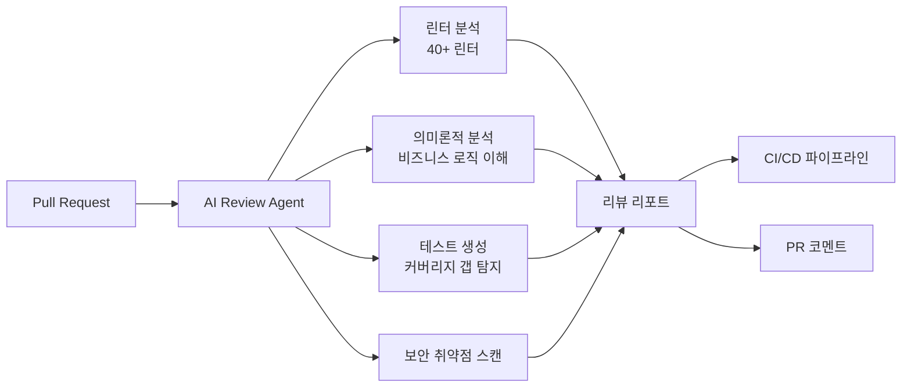

# AI 코드 리뷰 도구 (CodeRabbit / Qodo / Ellipsis)

## 개요

AI 코드 리뷰 도구는 풀 리퀘스트(PR) 단위로 코드 변경사항을 자동 분석하여 버그, 보안 취약점, 코드 스타일 위반을 탐지하고 개선안을 제시하는 자동화 도구다. 2026년 현재 CodeRabbit, Qodo, Ellipsis가 시장을 주도하며, 각각 린터 통합, 테스트 생성, 비용 효율성 측면에서 차별화된 강점을 보인다.

기존 정적 분석 도구(ESLint, Pylint 등)가 규칙 기반 패턴 매칭에 머물렀던 것과 달리, AI 코드 리뷰 도구는 코드의 의미론적 맥락을 이해하고 비즈니스 로직 수준의 결함까지 탐지할 수 있다. 엔터프라이즈 환경에서는 월 평균 800건 이상의 버그를 사전 차단하는 수준으로 효과가 검증되고 있다.

## 핵심 특징

### Qodo

- **Code Review Bench F1 스코어 64.3%**로 평가 대상 도구 중 최고 정확도 (2026년 기준)
- 다른 도구 대비 약 **2배의 버그 포착률** (Claude 포함 비교)
- Gartner Critical Capabilities for AI Assistants Report에서 코드 이해 분야 1위
- **73.8% 제안 수용률**: 대규모 환경에서 코드 제안의 73.8%가 수용됨
- 자동 테스트 생성 기능으로 커버리지 갭을 감지해 단위 테스트를 직접 작성
- 15개 이상의 에이전틱 워크플로우로 리뷰 자동화
- Claude, OpenAI, NVIDIA, Gemini 등 멀티 모델 지원
- 에어갭(Air-gapped) 배포, 단일 테넌트 아키텍처, SOC 2 Type II 인증
- 제로 데이터 보존 정책 (Zero Data Retention)
- 지원 언어: Python, JavaScript, TypeScript, Java, C++, Go, Ruby, PHP, C#, Swift 등

### CodeRabbit

- 40개 이상의 내장 린터(ESLint, Pylint, Golint 등) 통합으로 확정적 규칙 기반 + AI 분석 결합
- `.coderabbit.yaml` 파일로 자연어 기반 설정 가능 (팀 코딩 규칙을 자연어로 기술)
- Pro 플랜 월 $24/사용자로 최저가 포지셔닝 (Lite $12)
- 무료 티어에서 무제한 저장소 지원 (속도 제한 적용)
- GitHub, GitLab, Bitbucket, Azure DevOps 지원

### Ellipsis

- PR 요약 및 코드 변경 영향 범위 자동 시각화
- 빠른 피드백 루프에 특화된 경량 리뷰 에이전트
- [[junie-cli|CI/CD]] 파이프라인에 최소 오버헤드로 통합

## 기술 상세

### 비교 매트릭스

| 기준 | Qodo | CodeRabbit |
|------|------|-----------|
| F1 스코어 | 64.3% | ~44% |
| 내장 린터 수 | 전용 레이어 없음 | 40+ |
| 테스트 생성 | 자동 생성 (커버리지 갭 감지) | 필요성 지적만 |
| 월 비용/사용자 | $30 (Teams) | $24 (Pro) / $12 (Lite) |
| Git 플랫폼 | GitHub, GitLab, Bitbucket, Azure DevOps | GitHub, GitLab, Bitbucket |
| 에어갭 배포 | 지원 | 미지원 |
| SOC 2 인증 | Type II | - |
| 모델 선택 | 멀티 모델 | 고정 |

### 통합 생태계

### IDE 통합

Qodo는 PR 리뷰 외에도 VS Code, JetBrains IDE에서 실시간 코드 어시스턴트로 동작한다. 코드 작성 시점에서 잠재적 버그를 사전 경고하고, 테스트 코드를 인라인으로 제안한다.

### 선택 기준

- **테스트 커버리지 50% 미만**: Qodo의 자동 테스트 생성이 커버리지 갭을 직접 해결
- **확정적 린팅 강제 필요**: CodeRabbit의 40+ 린터 통합으로 규칙 기반 분석과 AI 분석을 동시 수행
- **예산 효율성 우선**: CodeRabbit Lite($12/월)가 가장 경제적
- **보안 민감 환경**: Qodo의 에어갭 배포, 단일 테넌트, SOC 2 Type II 인증
- **빠른 피드백 루프**: Ellipsis의 경량 리뷰로 CI 오버헤드 최소화
- **10인 팀 연간 비용 비교**: CodeRabbit Pro $2,880 vs Qodo Teams $3,600 (연간 $720 차이)

### 기존 정적 분석 도구와의 차이

| 구분 | 정적 분석 (ESLint 등) | AI 코드 리뷰 |
|------|---------------------|-------------|
| 분석 방식 | 규칙 기반 패턴 매칭 | 의미론적 맥락 이해 |
| 탐지 범위 | 문법, 스타일, 알려진 패턴 | 비즈니스 로직 결함, 설계 문제 |
| 테스트 | 불가 | 자동 생성 (Qodo) |
| 학습 | 수동 규칙 추가 | 코드베이스 컨텍스트 자동 학습 |
| 거짓 양성 | 높음 (규칙 충돌) | 낮음 (맥락 인식) |

## 관련 문서

- [[swe-bench-pro]] -- AI 코딩 에이전트 벤치마크
- [[deepeval]] -- [[context-engineering|LLM]] 평가 프레임워크
- [[openhands]] -- 자율 코딩 에이전트
