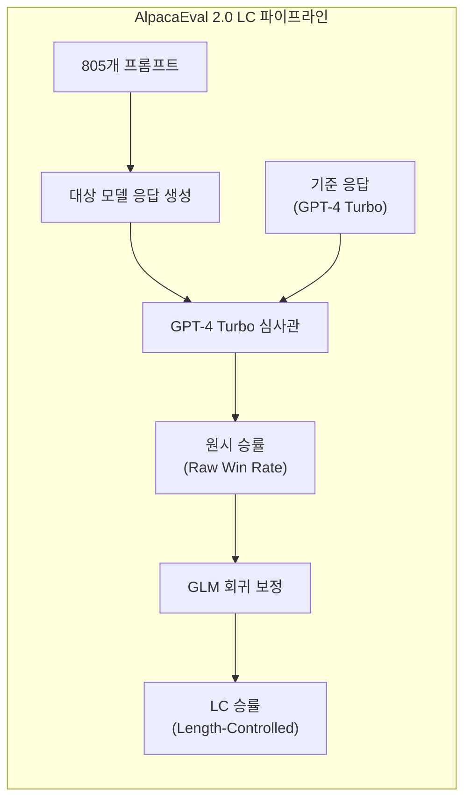
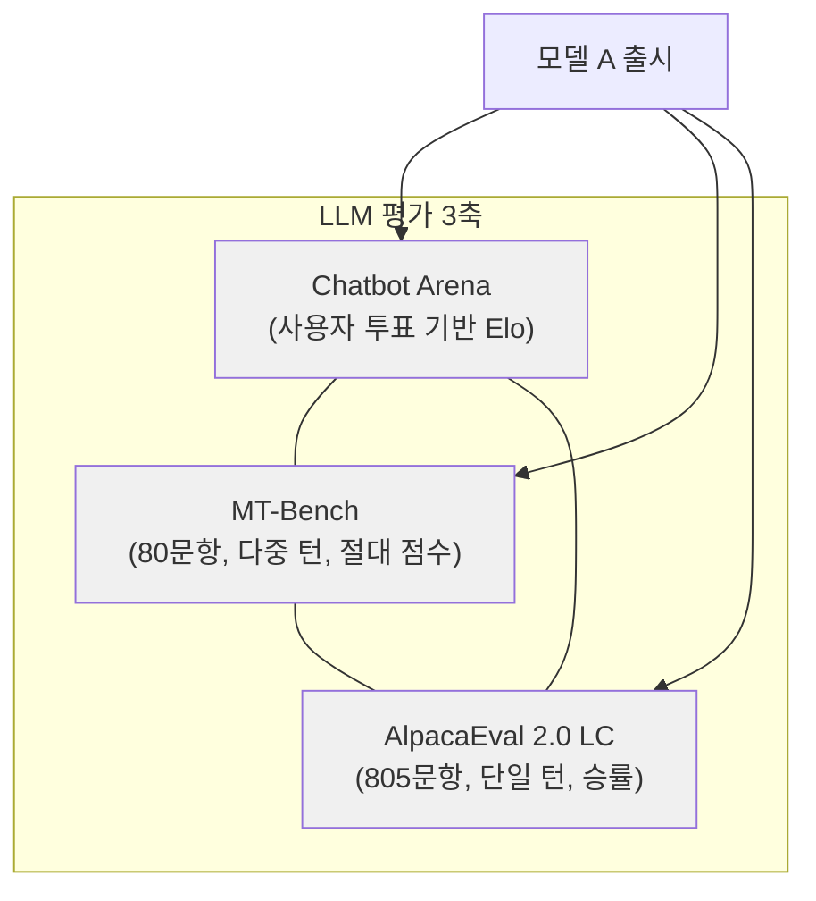

# AlpacaEval

Stanford CRFM(Center for Research on Foundation Models)의 tatsu-lab에서 개발한 LLM 자동 평가 벤치마크. 805개 지시 수행(instruction-following) 프롬프트에 대한 모델 응답을 GPT-4 Turbo 심사관(judge)이 기준 응답과 비교하여 승률(win rate)을 산출한다. 10달러 미만의 API 비용과 3분 이내의 실행 시간으로 Chatbot Arena와 0.98의 Spearman 상관을 달성하는 것이 핵심 가치 제안이다.

## 프로젝트 개요

| 항목 | 내용 |
|---|---|
| 이름 | AlpacaEval |
| 저자 | Xuechen Li, Tianyi Zhang, Yann Dubois, Rohan Taori, Ishaan Gulrajani, Carlos Guestrin, Percy Liang, Tatsunori B. Hashimoto |
| 소속 | Stanford University (tatsu-lab) |
| 저장소 | github.com/tatsu-lab/alpaca_eval |
| 리더보드 | tatsu-lab.github.io/alpaca_eval |
| 테스트셋 | 805개 프롬프트 (AlpacaFarm 평가 세트 기반) |
| 심사관 | GPT-4 Turbo (자동 주석자) |
| 관련 논문 | "Length-Controlled AlpacaEval" (COLM 2024) |

## 버전별 비교

### AlpacaEval 1.0

초기 버전은 `text_davinci_003`을 기준 응답(baseline)으로, `alpaca_eval_gpt4`를 심사관으로 사용했다. 모델 응답이 기준보다 나은지를 이진 판정하여 승률을 계산한다.

### AlpacaEval 2.0

심사관을 `weighted_alpaca_eval_gpt4_turbo`로, 기준 응답을 `gpt4_turbo`로 업그레이드했다. 더 강력한 기준선 덕분에 모델 간 변별력이 향상되었다.

### AlpacaEval 2.0 LC (Length-Controlled)

2024년 Yann Dubois 등이 제안한 길이 편향 보정(length bias debiasing) 버전. [[llm-as-judge-calibration|LLM-as-Judge]] 심사관이 긴 응답에 체계적으로 높은 점수를 부여하는 편향을 통계적으로 교정한다.



**보정 방법**: 일반화 선형 모델(GLM)을 적용하여 승률을 모델 정체성(identity), 정규화된 출력 길이 차이, 지시문 난이도의 함수로 파라미터화한다. "모델과 기준의 출력 길이가 같았다면 선호도가 어떠했을까?"라는 반사실적(counterfactual) 질문에 답하는 구조다.

**효과**: 길이 제어를 적용하면 Chatbot Arena와의 Spearman 상관이 0.94에서 0.98로 상승한다. 이는 단순히 길게 답하는 전략으로 리더보드 순위를 올리는 것을 방지한다.

## 평가 방식: LLM-as-Judge

AlpacaEval은 [[llm-as-judge-calibration|LLM-as-Judge]] 패러다임의 대표적 구현체다. 인간 평가자 대신 GPT-4 Turbo가 자동 주석자(auto-annotator)로 작동한다.

**평가 흐름**:
1. 대상 모델이 805개 프롬프트에 대해 응답을 생성한다
2. GPT-4 Turbo가 대상 모델의 응답과 기준 응답(GPT-4 Turbo)을 비교한다
3. 각 프롬프트에 대해 대상 모델이 이겼는지(win), 졌는지(lose) 판정한다
4. 전체 승률을 집계한다 (LC 버전은 길이 보정 적용)

**인간 일치율**: AlpacaEval의 자동 판정은 인간 주석자의 ground truth와 높은 일치율을 보인다. 이 검증이 벤치마크의 신뢰성 근거다.

## 805개 프롬프트 구성

테스트셋은 AlpacaFarm 평가 세트에서 유래하며, 다양한 지시 수행 태스크를 포함한다.

- 창의적 글쓰기 (Creative Writing)
- 분류 (Classification)
- 프로그래밍 (Programming)
- 일반 지식 (General Knowledge)
- 수학/추론 (Math/Reasoning)
- 요약 (Summarization)
- 브레인스토밍 (Brainstorming)
- 기타 개방형 지시문

805개라는 규모는 통계적 유의성을 확보하면서도 평가 비용을 10달러 미만으로 유지하는 균형점이다.

## MT-Bench, Chatbot Arena와의 비교

세 벤치마크는 LLM 평가의 상호 보완적 축을 형성한다.

| 항목 | AlpacaEval 2.0 LC | [[mt-bench|MT-Bench]] | Chatbot Arena |
|---|---|---|---|
| 프롬프트 수 | 805개 | 80개 (2턴) | 무제한 (크라우드소싱) |
| 평가 방식 | GPT-4 Turbo 승률 | GPT-4 절대 점수 (1-10) | 사용자 투표 (Elo) |
| 비용 | ~10 USD | ~1 USD | 인프라 운영비 |
| 실행 시간 | ~3분 | ~수분 | 지속 운영 |
| 턴 구조 | 단일 턴 | 2턴 (후속 질문) | 자유 형식 |
| Chatbot Arena 상관 | Spearman 0.98 | 높음 (원 논문 기준) | 기준 (ground truth) |
| 편향 보정 | LC로 길이 편향 교정 | 위치 편향 교정 | 익명 + 무작위 순서 |
| 강점 | 빠르고 저렴한 대규모 비교 | 다중 턴 + 카테고리별 분석 | 실제 사용자 선호 반영 |



AlpacaEval의 포지셔닝: Chatbot Arena가 "금본위(gold standard)"이지만 운영 비용이 높고 새 모델 반영이 느리다. AlpacaEval은 Chatbot Arena와의 높은 상관(0.98)을 유지하면서 누구나 10달러로 3분 만에 실행할 수 있는 "은본위(silver standard)" 역할을 한다. [[mt-bench|MT-Bench]]는 다중 턴 능력과 카테고리별 세부 분석에 강점이 있어 진단 도구로 활용된다.

## 실행 방법

```bash
pip install alpaca-eval
export OPENAI_API_KEY=<your-key>

# 모델 출력 파일로 평가 실행
alpaca_eval --model_outputs outputs.json

# Length-Controlled 승률 포함
alpaca_eval --model_outputs outputs.json --annotators_config weighted_alpaca_eval_gpt4_turbo
```

## 관련 문서

- [[mt-bench|MT-Bench]] -- 다중 턴 LLM 평가 벤치마크
- [[deepeval|DeepEval]] -- LLM 평가 프레임워크
- [[llm-as-judge-calibration|LLM-as-Judge Calibration]] -- LLM 심사관 패러다임
