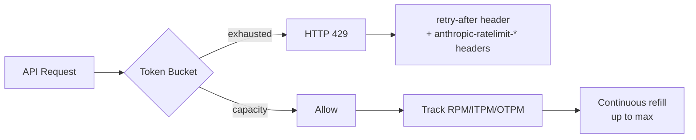

# Anthropic API Rate Limits 와 Tier 구조

Anthropic API 는 **token bucket algorithm** 기반으로 rate limit 을 적용한다. 4 단계
self-service tier (Tier 1~4) + Monthly Invoicing + Custom Enterprise. 한도는
**organization level**.

가장 중요한 운영 사실: **cached input token 은 (대부분 모델에서) ITPM 한도에 포함
안 됨** → prompt caching 이 사실상 throughput multiplier 로 작동한다.

> "Limits are designed to prevent API abuse, while minimizing impact on common
> customer usage patterns... All limits described here represent maximum allowed
> usage, not guaranteed minimums."

## 처리 흐름

## Spend Limit (월 한도)

| Tier | Credit Purchase 누적 | Max Single Deposit | Monthly Spend Limit |
|---|---|---|---|
| Tier 1 | $5 | $100 | $100 |
| Tier 2 | $40 | $500 | $500 |
| Tier 3 | $200 | $1,000 | $1,000 |
| Tier 4 | $400 | $200,000 | $200,000 |
| Monthly Invoicing | N/A | N/A | No limit |

> "Once you reach the spend limit of your tier, until you qualify for the next
> tier, you will have to wait until the next month to be able to use the API again."

## Rate Limit Tier 별 한도 (2026-05 시점)

### Tier 1

| Model | RPM | ITPM | OTPM |
|---|---|---|---|
| Sonnet 4.x | 50 | 30,000 | 8,000 |
| Sonnet 3.7 (deprecated) | 50 | 20,000 | 8,000 |
| Haiku 4.5 | 50 | 50,000 | 10,000 |
| Haiku 3.5 (deprecated) | 50 | 50,000† | 10,000 |
| Opus 4.x | 50 | 30,000 | 8,000 |

### Tier 2

| Model | RPM | ITPM | OTPM |
|---|---|---|---|
| Sonnet 4.x | 1,000 | 450,000 | 90,000 |
| Haiku 4.5 | 1,000 | 450,000 | 90,000 |
| Opus 4.x | 1,000 | 450,000 | 90,000 |

### Tier 3

| Model | RPM | ITPM | OTPM |
|---|---|---|---|
| Sonnet 4.x | 2,000 | 800,000 | 160,000 |
| Haiku 4.5 | 2,000 | 1,000,000 | 200,000 |
| Opus 4.x | 2,000 | 800,000 | 160,000 |

### Tier 4 (자가 service 최대)

| Model | RPM | ITPM | OTPM |
|---|---|---|---|
| Sonnet 4.x | 4,000 | 2,000,000 | 400,000 |
| Haiku 4.5 | 4,000 | 4,000,000 | 800,000 |
| Opus 4.x | 4,000 | 2,000,000 | 400,000 |

**중요한 합산 규칙**:

- `*` Opus: Opus 4.7, 4.6, 4.5, 4.1, 4 traffic 합산
- `**` Sonnet 4.x: 4.6, 4.5, 4 합산
- `†` 표시 모델은 cache_read_input_tokens 도 ITPM 에 포함됨 (older 모델)

## Cache-Aware ITPM (가장 중요한 운영 사실)

> "For most Claude models, only uncached input tokens count towards your ITPM rate
> limits."

ITPM 에 카운트되는 항목:

- `input_tokens` (마지막 cache breakpoint 이후 토큰) → 카운트
- `cache_creation_input_tokens` (cache 에 쓰는 토큰) → 카운트
- `cache_read_input_tokens` (cache 에서 읽는 토큰) → 미카운트 (대부분 모델)

**예시**: 2,000,000 ITPM + 80% cache hit rate → effective 10,000,000 input
tokens/min 처리 가능 (2M uncached + 8M cached).

> "For all models without the † marker, cached input tokens do not count towards
> rate limits and are billed at a reduced rate (10% of base input token price)."

## OTPM 계산 규칙

> "OTPM rate limits are evaluated in real time as output tokens are produced,
> counting only the actual tokens generated. The `max_tokens` parameter does not
> factor into OTPM rate limit calculations, so there is no rate limit downside to
> setting a higher `max_tokens` value."

→ `max_tokens` 를 보수적으로 잡을 필요 없음.

## Acceleration Limit (sharp burst 방지)

> "You might also encounter 429 errors due to acceleration limits on the API if
> your organization has a sharp increase in usage. To avoid hitting acceleration
> limits, ramp up your traffic gradually and maintain consistent usage patterns."

→ 신규 traffic 도입 시 **gradual ramp-up** 권장 (10% → 25% → 50% → 100%).

## Per-Model 독립 적용

> "Rate limits are applied separately for each model; therefore you can use
> different models up to their respective limits simultaneously."

→ Sonnet 한도 도달 시 Haiku 로 fallback 가능 (fair-share routing 의 기본 패턴).

## Inference Geography

> "Rate limits are currently shared across all `inference_geo` values. Requests
> with `inference_geo: 'us'` and `inference_geo: 'global'` draw from the same rate
> limit pool."

## Message Batches API (별도 한도)

| Tier | RPM | Queue 최대 | Batch 당 max requests |
|---|---|---|---|
| Tier 1 | 50 | 100,000 | 100,000 |
| Tier 2 | 1,000 | 200,000 | 100,000 |
| Tier 3 | 2,000 | 300,000 | 100,000 |
| Tier 4 | 4,000 | 500,000 | 100,000 |

Batch 가격은 standard 의 50% — non-realtime 작업의 비용 절감 수단.

## Managed Agents 한도

| Operation | Limit |
|---|---|
| Create endpoints (agents, sessions, env) | 300 RPM |
| Read endpoints (retrieve, list, stream) | 600 RPM |

## Fast Mode Rate Limits

Opus 4.6 fast mode (`speed: "fast"`) 는 별도 한도. 응답 헤더에 `anthropic-fast-*`
prefix.

## 429 Response Headers

429 발생 시 다음 응답 header 가 포함된다:

- `retry-after` — 재시도까지 대기 초
- `anthropic-ratelimit-requests-limit` / `-remaining` / `-reset` (RFC 3339 시간)
- `anthropic-ratelimit-input-tokens-limit` / `-remaining` / `-reset`
- `anthropic-ratelimit-output-tokens-limit` / `-remaining` / `-reset`
- `anthropic-ratelimit-tokens-limit` / `-remaining` / `-reset` (가장 제한적인 한도)
- Priority Tier 사용 시: `anthropic-priority-input-tokens-*`, `anthropic-priority-output-tokens-*`

> "The `anthropic-ratelimit-tokens-*` headers display the values for the most
> restrictive limit currently in effect."

## Workspace 단위 sub-limit

> "you can set custom spend and rate limits per Workspace... If your
> Organization's limit is 40,000 input tokens per minute and 8,000 output tokens
> per minute, you might limit one Workspace to 30,000 input tokens per minute."

- default workspace 는 limit 설정 불가
- workspace 한도 미설정 시 organization 한도와 동일
- organization 한도가 항상 우선 (workspace 합 ≥ org 이어도 org cap 적용)

## Production 운영 패턴

### 1. Fair-share scheduling

- 한 사용자가 organization 전체 quota 를 잠그지 못하게 workspace 분리
- 모델별 한도 독립 → critical path 는 Sonnet, batch 는 Haiku 분리

### 2. Cache-first prompt design

- system prompt + tool definition 를 cache breakpoint 이전 배치
- 80%+ cache hit rate 목표 → 사실상 throughput 5x

### 3. Batch API 활용

- realtime 비필수 작업은 Batch API → 50% cost + 별도 quota pool

### 4. Tier 승급 전략

- Tier 4 도달까지 누적 $400 입금 → 자동 승급
- 그 이상은 Sales 와 Custom Enterprise 협상

### 5. Retry-after 준수

- `retry-after` header 값을 그대로 sleep
- header 미반환 시 exponential backoff (jitter 포함)

### 6. Pre-flight check

- Rate Limits API 로 현재 한도 확인
- 사용량 dashboard 의 rate-limited request 차트로 capacity planning

## 산업 데이터 (2026-02 Datadog State of AI Engineering)

> "5% of all LLM call spans reported an error and 60% of those errors were caused
> by exceeded rate limits"

→ rate limit 이 LLM 호출 실패의 단일 최대 원인. circuit breaker / fallback / TPM
보호가 필수.

## 관련 문서

- [[agent-rate-limiting-patterns]] — 일반적 rate limit 알고리즘
- [[agent-circuit-breaker]] — 429 발생 시 circuit breaker
- [[prompt-cache-cost-economics]] — cache hit 의 ITPM 효과
- [[agent-cost-optimization]] — 비용/throughput 최적화
- [[agent-fallback-strategies]] — model 간 fallback routing
- [[anthropic-harness-design]] — Anthropic API 기반 harness
