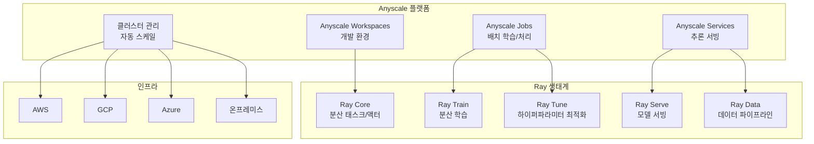
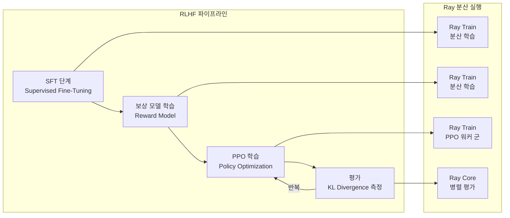
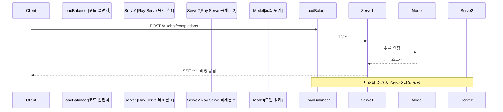

# Anyscale - Ray 기반 분산 ML 플랫폼

Anyscale은 분산 컴퓨팅 프레임워크 [[ray-distributed|Ray]]의 창립자 팀이 세운 회사로, Ray를 매니지드 클라우드 환경에서 쉽게 사용할 수 있도록 제공하는 플랫폼이다. 대규모 분산 학습, RLHF(Reinforcement Learning from Human Feedback) 파이프라인, LLM 추론 서빙까지 Ray 생태계를 기반으로 한 풀스택 ML 플랫폼을 지향한다.

## 플랫폼 개요



Anyscale은 "Ray를 직접 설치하고 관리하는 고통 없이, 클라우드에서 Ray의 모든 기능을 쓸 수 있게 한다"는 포지셔닝이다.

## Ray 프레임워크 기반

### Ray Core 분산 컴퓨팅

Ray의 핵심은 파이썬 함수를 분산 태스크로, 클래스를 분산 액터(actor)로 만드는 데코레이터다:

```python
import ray

ray.init()  # 로컬 또는 Anyscale 클러스터에 연결

@ray.remote
def process_batch(data: list) -> list:
    """병렬 처리할 태스크"""
    return [item * 2 for item in data]

# 병렬 실행
futures = [process_batch.remote(batch) for batch in batches]
results = ray.get(futures)  # 모든 결과 수집

# GPU 리소스 지정
@ray.remote(num_gpus=1)
class ModelActor:
    def __init__(self):
        self.model = load_model()

    def predict(self, inputs):
        return self.model(inputs)
```

### Ray Train 분산 학습

[[training-frameworks]]의 맥락에서, Ray Train은 PyTorch DDP, DeepSpeed, Megatron-LM 등을 분산 환경에서 쉽게 실행할 수 있게 추상화한다:

```python
import ray
from ray import train
from ray.train.torch import TorchTrainer
from ray.train import ScalingConfig

def train_func(config: dict):
    """각 워커에서 실행되는 학습 함수"""
    from transformers import AutoModelForCausalLM, TrainingArguments, Trainer
    import torch

    model = AutoModelForCausalLM.from_pretrained(config["model_name"])
    # 분산 학습 설정 (Ray Train이 자동 처리)
    model = train.torch.prepare_model(model)

    # 학습 루프
    optimizer = torch.optim.AdamW(model.parameters(), lr=config["lr"])
    for epoch in range(config["epochs"]):
        # ... 학습 코드
        train.report({"loss": loss.item(), "epoch": epoch})

trainer = TorchTrainer(
    train_loop_per_worker=train_func,
    train_loop_config={
        "model_name": "meta-llama/Llama-3-8b",
        "lr": 2e-5,
        "epochs": 3,
    },
    scaling_config=ScalingConfig(
        num_workers=8,       # 8개 GPU 워커
        use_gpu=True,
        resources_per_worker={"GPU": 1},
    ),
)

result = trainer.fit()
```

### RLHF 파이프라인

Anyscale은 RLHF(인간 선호도 강화학습) 파이프라인을 Ray 위에서 대규모로 실행하는 데 특화됐다. RLHF 파이프라인의 복잡한 다단계 구조를 Ray의 분산 실행으로 처리한다:



[[rlhf]] 개념과 Ray 분산 실행의 결합이다.

### Ray Serve LLM 추론

```python
from ray import serve
from ray.serve.llm import LLMConfig, build_openai_app

# OpenAI 호환 서빙 설정
llm_config = LLMConfig(
    model_loading_config={
        "model_id": "meta-llama/Llama-3-70b-instruct",
        "model_source": "huggingface",
    },
    accelerator_type="A100-80G",
    max_ongoing_requests=100,
    engine_kwargs={
        "tensor_parallel_size": 4,   # 4-GPU 텐서 패럴리즘
        "max_model_len": 8192,
        "dtype": "bfloat16",
    },
)

app = build_openai_app({"llama-70b": llm_config})

serve.run(app, route_prefix="/v1")
# -> http://localhost:8000/v1/chat/completions (OpenAI 호환)
```

내부적으로 vLLM을 백엔드로 사용하며, Ray Serve가 트래픽 라우팅과 복제본 관리를 담당한다.

## Anyscale 플랫폼 주요 서비스

### Anyscale Workspaces

Jupyter/VS Code 기반의 개발 환경으로, 클러스터 자원을 공유하면서 여러 개발자가 협업할 수 있다. 로컬 PC처럼 사용하지만 실제로는 클라우드 GPU 인스턴스가 뒤에서 실행된다.

특징:
- 노트북에서 `ray.remote`로 즉시 분산 작업 시작
- 팀 공유 클러스터 자원 자동 할당
- `ray job submit`으로 백그라운드 장시간 작업 제출

### Anyscale Jobs

배치성 학습이나 데이터 처리 작업을 제출하고 관리하는 서비스:

```bash
# CLI로 작업 제출
anyscale job submit \
  --name "llama-finetune" \
  --compute-config compute.yaml \
  -- python train.py --model llama-3-70b --epochs 3
```

`compute.yaml` 예시:

```yaml
cloud: aws
region: us-west-2
head_node:
  instance_type: m5.xlarge
worker_nodes:
  - instance_type: g5.12xlarge   # A10G x4 GPU
    min_nodes: 4
    max_nodes: 16
    use_spot: true   # 스팟 인스턴스로 비용 절감
```

### Anyscale Services

프로덕션 LLM 서빙을 위한 관리형 서비스:

- **자동 스케일링**: 요청량에 따라 Ray Serve 복제본 수 자동 조정
- **롤링 업데이트**: 다운타임 없이 모델 버전 업데이트
- **모니터링**: Ray 대시보드 + 커스텀 메트릭
- **멀티-모델**: 단일 엔드포인트에서 여러 모델 라우팅



## 분산 파인튜닝 실전 예시

### DeepSpeed + Ray Train 조합

```python
from ray.train.torch import TorchTrainer
from ray.train import ScalingConfig, RunConfig, CheckpointConfig
from ray.train.huggingface import TransformersTrainer

def train_with_deepspeed(config: dict):
    """DeepSpeed ZeRO-3로 70B 모델 파인튜닝"""
    from transformers import TrainingArguments, Trainer

    training_args = TrainingArguments(
        output_dir="/tmp/checkpoint",
        deepspeed=config["deepspeed_config"],  # ZeRO-3 설정
        fp16=True,
        gradient_accumulation_steps=4,
        per_device_train_batch_size=2,
        num_train_epochs=config["epochs"],
        save_strategy="epoch",
        report_to="none",
    )
    # ... Trainer 설정 및 실행

trainer = TorchTrainer(
    train_loop_per_worker=train_with_deepspeed,
    train_loop_config={
        "model_name": "meta-llama/Llama-3-70b",
        "epochs": 2,
        "deepspeed_config": "ds_config_zero3.json",
    },
    scaling_config=ScalingConfig(
        num_workers=16,  # 16 GPU
        use_gpu=True,
        resources_per_worker={"GPU": 1},
    ),
    run_config=RunConfig(
        checkpoint_config=CheckpointConfig(num_to_keep=2),
    ),
)
```

[[deepspeed-zero-internals]] 기법과 Ray의 분산 오케스트레이션을 결합한 패턴이다.

### Ray Tune 하이퍼파라미터 최적화

```python
from ray import tune
from ray.tune.schedulers import ASHAScheduler

def objective(config: dict):
    """각 하이퍼파라미터 조합에서 학습 및 평가"""
    model = train_model(
        lr=config["lr"],
        batch_size=config["batch_size"],
        lora_r=config["lora_r"],
    )
    val_loss = evaluate(model)
    tune.report(val_loss=val_loss)

analysis = tune.run(
    objective,
    config={
        "lr": tune.loguniform(1e-6, 1e-4),
        "batch_size": tune.choice([8, 16, 32]),
        "lora_r": tune.choice([8, 16, 32, 64]),
    },
    num_samples=50,
    scheduler=ASHAScheduler(metric="val_loss", mode="min"),
    resources_per_trial={"gpu": 1},
)
```

## 경쟁 플랫폼과 비교

| 기능 | Anyscale | [[together-ai-inference\|Together AI]] | [[fireworks-ai-platform\|Fireworks AI]] | SageMaker |
|------|----------|------------|--------------|-----------|
| Ray 기반 분산 | 네이티브 | 미지원 | 미지원 | 미지원 |
| 대규모 학습 | 최강 | 기본 지원 | 기본 지원 | 지원 |
| RLHF 파이프라인 | 특화 | 제한적 | 미지원 | 제한적 |
| 추론 서빙 | Ray Serve | 지원 | 지원 | SageMaker |
| 멀티클라우드 | AWS/GCP/Azure | AWS 중심 | AWS 중심 | AWS 전용 |
| 온프레미스 | 지원 | 미지원 | 미지원 | 제한적 |
| 오픈소스 모델 | 제한적 카탈로그 | 200+ | 50+ | 지원 |
| 진입 장벽 | 높음 (Ray 이해 필요) | 낮음 | 낮음 | 중간 |

### Anyscale이 적합한 경우

- 70B+ 모델의 대규모 분산 학습이 필요할 때
- RLHF, DPO 등 복잡한 학습 파이프라인 오케스트레이션
- 기존 Ray 코드베이스를 클라우드로 이관할 때
- 멀티클라우드 또는 온프레미스 + 클라우드 하이브리드 환경
- 하이퍼파라미터 탐색(Ray Tune)을 대규모로 실행할 때

### Together AI/Fireworks AI가 더 적합한 경우

- 기존 오픈모델을 빠르게 API로 사용하고 싶을 때
- 파인튜닝보다 추론 API 사용이 주목적일 때
- Ray를 모르는 팀이 빠르게 시작해야 할 때

## 실무 사용 가이드

### 클러스터 시작 및 연결

```python
import anyscale
from anyscale.compute_config import ComputeConfig

# Anyscale에 연결
ray.init("anyscale://my-cluster")

# 또는 새 클러스터 자동 생성
ray.init(
    "anyscale://",
    runtime_env={"pip": ["transformers", "torch", "deepspeed"]},
)
```

### 스팟 인스턴스 체크포인팅

스팟 인스턴스 선점(preemption)에 대비한 체크포인트 전략:

```python
from ray.train import CheckpointConfig, RunConfig

run_config = RunConfig(
    checkpoint_config=CheckpointConfig(
        num_to_keep=3,              # 최근 3개 체크포인트 유지
        checkpoint_frequency=100,   # 100 스텝마다 저장
    ),
    failure_config=ray.train.FailureConfig(
        max_failures=3,  # 최대 3번 재시작 허용
    ),
)
```

## 한계 / 트레이드오프

| 항목 | 내용 |
|------|------|
| 학습 곡선 | Ray 분산 개념 이해 필요, 진입 장벽 높음 |
| 비용 | 관리형 서비스로 자체 Ray 클러스터 대비 비쌈 |
| 오픈모델 카탈로그 | Together/Fireworks 대비 즉시 사용 모델 수 적음 |
| 디버깅 복잡도 | 분산 환경 버그 추적이 로컬 대비 어려움 |
| 벤더 종속성 | Anyscale 특화 CLI/API가 자체 Ray 환경과 다를 수 있음 |
| 소규모 사용 비효율 | 단순 추론 API 호출에는 오버스펙 |

## 관련 문서

- [[ray-distributed]] - Ray 오픈소스 분산 컴퓨팅 프레임워크 상세
- [[rlhf]] - 강화학습 기반 인간 선호도 학습 개념
- [[together-ai-inference]] - 오픈모델 추론 API 중심 경쟁 플랫폼
- [[fireworks-ai-platform]] - 고속 추론 및 함수 호출 특화 플랫폼
- [[deepspeed-zero-internals]] - DeepSpeed ZeRO 분산 학습 내부 구조
- [[training-frameworks]] - 분산 학습 프레임워크 비교
- [[peft-library]] - LoRA 기반 파인튜닝 라이브러리
