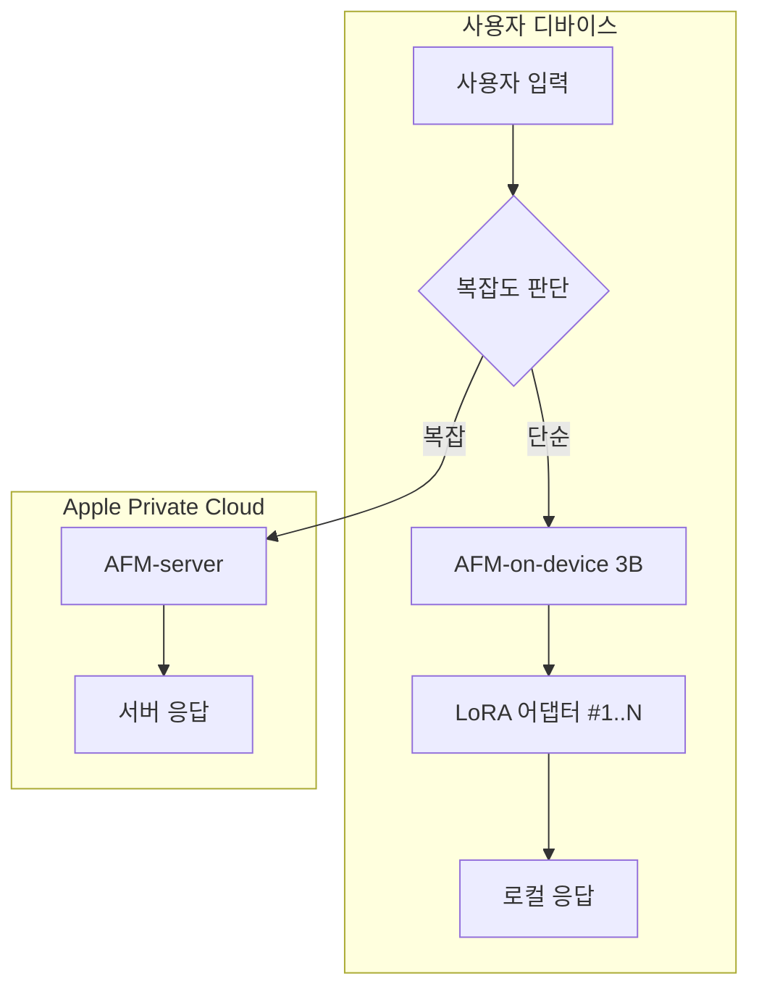
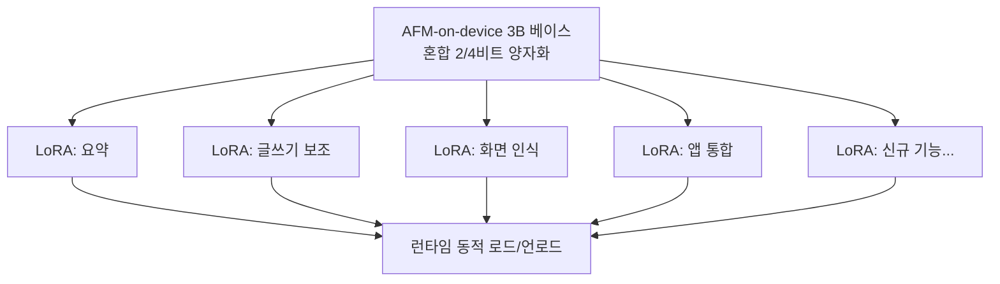
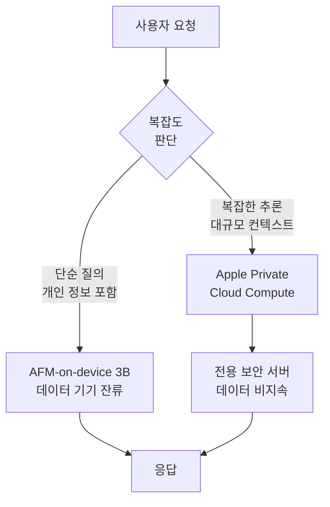

## 개요

Apple Foundation Model(AFM)은 Apple이 자체 개발한 대규모 언어 모델 시리즈로, 차세대 Siri(LLM Siri)의 핵심 엔진이다. 온디바이스 추론을 위한 3B 파라미터 모델(AFM-on-device)과 서버 사이드 모델을 이중 구조로 운용하며, 혼합 2/4비트 양자화와 LoRA 어댑터를 통해 단말기에서 직접 실행되는 프라이버시 우선(Privacy-First) 설계를 채택했다. iOS 26.4 업데이트를 통해 2026년 봄 출시가 예정되어 있다.

## 핵심 특징

- **온디바이스 + 클라우드 이중 구조**: 단순 질의는 기기 내 3B 모델로 처리하고, 복잡한 작업은 Apple Private Cloud Compute로 전송
- **프라이버시 우선 설계**: 사용자 데이터가 기기를 떠나지 않는 로컬 추론 우선 원칙
- **혼합 비트 양자화**: 2비트와 4비트를 레이어별로 혼합 적용하여 모델 크기를 최소화하면서 품질 유지
- **LoRA 어댑터**: 기반 모델 위에 태스크별 경량 어댑터를 동적으로 로드하여 다양한 기능 지원
- **ChatGPT 수준의 대화 능력**: 기존 규칙 기반 Siri에서 LLM 기반 자연어 이해로 전면 전환

## 기술 상세

### 모델 아키텍처

### 양자화 전략

AFM-on-device는 혼합 정밀도 양자화(mixed-precision quantization)를 적용한다:

| 레이어 유형 | 양자화 비트 | 근거 |
|------------|-----------|------|
| 어텐션 레이어 | 4비트 | 정밀도에 민감 -- 토큰 간 관계 보존 필수 |
| 피드포워드 레이어 | 2비트 | 상대적으로 둔감 -- 공격적 압축 가능 |

이 혼합 전략으로 전체 모델 크기를 iPhone/iPad의 Neural Engine과 통합 메모리에서 실행 가능한 수준으로 압축하면서 품질 저하를 최소화한다. Apple Silicon의 통합 메모리 아키텍처는 CPU-GPU 간 데이터 복사 없이 직접 접근이 가능하여 메모리 대역폭 병목을 완화하는 데 특히 유리하다.

### LoRA 어댑터 시스템

기반 모델 하나 위에 여러 태스크별 LoRA 어댑터를 동적으로 로드/언로드하는 구조를 채택했다. 어댑터 교체 시 베이스 모델 재배포가 불필요하며, 각 어댑터는 수십~수백 MB 수준의 경량 파일이다.

이 구조는 [[lora-qlora-finetuning]]에서 설명하는 "하나의 베이스 + 다수 어댑터" 패턴의 대표적인 상용 적용 사례이다.

### 온디바이스 vs 클라우드 라우팅

단순 질의와 개인 데이터가 포함된 요청은 기기 내에서 처리하여 프라이버시를 보장하고, 복잡한 작업만 Apple Private Cloud Compute로 전송한다. 클라우드 서버에서도 사용자 데이터가 지속적으로 저장되지 않는 설계를 채택했다.

### 주요 기능

- **개인 맥락 인식**: 연락처, 일정, 메시지, 이메일, 파일, 사진 등 기기 내 데이터를 활용한 맞춤형 응답. 예: "김과장이 보낸 파일 찾아줘", "지난주 맛집 추천 메시지 어디 있지?"
- **화면 인식(Screen Awareness)**: 현재 화면 콘텐츠를 이해하고 맥락에 맞는 동작 수행. 메시지에 포함된 주소를 연락처에 추가하거나, 화면의 사진을 바로 전송
- **앱 간 통합(Cross-App Integration)**: 여러 앱에 걸친 복합 작업 수행. 파일 전송, 사진 편집 후 전송, 길안내 공유, 이메일 초안 작성 등

### 출시 일정

- iOS 26.4 업데이트를 통해 2026년 봄 출시 예정
- 원래 iOS 18(2024)에서 약속되었으나 2025년 3월에 무기한 연기 후 재확정
- Apple 자체 모델과 외부 모델(OpenAI/Anthropic) 모두 테스트 중인 것으로 보도

## 기존 Siri와의 비교

| 항목 | 기존 Siri (규칙 기반) | LLM Siri (AFM 기반) |
|------|---------------------|---------------------|
| 언어 이해 | 의도 분류(intent classification) | 자연어 이해(NLU) |
| 대화 | 단일 턴 질의 응답 | 멀티턴 맥락 유지 대화 |
| 개인화 | 제한적 | 기기 내 데이터 기반 심층 개인화 |
| 복합 작업 | 미지원 | 앱 간 통합 복합 작업 |
| 화면 인식 | 미지원 | 현재 화면 맥락 이해 |
| 오류 복구 | 고정된 폴백 | 맥락 기반 재시도 |

## 경쟁 환경에서의 위치

AFM은 Google Gemini Nano(온디바이스), Qualcomm AI Hub, Samsung Galaxy AI 등과 온디바이스 LLM 시장에서 경쟁한다. Apple의 차별점은 하드웨어-소프트웨어 수직 통합이다. 자체 설계한 Neural Engine에 최적화된 모델 아키텍처, 통합 메모리를 활용한 메모리 대역폭 최적화, 그리고 iOS 생태계 전체에 걸친 깊은 시스템 통합은 타사가 쉽게 모방하기 어려운 구조적 이점이다.

프라이버시 측면에서도 Apple의 접근은 독특하다. Google이나 Samsung이 클라우드 처리를 기본으로 하는 반면, AFM은 로컬 추론을 기본값으로 설정하고 클라우드를 폴백으로 사용한다. Private Cloud Compute 서버에서도 사용자 데이터가 지속 저장되지 않는 설계는 규제가 강화되는 환경에서 경쟁 우위로 작용할 수 있다.

## 관련 문서

- [[multi-head-latent-attention]] - KV 캐시 압축 기법 (온디바이스 추론 최적화)
- [[open-source-ai-movement-2026]] - 2026 오픈소스 AI 생태계 (AFM은 비공개 모델)
- [[model-merging]] - 모델 병합 및 경량화 기법
- [[mirror-speculative-decoding]] - Apple의 온디바이스 추론 가속 기술
- [[lora-qlora-finetuning]] - LoRA 어댑터 기술의 기반 원리
- [[small-language-models]] - 소형 언어 모델 생태계
