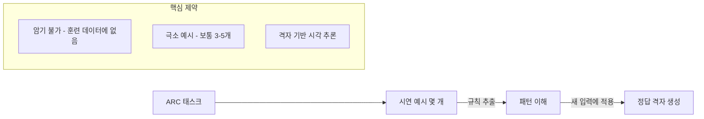
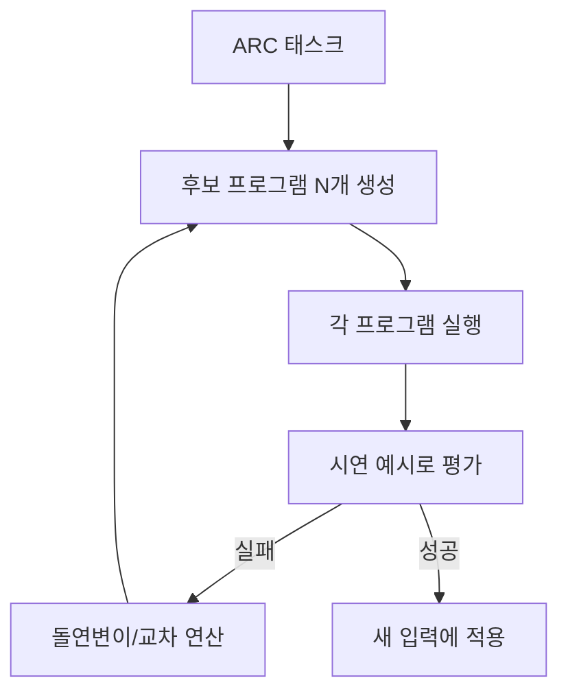

# ARC-AGI-2

ARC Prize가 운영하는 추상 추론(abstract reasoning)/유동지능(fluid intelligence) 벤치마크 2세대.

## 개요

ARC-AGI-2는 Francois Chollet과 ARC Prize 팀이 만든 추상 추론 벤치마크다. François Chollet이 2019년 제안한 ARC(Abstraction and Reasoning Corpus)의 후속으로, 기존 ARC-AGI-1에서 모델들이 접근하기 시작하자 2세대 버전을 설계했다.

핵심 설계 원칙은 "학습된 패턴을 재조합하는 것만으로는 풀 수 없다"다. 각 태스크는 유한한 기본 개념에서 새로운 조합을 요구하여, 암기(memorization)가 아닌 **유동지능(fluid intelligence)**을 측정한다.

## 벤치마크 설계 원칙

각 태스크는 입력-출력 격자 쌍 몇 개를 보여주고, 새 입력에 대해 정답 출력 격자를 요구한다. 태스크마다 고유한 추론 규칙이 있으며 이를 암기할 수 없다.

## 2026년 주요 성과

| 날짜 | 주체 | 점수 | 방법론 |
|---|---|---|---|
| 2026-02 | Gemini 3.1 Pro | 77.1% | 공개 API 최초 기록 |
| 2026-02 | Imbue | 95.1% | Code Evolution 기법 |
| 2026-03 | Confluence Lab | 97.9% | 태스크당 $11.77 비용 |

[교차검증 필요] 구체적 날짜와 점수는 [공식 리더보드](https://arcprize.org/leaderboard)에서 확인 필요.

## Imbue의 Code Evolution 접근법

Imbue가 95.1%를 달성한 "Code Evolution" 기법은 주목할 만하다:

이 방법은 LLM을 프로그램 합성 도구로 사용하고, 진화 알고리즘으로 후보 프로그램을 탐색한다. 단순 프롬프트 기반 접근보다 훨씬 높은 정확도를 달성했다.

## "AGI 진척도 지표"로서의 위상

ARC-AGI-2는 단순 코딩 능력([[terminal-bench-2-0]])이나 지식 범위(MMLU)와 달리 **일반 유동지능**을 측정한다는 점에서 AGI 진척도 지표로 자주 인용된다.

그러나 97.9%에 달하는 최고 점수를 달성하는 데 태스크당 $11.77이 소요된다는 점은 "비용 효율적 AGI"와의 거리를 보여준다.

## SWE-bench vs. ARC-AGI-2 비교

| 항목 | ARC-AGI-2 | [[terminal-bench-2-0|Terminal-Bench 2.0]] |
|---|---|---|
| 측정 대상 | 추상 추론/유동지능 | 터미널/시스템 조작 능력 |
| 태스크 유형 | 격자 기반 패턴 추론 | 셸 명령, 빌드, 보안 |
| 오염 위험 | 낮음 (태스크별 고유 규칙) | 중간 |
| AGI 지표 | 높음 | 낮음 |
| 실무 연관성 | 낮음 | 높음 |

## ARC Prize 2026

Kaggle에서 운영 중인 공개 대회. 상금 구조와 참여 규칙은 [ARC Prize 2026 Kaggle 페이지](https://www.kaggle.com/competitions/arc-prize-2026-arc-agi-2/leaderboard)에서 확인.

## 왜 지금 중요한가

2026년 2월 Gemini 3.1 Pro가 공개 API 중 최초로 77.1%를 기록한 뒤 Imbue의 code evolution 기법이 95.1%, Confluence Lab이 97.9%(태스크당 $11.77)까지 밀어올리면서 "log-linear scaling으로는 못 깬다"던 벽이 흔들리고 있어 AGI 진척도 지표로 월간 주목도가 폭증했다.

## 대표 자료

- [ARC-AGI-2 Overview -- ARC Prize](https://arcprize.org/arc-agi/2)
- [ARC Prize Leaderboard](https://arcprize.org/leaderboard)
- [ARC-AGI v2 Leaderboard -- LLM Stats](https://llm-stats.com/benchmarks/arc-agi-v2)
- [Beating ARC-AGI-2 with Code Evolution -- Imbue](https://imbue.com/research/2026-02-27-arc-agi-2-evolution/)
- [ARC Prize 2026 -- Kaggle](https://www.kaggle.com/competitions/arc-prize-2026-arc-agi-2/leaderboard)

## 관련 문서
- [[gemini-deep-think]] -- Gemini Deep Think (과학 발견 가속)

- [[terminal-bench-2-0|Terminal-Bench 2.0]]
- [[long-horizon-agent-benchmarks|Long-Horizon Agent Benchmarks]]
