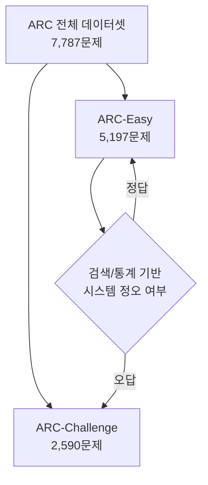
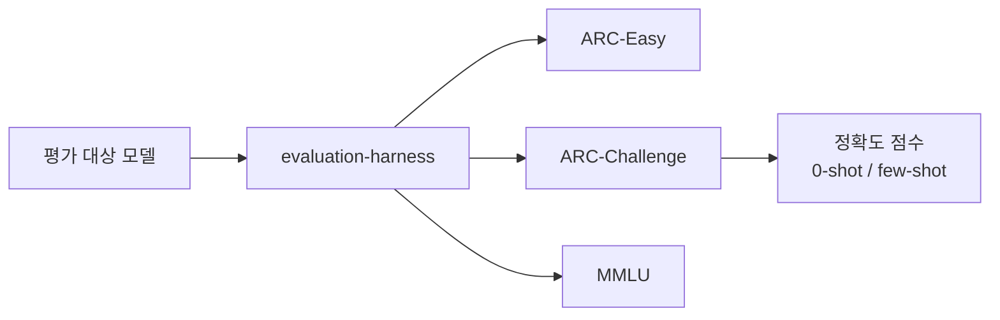

# ARC 벤치마크

ARC(AI2 Reasoning Challenge)는 Allen Institute for AI(AI2)가 공개한 초등학교 수준의 과학 지식 기반 4지선다 질의응답 벤치마크다. 단순 키워드 매칭이나 검색 기반 방법으로 풀기 어렵도록 설계된 문제들로 구성되어 있어, LLM의 진정한 추론 능력을 측정하는 데 널리 활용된다.

## 구성 및 난이도 분류

ARC 데이터셋은 두 개의 파티션으로 나뉜다:

- **ARC-Easy**: 검색 기반 시스템이나 단순 통계 모델도 비교적 잘 푸는 문제들
- **ARC-Challenge**: 검색 기반 시스템과 단어 공동출현(co-occurrence) 방법을 모두 패배시킨 어려운 문제들만 선별

ARC-Challenge가 실질적인 추론 능력 평가 척도로 주목받으며, 대부분의 벤치마크 리포트에서 이 파티션을 기준으로 삼는다.

위 다이어그램은 ARC 데이터셋이 난이도에 따라 어떻게 분할되는지를 보여준다. 기존 시스템이 틀린 문제만 선별하여 ARC-Challenge를 구성한다.

## 문항 예시와 특징

ARC 문항은 미국 초등~중등 수준의 표준화 과학 시험에서 수집된다. 주요 특징은 다음과 같다:

- **4지선다** 형식 (일부 3지선다 혼재)
- 단순 정의 암기가 아닌 **원인-결과, 추론, 비교** 능력 요구
- 물리, 화학, 생물, 지구과학 등 자연과학 전반 포괄
- 외부 지식이나 웹 검색 없이 내재된 지식만으로 풀어야 하는 설계

예시 문항:
> "Which of the following best explains why leaves change color in autumn?"
> (A) decreased sunlight triggers chlorophyll breakdown ...

## 점수 해석과 현황

LLM 성능 기준으로 ARC-Challenge 점수는 다음과 같이 해석된다:

| 구간 | 해석 |
|------|------|
| ~50% | 무작위 추론 수준 |
| 60-75% | 초기 GPT-3급 |
| 85-90% | GPT-4급 |
| 90%+ | 인간 평균 근접 |

최신 대형 모델(GPT-4, Claude 3 이상)은 ARC-Challenge에서 90%를 상회하여 포화(saturation) 징후를 보인다. 이에 따라 연구 커뮤니티는 더 어려운 벤치마크([[mmlu]], ARC-AGI 등)로 이동하는 추세다.

## ARC-AGI와의 구분

주의: "ARC"라는 약어는 두 가지 다른 벤치마크를 지칭한다.

- **ARC(AI2 Reasoning Challenge)**: 본 문서에서 다루는 과학 4지선다 벤치마크
- **ARC-AGI(Abstraction and Reasoning Corpus)**: Francois Chollet이 설계한 시각적 패턴 추상화 벤치마크 (별개 개념)

두 벤치마크는 설계 철학, 측정 대상, 문제 형식이 완전히 다르므로 혼동하지 말 것.

## 평가 인프라

[[evaluation-harness]]를 통해 ARC를 포함한 수십 개의 벤치마크를 동일한 인터페이스로 실행할 수 있다. EleutherAI의 lm-evaluation-harness가 사실상의 표준으로 자리잡았으며, Hugging Face Open LLM Leaderboard도 이 인프라 기반으로 ARC-Challenge 점수를 공개한다.

## 한계와 비판

- **포화 문제**: 최신 모델들이 90% 이상을 달성하면서 변별력이 약해짐
- **형식 편향**: 4지선다 형식 특성상 chain-of-thought 없이도 고득점 가능
- **데이터 오염(data contamination)**: 학습 데이터에 ARC 문항이 포함될 가능성 — [[livecodebench]] 같은 동적 벤치마크가 이 문제를 해결하려는 시도
- **영어 중심**: 비영어권 과학 추론 능력 측정 불가

## 관련 문서

- [[evaluation-harness]] - ARC 실행 인프라
- [[mmlu]] - 다학문 언어 이해 벤치마크, ARC와 함께 LLM 리더보드 핵심 지표
- [[livecodebench]] - 데이터 오염 방지를 위한 동적 벤치마크
- [[agentic-benchmarks-overview]] - 에이전틱 벤치마크와의 비교 맥락
