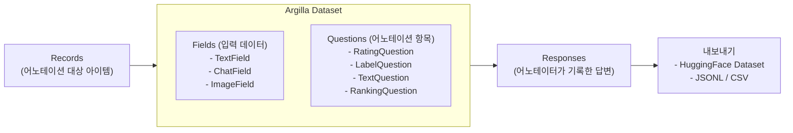
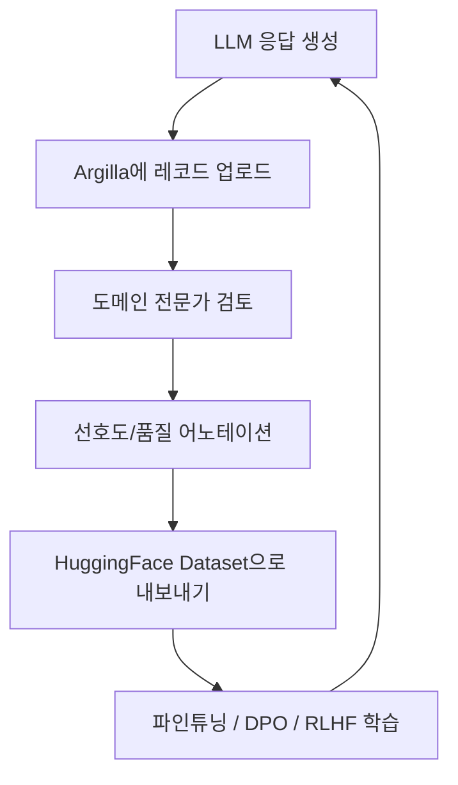

# Argilla

LLM 파인튜닝과 RLHF(인간 피드백 강화학습)를 위한 오픈소스 데이터 큐레이션 플랫폼. 데이터 어노테이션, 품질 검토, 모델 피드백 수집에 특화되어 있으며, HuggingFace 생태계와 긴밀하게 통합된다. 비개발자도 사용할 수 있는 직관적인 UI와 강력한 Python SDK를 함께 제공한다.

## 개요

| 항목 | 내용 |
|---|---|
| 이름 | Argilla |
| 개발사 | Argilla (스페인 스타트업) |
| 라이선스 | Apache 2.0 |
| 저장소 | github.com/argilla-io/argilla |
| 코어 스택 | Python + FastAPI (서버), Vue.js (UI) |
| 백엔드 | Elasticsearch / OpenSearch |
| HuggingFace 통합 | Spaces 배포, Dataset Hub 연동 |
| 버전 | Argilla 2.x (2024~ 대규모 리아키텍처) |

## 핵심 개념

Argilla 2.x는 Dataset 중심 설계로 개편되었다. 모든 데이터는 Dataset에 속하고, Dataset은 Field(입력)와 Question(레이블링 항목)으로 구성된다.



## 설치와 시작

```bash
pip install argilla

# HuggingFace Spaces에 배포하거나 로컬 Docker로 실행
docker run -d --name argilla \
    -p 6900:6900 \
    argilla/argilla-quickstart:latest
```

```python
import argilla as rg

rg.init(api_url="http://localhost:6900", api_key="admin.apikey")
```

## 데이터셋 생성 (LLM 선호도 수집 예시)

```python
import argilla as rg

# 데이터셋 정의
dataset = rg.Dataset(
    name="llm-preference-2026",
    settings=rg.Settings(
        fields=[
            rg.TextField(name="prompt", title="사용자 프롬프트"),
            rg.TextField(name="response_a", title="응답 A"),
            rg.TextField(name="response_b", title="응답 B"),
        ],
        questions=[
            rg.LabelQuestion(
                name="preference",
                title="어떤 응답이 더 낫습니까?",
                labels=["A가 낫다", "B가 낫다", "동등함", "모두 나쁨"],
            ),
            rg.TextQuestion(
                name="reason",
                title="이유를 설명해주세요 (선택)",
                required=False,
            ),
        ],
    ),
)
dataset.create()
```

## RLHF/파인튜닝 데이터 파이프라인

Argilla는 LLM 데이터 수집 루프에서 핵심 허브 역할을 한다.



## HuggingFace Hub 연동

```python
# 어노테이션 완료 후 HuggingFace Dataset으로 내보내기
dataset = rg.Dataset.from_argilla("llm-preference-2026")

# 필터링: 어노테이터 의견 일치 레코드만 선택
filtered = dataset.filter_by(response_status=["submitted"])
hf_dataset = filtered.to_datasets()

# HuggingFace Hub에 push
hf_dataset.push_to_hub("my-org/preference-dataset-2026")
```

Argilla Hub를 통해 커뮤니티가 공유한 사전 구성 데이터셋 템플릿을 바로 활용할 수 있다.

## 어노테이션 워크플로우 관리

| 기능 | 설명 |
|---|---|
| 역할 기반 접근 제어 | 어노테이터/검토자/관리자 역할 분리 |
| 어노테이터 할당 | 특정 레코드를 특정 어노테이터에 배정 |
| 합의(Consensus) | 복수 어노테이터 답변 집계, 의견 일치율 계산 |
| 진행 현황 | 데이터셋별 완료율, 어노테이터별 통계 |
| 피드백 루프 | 검토자가 어노테이션 품질을 재평가 |

## Argilla vs Label Studio

| 항목 | Argilla | [[label-studio|Label Studio]] |
|---|---|---|
| 주요 초점 | LLM 데이터 큐레이션 | 범용 다중 모달 어노테이션 |
| LLM 통합 | HuggingFace 네이티브 | 플러그인 기반 |
| UI 설정 | Python SDK 코드 | XML 설정 필요 |
| 데이터 유형 | 텍스트/채팅/임베딩 중심 | 이미지/오디오/비디오 포함 |
| 배포 | HuggingFace Spaces / Docker | Docker / Kubernetes |
| 합의 기능 | 내장 | Enterprise 한정 |

## 실무 관점

Argilla는 **LLM 파인튜닝과 RLHF 데이터 수집에 특화**되어 있다. HuggingFace 생태계와의 긴밀한 통합이 강점으로, 어노테이션한 데이터를 바로 HuggingFace Dataset으로 내보내 학습 파이프라인에 연결할 수 있다. 이미지/오디오 어노테이션이 필요하다면 [[label-studio|Label Studio]]가 더 적합하다. Argilla 2.x 이후 대폭 단순화된 API 덕분에 소규모 팀도 빠르게 데이터 수집 루프를 구축할 수 있다.

## 관련 문서

- [[data-annotation|데이터 어노테이션]] - 어노테이션 전략과 도구 비교
- [[label-studio|Label Studio]] - 범용 다중 모달 어노테이션 플랫폼
- [[rag-pipeline|RAG 파이프라인]] - 큐레이션된 데이터를 활용하는 다운스트림 파이프라인
