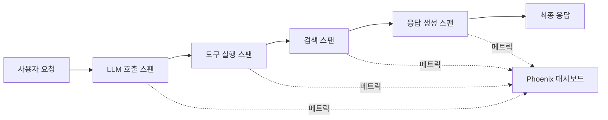
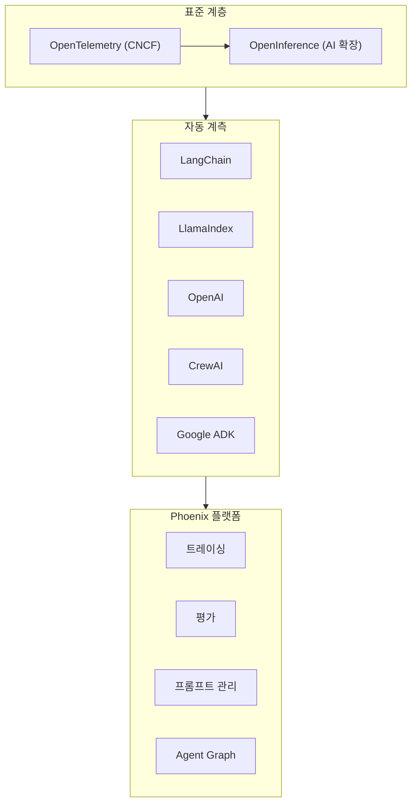

## 개요

Arize Phoenix는 Arize AI가 개발한 오픈소스 AI 옵저버빌리티 및 평가 플랫폼이다. OpenTelemetry 표준 위에 AI 전용 의미론을 확장한 OpenInference 계측을 기반으로 하여, 벤더 종속 없이 LLM 애플리케이션과 에이전트의 트레이싱, 평가, 프롬프트 엔지니어링을 통합 제공한다. Agent Graph 시각화 기능으로 멀티에이전트 시스템의 의사결정 과정을 직관적으로 추적할 수 있으며, LangChain, LlamaIndex, Google ADK, CrewAI 등 주요 에이전트 프레임워크를 네이티브로 지원한다.

## 핵심 기능

### 트레이싱 (Tracing)

단일 실행 과정을 단계별로 추적한다. 모델 호출, 검색, 도구 사용, 커스텀 로직을 캡처하여 동작을 디버깅하고 병목 구간을 파악한다.

### Agent Graph 시각화

멀티에이전트 시스템의 실행 트리를 시각적으로 표현한다. 에이전트가 하위 에이전트에 위임한 방식, 어떤 도구가 작동했는지, 상태가 어떻게 변경되었는지를 한눈에 파악할 수 있다. 원시 로그를 읽는 것보다 10배 빠른 디버깅이 가능하다.

### 평가 (Evaluation)

LLM 기반 평가자, 코드 기반 검사, 인간 라벨을 활용하여 출력 품질을 측정한다. 트레이스 및 세션 수준의 평가를 지원하며, 개발 단계의 평가를 프로덕션에 동일하게 적용할 수 있다.

### 프롬프트 엔지니어링

실제 프로덕션 예제로 프롬프트를 버전 관리하고, 프롬프트 변형을 데이터셋에서 테스트한다. A/B 테스트와 체계적 비교가 가능하다.

### 데이터셋 및 실험

동일한 입력으로 애플리케이션의 다양한 버전을 비교하고 평가 결과를 검증한다. 회귀 테스트와 성능 비교를 체계적으로 수행할 수 있다.

## 기술 상세

### OpenTelemetry + OpenInference

Phoenix는 CNCF 표준인 OpenTelemetry를 기반으로 구축되었다. 텔레메트리 데이터 수집 및 내보내기가 특정 백엔드에 제한되지 않는 벤더 중립적 접근이 핵심이다. Arize가 개발한 OpenInference 프로젝트는 기본 OTel 사양을 AI 전용 의미론(LLM 호출, 임베딩, 검색 등)으로 확장한다.

### 지원 프레임워크 및 통합

| 카테고리 | 지원 대상 |
|---------|---------|
| 오케스트레이션 | LangChain, LlamaIndex, DSPy, Mastra |
| AI SDK | Vercel AI SDK, OpenAI, Anthropic, AWS Bedrock |
| 에이전트 | CrewAI, Google ADK |
| 평가 통합 | Ragas, Deepeval, Cleanlab |
| 언어 | Python, TypeScript, Java |
| 프로토콜 | [[model-context-protocol-mcp]] (IDE 통합 디버깅) |

### 배포 옵션

| 방식 | 설명 |
|------|------|
| 로컬 | `pip install arize-phoenix`로 즉시 실행 |
| Docker | 컨테이너 기반 배포 |
| Kubernetes | 대규모 프로덕션 환경 |
| 클라우드 | Arize 호스팅 버전 |

### 경쟁 도구 비교

| 항목 | Arize Phoenix | [[langfuse]] | [[braintrust]] | [[galileo-ai]] |
|------|-------------|-------------|---------------|--------------|
| 라이선스 | 오픈소스 | MIT 오픈소스 | 상용 | 상용 |
| 핵심 강점 | OTel 네이티브, Agent Graph | 유연성, 셀프호스팅 | 80x 쿼리, Loop AI | Luna-2 실시간 평가 |
| 벤더 중립 | OTel 기반 완전 중립 | 자체 SDK | 자체 SDK | 자체 SDK |
| 에이전트 그래프 | 내장 | 없음 | 없음 | 없음 |
| 가격 | 오픈소스 무료 | 셀프호스팅 무료 | Free 1M 스팬 | 유료 |

## 도입 시 고려사항

**적합 케이스**:
- 벤더 종속 없이 AI 옵저버빌리티를 구축하려는 조직
- 기존 OpenTelemetry 인프라가 있는 환경 (자연스러운 확장)
- 멀티에이전트 시스템의 의사결정 과정을 시각적으로 디버깅해야 하는 경우
- DevOps 역량이 충분하고 셀프호스팅을 선호하는 팀
- 다양한 AI 프레임워크를 혼용하는 환경

**제약사항**:
- 실시간 가드레일 기능은 [[galileo-ai]]나 [[fiddler-ai]]에 비해 제한적
- 엔터프라이즈 지원은 Arize 호스팅 버전에서만 제공
- UI 완성도는 상용 제품 대비 보통 수준

## 관련 문서

- [[galileo-ai]] - Galileo AI (LLM 평가 및 옵저버빌리티)
- [[braintrust]] - Braintrust (AI 옵저버빌리티)
- [[langfuse]] - Langfuse (오픈소스 LLM 옵저버빌리티)
- [[fiddler-ai]] - Fiddler AI Control Plane (에이전트 옵저버빌리티)
- [[model-context-protocol-mcp]] - MCP (IDE 통합 디버깅 지원)
