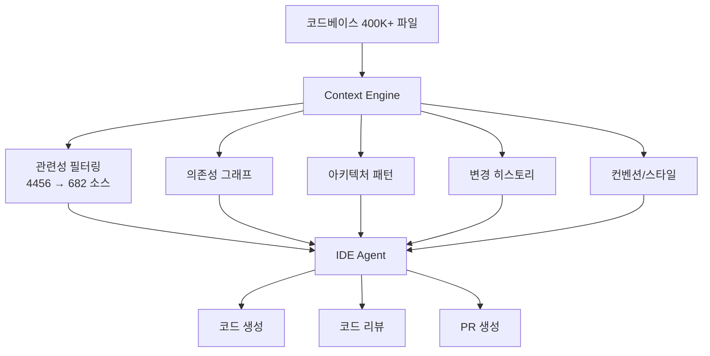
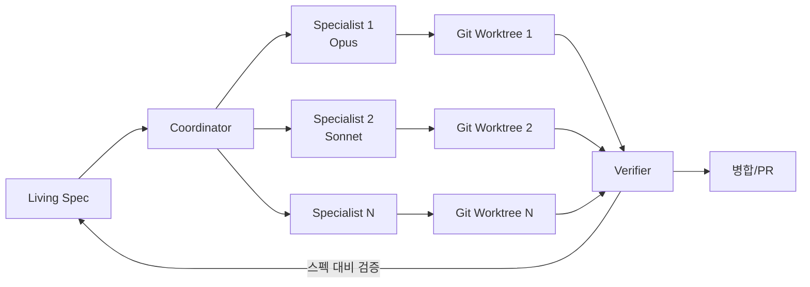

# Augment Code (Context Engine)

## 개요

Augment Code는 400,000개 이상의 파일을 처리할 수 있는 Context Engine을 핵심 기술로 내세운 엔터프라이즈급 AI 코딩 어시스턴트다. 코드, 의존성, 아키텍처, 변경 히스토리를 포함한 전체 스택의 실시간 이해를 유지하여, 대규모 코드베이스에서도 깊은 맥락 기반 코드 생성과 리뷰를 수행한다.

동일한 기반 모델([[context-engineering|LLM]])을 사용하는 다른 코딩 도구들과 달리, Augment Code는 Context Engine이 제공하는 맥락 품질이 코드 생성 품질의 핵심 차별화 요소라고 주장한다. ISO/IEC 42001 인증을 취득하여 엔터프라이즈 보안 요구사항을 충족하며, MongoDB, Spotify, Snyk, Webflow 등 대형 기업이 실전 도입하고 있다.

## 핵심 특징

### Context Engine

- 400,000개 이상 파일의 코드베이스에서 실시간 맥락 유지
- 코드뿐 아니라 의존성 그래프, 아키텍처 패턴, git 히스토리를 함께 분석
- 프로젝트 전체의 암묵적 컨벤션과 패턴을 학습하여 일관된 코드 생성
- 4,456개 소스를 분석한 뒤 682개의 관련 파일로 필터링하는 고도의 관련성 랭킹 시스템 내장
- Elasticsearch 리포지토리(Java 360만 라인, 기여자 2,187명) 규모의 코드베이스로 벤치마크 검증

### [[junie-cli|IDE]] Agents

- 프롬프트에서 풀 리퀘스트까지의 전 과정을 자동화
- VS Code, JetBrains (IntelliJ 등), CLI 환경 지원
- 세션 간 메모리 지속(memory persistence)으로 이전 작업 맥락 유지
- Slack 통합을 통한 팀 워크플로우 연동

### Intent (에이전트 오케스트레이션 워크스페이스)

- **Coordinator-Specialist-Verifier 시스템**: Coordinator가 스펙을 개별 태스크로 분해하고, Specialist 에이전트가 병렬 웨이브로 실행하며, Verifier가 스펙 대비 결과를 검증하는 3단계 팀 구조
- **Living Specifications**: 에이전트 작업 완료 시 스펙이 자동 갱신되어 계획-실행 간 문서 드리프트(documentation drift) 제거. 요구사항 변경이 활성 에이전트에 실시간 전파
- **Git Worktree 격리**: 각 작업 스트림이 독립적인 git worktree에서 실행되어 브랜치 충돌 방지
- **태스크별 모델 선택**: "Opus for architecture, Sonnet for speed" -- 태스크 복잡도에 따라 연산 강도를 매칭
- **Resumable Sessions**: 워크스페이스 상태가 세션 종료 후에도 지속. Auto-commit으로 에이전트 작업을 태스크 완료 시점에 자동 저장
- 코드 에디터, 브라우저 프리뷰(Chrome), 터미널, Git 클라이언트를 단일 윈도우에 통합

### Code Review

- GitHub 인라인 댓글 방식의 자동 코드 리뷰
- 원클릭 IDE 수정 제안 기능

## 기술 상세

### 벤치마크 성능

SWE-Bench Pro에서 51.80%를 기록하여 상위권에 위치한다. 이는 대규모 코드베이스에서의 장기 호흡 소프트웨어 엔지니어링 태스크 해결 능력을 실증하는 수치다.

| 도구 | SWE-Bench Pro (%) | 기반 모델 |
|------|-------------------|-----------|
| **Augment Code** | **51.80** | Claude Opus 4.5 |
| Cursor | 50.21 | - |
| Claude Code | 49.75 | Claude Opus 4.5 |

블라인드 스터디(500개 PR)에서 인간 베이스라인 대비 코드 품질 평가:

| 항목 | 개선율 |
|------|--------|
| 전체 품질 | +12.8% |
| 정확성(Correctness) | +14.8% |
| 코드 재사용(Code Reuse) | +18.2% |

### 아키텍처

### Intent 워크플로우

### 보안 및 인증

- ISO/IEC 42001 AI 관리 시스템 인증 취득
- 엔터프라이즈 배포 환경에 적합한 데이터 처리 정책
- Trust Center를 통한 보안 정책 공개

### 엔터프라이즈 도입 사례

MongoDB, Spotify, Snyk, Webflow 등 대형 기업이 프로덕션 환경에서 사용 중이다. 특히 대규모 모노레포(monorepo)를 운영하는 조직에서 Context Engine의 맥락 품질이 핵심 차별 요인으로 작용한다.

## 다른 코딩 어시스턴트와의 비교

| 항목 | Augment Code | Cursor | Claude Code |
|------|-------------|--------|-------------|
| 핵심 차별점 | Context Engine (400K+ 파일) | 에디터 내장 AI | 터미널 기반 에이전트 |
| SWE-Bench Pro | 51.80% | 50.21% | 49.75% |
| 에이전트 오케스트레이션 | Intent (멀티에이전트, 병렬) | 제한적 | 단일 에이전트 |
| IDE 지원 | VS Code, JetBrains, CLI | Cursor IDE (독립) | 터미널 (IDE 독립) |
| 엔터프라이즈 인증 | ISO/IEC 42001 | 해당 없음 | 해당 없음 |
| 코드 리뷰 | GitHub 인라인 | 미지원 | 미지원 |
| Git 통합 | 네이티브 (worktree 포함) | 기본 git | 네이티브 |

Augment Code의 핵심 주장은 "동일한 기반 모델(LLM)을 사용하더라도 Context Engine이 제공하는 맥락 품질이 코드 생성 품질의 핵심 차별화 요소"라는 것이다. 이는 SWE-Bench Pro에서 Claude Opus 4.5를 동일하게 사용하면서도 Claude Code 자체보다 높은 점수를 기록한 것으로 뒷받침된다.

## 관련 문서

- [[ai-code-review-tools]] -- AI 코드 리뷰 도구 비교
- [[swe-bench-pro]] -- SWE-bench Pro 벤치마크
- [[claude-code]] -- Claude Code CLI 도구
