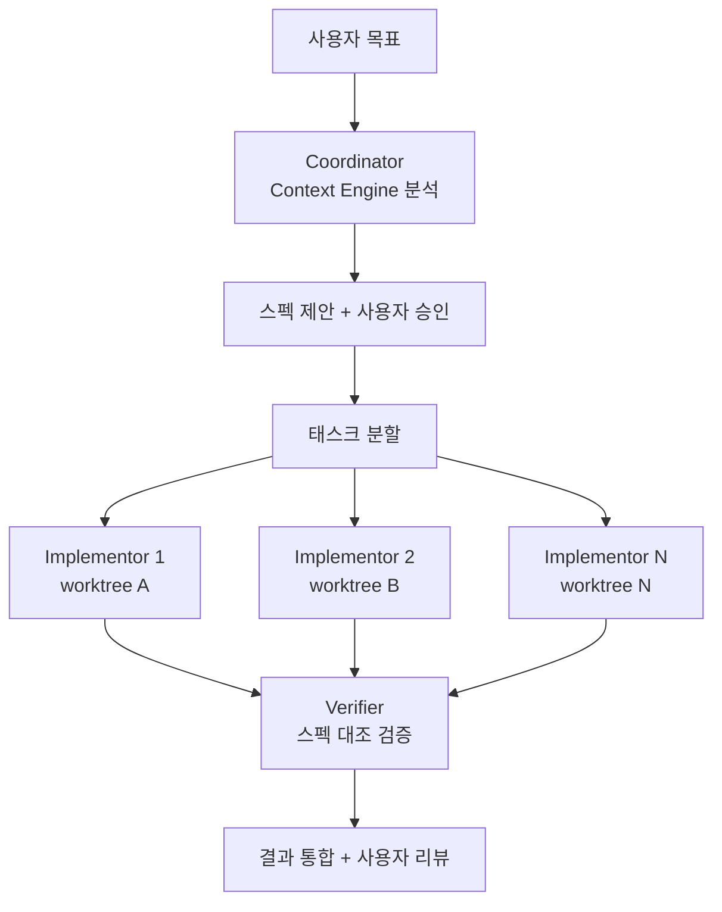

## 개요

Intent는 Augment Code가 개발한 에이전트 오케스트레이션 워크스페이스다. 복수의 AI 에이전트를 충돌 없이 병렬로 실행하는 것이 핵심이며, 각 에이전트는 독립된 git worktree에서 격리되어 작업한다. Coordinator-Implementor-Verifier 3단계 에이전트 팀 구조를 통해 계획 수립부터 구현, 검증까지를 자동화한다.

기존 코딩 에이전트가 단일 에이전트로 순차 작업하는 것과 달리, Intent는 여러 작업을 동시에 진행하면서도 코드 충돌을 방지하는 멀티에이전트 접근을 취한다. [[spec-driven-development|스펙 드리븐 개발]]의 Living Specification으로 코드와 문서를 동기화하며, [[coding-agent|코딩 에이전트]] 범주에서 [[git-worktree-isolation|Git Worktree 격리]] 전략을 가장 완성도 있게 구현한 사례다.

## 핵심 특징

### 3단계 에이전트 구조

1. **Coordinator (코디네이터)**: Context Engine을 활용해 작업을 분석하고 구현 스펙을 제안한다. 사용자 승인 전까지 실행하지 않는다.
2. **Implementor (구현자)**: 승인된 계획을 병렬로 실행한다. 각 구현자는 독립된 worktree에서 작업한다.
3. **Verifier (검증자)**: 구현 결과를 스펙과 대조하여 일관성과 버그를 확인한 뒤 사용자에게 반환한다.

이 구조는 완전히 커스터마이징 가능하며, 다른 전문 에이전트를 추가할 수 있다.

### Git Worktree 격리

각 워크스페이스는 독립적인 git worktree로 지원된다. 이를 통해:

- 에이전트 간 파일 충돌 방지
- 작업 일시 중지 및 컨텍스트 전환 지원
- 변경사항을 안전하게 탐색하고 롤백 가능
- 메인 브랜치에 영향 없이 실험적 구현 수행

### Context Engine

프로젝트의 코드베이스, 의존성, 패턴을 자동으로 분석하여 에이전트에게 필요한 정확한 컨텍스트를 제공한다. 프롬프트를 수동으로 복사-붙여넣기할 필요가 없다.

실제 작업에서 Context Engine은 수천 개의 소스 중 관련 항목만 선별한다. 예: 4,456개 소스에서 특정 태스크에 필요한 682개 항목만 큐레이션하여 에이전트에 전달.

### Living Specification

Intent의 스펙은 "살아있는 문서"다. 에이전트가 코드를 변경할 때마다 스펙도 자동으로 갱신되어, 기존 문서가 코드 출시 후 즉시 구식이 되는(documentation rot) 문제를 해결한다. 모든 인간과 에이전트가 동일한 최신 스펙을 참조하여 정렬을 유지한다.

### BYOA (Bring Your Own Agent)

기존 Claude Code, Codex, OpenCode 구독을 그대로 사용할 수 있다. Augment 구독 없이도 Intent의 전체 기능을 활용할 수 있으며, Augment의 Context Engine MCP를 통해 시맨틱 검색 기능을 추가할 수 있다.

## 기술 상세

### 실행 아키텍처

### 전문 에이전트 (6종 기본 포함)

| 에이전트 | 역할 |
|---|---|
| **Investigate** | 코드베이스 탐색, 관련 파일/패턴 식별 |
| **Implement** | 승인된 계획에 따른 코드 작성 |
| **Verify** | 스펙 대조 검증, 테스트 실행 |
| **Critique** | 구현 품질 평가, 개선점 제안 |
| **Debug** | 오류 진단, 수정 방안 제시 |
| **Code Review** | 코드 리뷰, 스타일/보안 검토 |

### 통합 워크스페이스

단일 윈도우에서 코드 에디터, 브라우저 프리뷰(Chrome), 터미널, Git 관리를 통합한다. 프롬프트에서 커밋, PR, 머지까지 앱을 떠나지 않고 전체 개발 사이클을 완료할 수 있다.

세션 영속성: 앱을 닫고 다음 날 열어도 모든 작업 상태가 정확히 유지된다. 자동 커밋과 브랜치 추적이 포함된다.

### 경쟁 도구 비교

| 특성 | Intent | Cursor | Copilot /fleet | Claude Code Swarm |
|------|--------|--------|----------------|-------------------|
| 병렬 에이전트 | O (네이티브) | X | O (서브에이전트) | O (팀 모드) |
| Worktree 격리 | 자동 | 수동 | 자동 | 수동 |
| 에이전트 팀 구조 | Coordinator-Implementor-Verifier | 단일 에이전트 | Orchestrator-Worker | 피어 기반 |
| 코드베이스 컨텍스트 | Context Engine (시맨틱) | 인덱싱 | 코드 서치 | 프로젝트 파일 |
| Living Spec | O | X | X | X |
| 모델 선택 | Mix-and-match (Opus/Sonnet/GPT) | 고정 | 고정 | Claude 전용 |

### 플랫폼 지원

현재 macOS (Apple Silicon) 전용. Windows/Linux는 퍼블릭 베타 성과에 따라 개발 예정이다.

## 활용 시나리오 예시

**JWT 인증 구현 태스크**:
1. Coordinator가 Context Engine으로 코드베이스 분석 후 스펙 생성
2. 사용자 승인 후 Implementor A(토큰 발행 로직)와 Implementor B(게이트웨이 미들웨어)가 별도 worktree에서 병렬 작업
3. 백그라운드 에이전트가 테스트/린팅 동시 수행
4. Verifier가 스펙 대조 후 통합 PR 생성

이 과정에서 에이전트들이 "여러 레포에 걸쳐 병렬로 작업"하며, Living Spec이 모든 변경을 실시간 반영한다.

### 가격 및 이용

퍼블릭 베타 기간 중 별도 가격 티어 없이 표준 Augment 크레딧으로 사용한다. BYOA 모드에서는 Augment 구독 없이도 기존 Claude Code/Codex/OpenCode 구독으로 전체 기능 이용 가능하다.

## 관련 문서

- [[copilot-fleet]] - GitHub Copilot 병렬 멀티에이전트
- [[orchestrator-worker-pattern]] - 오케스트레이터-워커 패턴
- [[git-worktree-isolation]] - Git Worktree 격리 전략
- [[subagents]] - 서브에이전트 패턴
- [[augment-code]] - Augment Code의 400K+ 파일 컨텍스트 엔진
