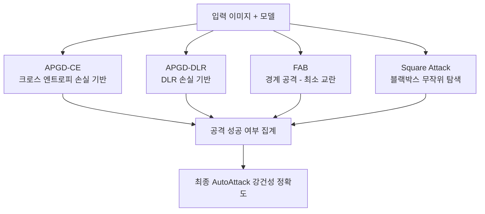

# AutoAttack 벤치마크

## 개요

AutoAttack은 딥러닝 모델의 **적대적 강건성(adversarial robustness)** 을 표준화된 방식으로 측정하기 위한 공격 앙상블 프레임워크 및 벤치마크다. Francesco Croce와 Matthias Hein이 2020년에 제안했으며, 연구자들이 직접 공격 코드를 구현하거나 튜닝하지 않고도 신뢰할 수 있는 강건성 평가를 수행할 수 있도록 설계되었다.

[[adversarial-attacks-robustness]] 분야에서 AutoAttack이 등장하기 전까지는 각 논문이 서로 다른 공격 설정을 사용하여 결과 비교가 어려웠다. AutoAttack은 이 문제를 해결한 사실상의 표준(de facto standard)으로 자리잡았다.

## 동기: 왜 표준 평가가 필요한가

### 기존 평가의 문제점

[[pgd-adversarial-training]]으로 학습된 모델들을 평가할 때, 초기에는 PGD(Projected Gradient Descent) 공격으로만 강건성을 측정했다. 그러나 많은 "강건한" 모델이 실제로는:

- **그래디언트 마스킹(Gradient Masking)**: 그래디언트가 의도적으로 0에 가깝게 만들어져 그래디언트 기반 공격을 회피
- **기울기 소실(Vanishing Gradient)**: 비미분 가능한 연산을 통해 공격자의 업데이트를 막음
- **잘못된 수렴(False Convergence)**: PGD가 로컬 미니멈에 갇혀 실제 최악의 적대적 예제를 찾지 못함

이런 취약점 때문에 PGD 강건성이 높아도 다른 공격에는 쉽게 무너지는 경우가 많았다.

## AutoAttack의 구성

AutoAttack은 서로 다른 원리를 가진 4개의 공격을 앙상블하여 포괄적인 평가를 수행한다.



### 공격 1: APGD-CE (Auto-PGD with Cross-Entropy)

PGD의 자동화 버전. 스텝 크기를 자동으로 조정하여 수동 튜닝 없이도 효과적인 공격을 수행한다. 크로스 엔트로피를 손실 함수로 사용한다.

**자동 스텝 크기 조정 원리:** 일정 스텝 수 후 손실이 개선되지 않으면 스텝 크기를 절반으로 줄이고 체크포인트로 되돌아가는 방식으로 국소 최적에 빠지는 것을 방지한다.

### 공격 2: APGD-DLR (Auto-PGD with DLR Loss)

DLR(Difference of Logits Ratio) 손실을 사용한다. 이 손실은 그래디언트 마스킹에 더 강건하며, 특히 소프트맥스 출력의 포화(saturation) 상황에서도 유효한 그래디언트를 유지한다.

$$L_{DLR}(x, y) = -\frac{z_y - \max_{j \neq y} z_j}{z_{[1]} - z_{[3]}}$$

분모의 상위 로짓 차이가 0에 가까워지는 것을 방지하여 그래디언트 소실 문제를 완화한다.

### 공격 3: FAB (Fast Adaptive Boundary)

모델의 결정 경계에 가장 가까운 적대적 예제를 찾는 경계 공격(boundary attack)이다. 최소 $L_p$ 교란으로 분류가 바뀌는 지점을 찾아 교란 크기를 최소화한다.

- 화이트박스 공격 (그래디언트 접근 가능)
- 교란 크기 최소화에 특화 - 모델의 결정 경계 위치를 더 정밀하게 파악

### 공격 4: Square Attack

**블랙박스(black-box)** 공격으로, 모델의 그래디언트에 접근하지 않고 입력-출력 쌍만으로 공격한다. 무작위 사각형(square) 형태의 교란을 반복 적용하며 손실을 최대화한다.

- 그래디언트 마스킹/은닉에 완전히 면역
- 쿼리 효율적인 블랙박스 설정에서도 강력

## 벤치마크 리더보드

AutoAttack의 저자들은 [RobustBench](https://robustbench.github.io/)라는 공개 리더보드를 운영한다. 제출된 모델의 AutoAttack 강건성을 공식적으로 검증하고 순위를 매긴다.


주요 평가 설정:
- **CIFAR-10**: $\epsilon = 8/255$ ($L_\infty$ 노름)
- **ImageNet**: $\epsilon = 4/255$ ($L_\infty$ 노름)
- $L_2$ 노름 평가도 제공

## 주요 결과와 인사이트

- AutoAttack 도입 이후 많은 "SOTA 강건 모델"이 실제로는 그래디언트 마스킹에 의존하고 있었음이 밝혀짐
- [[pgd-adversarial-training]] 기반 모델의 실제 강건성은 PGD 단독 평가보다 AutoAttack 평가에서 평균 5~15%p 낮게 측정됨
- 현재 RobustBench 리더보드 상위권은 대부분 **대규모 데이터(WRN-70-16, ViT) + 적대적 학습** 조합

## 사용 방법 (Python)

```python
from autoattack import AutoAttack

# 모델 준비 (PyTorch)
adversary = AutoAttack(
    model,
    norm='Linf',
    eps=8/255,
    version='standard'  # 또는 'plus', 'rand', 'custom'
)

# 평가 실행
x_adv = adversary.run_standard_evaluation(x_test, y_test, bs=256)
```

버전 옵션:
- `standard`: APGD-CE, APGD-DLR, FAB, Square
- `plus`: standard + APGD-T, FAB-T (타겟 공격 포함)
- `rand`: 무작위 화를 사용하는 모델용

## 한계

- 화이트박스 공격 중심이므로 실제 블랙박스 위협 환경과 차이 있을 수 있음
- $L_p$ 노름 기반 교란만 평가 - 자연스러운 변환(밝기, 회전 등)에 대한 강건성은 별도 평가 필요
- 계산 비용이 높음 - 대형 모델에서 전체 테스트셋 AutoAttack 실행은 수 시간 소요

## 관련 문서

- [[adversarial-attacks-robustness]] - 적대적 공격과 방어의 전반적 개념
- [[pgd-adversarial-training]] - AutoAttack이 평가 대상으로 삼는 주요 방어 기법
- [[vit-distillation-techniques]] - 강건성 평가가 필요한 경량 ViT 학습과의 연결
