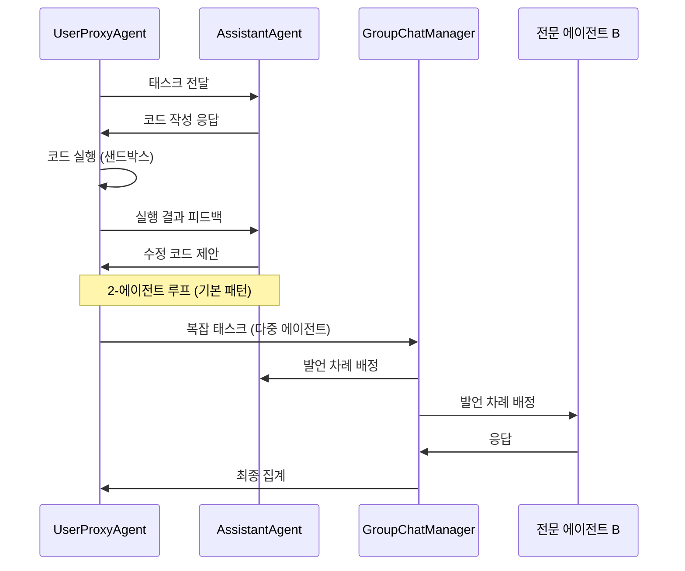

# AutoGen

Microsoft Research가 개발한 오픈소스 다중 에이전트 대화 프레임워크. 2023년에 공개된 이후 빠르게 확산되었으며, "여러 LLM 에이전트가 서로 대화하며 복잡한 태스크를 해결한다"는 패러다임을 대중화한 프로젝트다. 2024년 말에 코어 팀 일부가 독립해 **AG2**(AutoGen 2)로 포크를 만들었으며, 현재는 두 프로젝트가 병존한다.

## 프로젝트 개요

| 항목 | 내용 |
|---|---|
| 이름 | AutoGen (v0.4+) / AG2 (포크) |
| 개발 | Microsoft Research |
| 공개 | 2023년 9월 |
| 언어 | Python |
| 라이선스 | MIT (AutoGen v0.4+: Apache 2.0) |
| 저장소 | github.com/microsoft/autogen |
| 포크 | github.com/ag2ai/ag2 (AG2) |

## 핵심 개념: ConversableAgent

AutoGen의 모든 에이전트는 `ConversableAgent`를 기반으로 한다. 이 에이전트는:
- 다른 에이전트와 메시지를 주고받을 수 있다
- LLM 응답, 코드 실행, 사람 입력(Human-in-the-loop) 중 하나로 응답을 생성한다
- 대화 종료 조건을 자체적으로 판단한다(`is_termination_msg`)

두 에이전트가 서로 대화하는 **2-에이전트 패턴**이 가장 기본이며, 여기에 코드 실행 샌드박스(`UserProxyAgent`)를 붙이는 것이 표준 레시피다.

## 주요 에이전트 유형

| 에이전트 | 역할 |
|---|---|
| `AssistantAgent` | LLM이 응답을 생성하는 주체. 기본적으로 GPT-4 계열을 사용 |
| `UserProxyAgent` | 사람 또는 코드 실행기를 대리. 코드 블록을 자동 실행하고 결과를 피드백 |
| `GroupChatManager` | 3개 이상 에이전트 간 라운드로빈/선택적 발언 순서를 조율 |

위 시퀀스는 2-에이전트 패턴(상단)과 GroupChat 패턴(하단)을 함께 보여준다.

## AutoGen v0.4의 변화

v0.4(2024년 말)는 내부 아키텍처를 전면 재설계했다.

- **비동기 메시징**: 에이전트 간 통신이 동기 함수 호출에서 async 메시지 큐 기반으로 전환
- **분산 런타임**: 에이전트를 여러 프로세스/머신에 분산 배치 가능
- **AgentChat API**: 기존 v0.2 스타일의 `ConversableAgent` 인터페이스를 유지하는 호환성 레이어

이 변화로 인해 기존 v0.2 코드와 v0.4가 호환되지 않는 문제가 생겼고, 이것이 AG2 포크의 주요 배경 중 하나다.

## [[multi-agent-orchestration]]과의 관계

AutoGen은 에이전트 간 **대화(conversation)**를 기본 조율 메커니즘으로 삼는다는 점에서 독특하다. 다른 프레임워크들이 "워크플로우 그래프"나 "역할 할당"을 사용하는 데 비해, AutoGen은 에이전트들이 자연어 메시지를 주고받으며 태스크를 분해하고 해결한다.

[[crewai]]는 역할(Role)과 태스크(Task) 기반으로 에이전트를 구성하는 반면, AutoGen은 에이전트가 서로 협상하며 분업을 자동으로 결정한다는 차이가 있다.

## 코드 실행 보안

`UserProxyAgent`의 코드 실행 기능은 강력하지만 보안 위험을 수반한다. AutoGen은 다음 실행 환경을 지원한다:

- **로컬 subprocess**: 기본값, 가장 간단하지만 샌드박싱 없음
- **Docker 컨테이너**: `DockerCommandLineCodeExecutor`로 격리 실행
- **Jupyter**: `JupyterCodeExecutor`로 노트북 환경 재사용

프로덕션에서는 반드시 Docker 또는 별도 샌드박스를 사용할 것을 권장한다.

## 실무 활용 패턴

1. **코드 생성 + 테스트 루프**: AssistantAgent가 코드를 작성하고 UserProxyAgent가 테스트를 실행한 뒤 결과를 피드백하는 루프. 테스트 통과 시 자동 종료.
2. **전문가 패널**: 여러 도메인 전문 에이전트(예: 보안 전문가, 성능 전문가)를 GroupChat에 참여시켜 코드 리뷰를 수행.
3. **계층적 태스크 분해**: 오케스트레이터 에이전트가 서브태스크를 정의하고, 각 서브태스크를 담당 에이전트에게 위임.

## 관련 문서

- [[multi-agent-orchestration]] - 다중 에이전트 조율 패턴 일반론
- [[crewai]] - 역할/태스크 기반 다중 에이전트 프레임워크
- [[langgraph]] - 상태 그래프 기반 에이전트 조율
- [[subagents]] - 서브에이전트 패턴 개념
