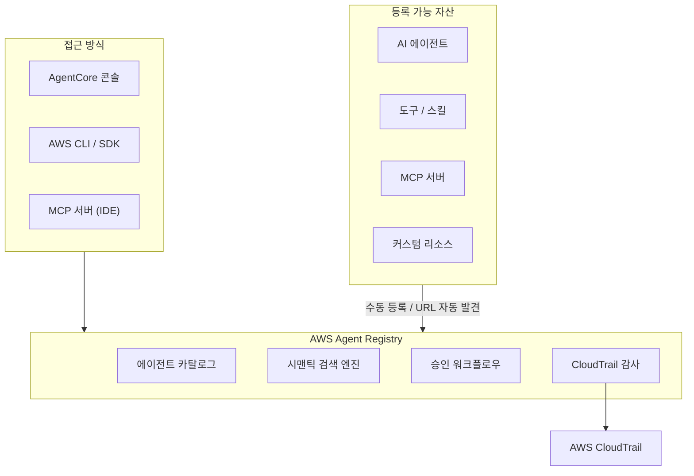

## 개요

AWS Agent Registry는 Amazon Bedrock AgentCore의 구성요소로, 조직 내 AI 에이전트, 도구, 스킬, MCP 서버 및 커스텀 리소스를 중앙에서 발견하고 관리하는 프라이빗 카탈로그이다. 2026년 4월 프리뷰로 출시되었으며, 시맨틱 검색, 승인 워크플로우, CloudTrail 기반 감사 로그를 통해 엔터프라이즈 환경에서 에이전트 자산의 재사용성을 높이고 중복 개발을 방지한다. MCP와 [[a2a-protocol]] 표준을 네이티브로 지원하여, 멀티 프레임워크/멀티 벤더 환경에서도 일관된 에이전트 거버넌스를 제공한다.

## 핵심 기능

### 중앙집중식 에이전트 카탈로그

에이전트, 도구, 스킬, MCP 서버를 하나의 레지스트리에 등록하고 조회할 수 있다. AgentCore 콘솔 UI, AWS CLI/SDK, IDE에서 MCP 서버로 직접 쿼리하는 세 가지 접근 방식을 지원한다. 수동 등록 외에도 URL 기반 자동 발견을 지원하여, 기존 인프라에 배포된 에이전트를 자동으로 인덱싱한다.

### 시맨틱 검색

자연어 의미 기반 검색과 키워드 검색을 모두 지원한다. 팀원이 "고객 문의 처리 에이전트"와 같은 자연어로 검색하면, 메타데이터와 능력 설명을 분석하여 관련 에이전트를 반환한다. 이를 통해 기존에 개발된 에이전트를 재발견하고 중복 개발을 방지한다.

### 승인 워크플로우

관리자가 새로 등록된 에이전트를 검토하고 승인하는 거버넌스 체계를 제공한다. 승인되지 않은 에이전트는 카탈로그에 노출되지 않아, 비인가 에이전트의 무분별한 확산을 방지한다.

### CloudTrail 감사

모든 레지스트리 접근과 변경을 AWS CloudTrail로 기록한다. 누가 어떤 에이전트를 등록했고, 누가 조회했으며, 어떤 에이전트가 다른 에이전트를 호출했는지 완전한 감사 추적이 가능하다.

## 아키텍처

## 표준 지원

| 표준 | 역할 |
|------|------|
| [[model-context-protocol-mcp]] | 에이전트-도구 통합, MCP 서버 자동 인덱싱 |
| [[a2a-protocol]] | 에이전트 간 통신, Agent Card 기반 발견 |

MCP 서버를 레지스트리에 등록하면, IDE에서 MCP 클라이언트로 직접 쿼리하여 사용 가능한 도구를 탐색할 수 있다. A2A 에이전트 카드도 레지스트리에 저장되어, 에이전트 간 협업 대상을 중앙에서 발견한다.

## 지원 리전 (프리뷰)

| 리전 | 코드 |
|------|------|
| 미국 동부 (버지니아 북부) | us-east-1 |
| 미국 서부 (오리건) | us-west-2 |
| 아시아 태평양 (도쿄) | ap-northeast-1 |
| 아시아 태평양 (시드니) | ap-southeast-2 |
| 유럽 (아일랜드) | eu-west-1 |

## 경쟁 제품 비교

| 제품 | 벤더 | 특징 |
|------|------|------|
| AWS Agent Registry | Amazon | AgentCore 통합, CloudTrail 감사, MCP/A2A 네이티브 |
| Entra Agent Registry | Microsoft | Azure AD 통합, 에이전트 신원 관리 |
| Agent Registry | Google Cloud | Vertex AI 통합, Agent Card 기반 |
| ACP Registry | 오픈소스 | Agent Client Protocol 기반 |

## 도입 시 고려사항

**적합 케이스**:
- AWS 중심 인프라에서 다수의 에이전트를 운영하는 조직
- MCP 서버와 A2A 에이전트를 혼합 사용하는 멀티 프레임워크 환경
- CloudTrail 기반 감사 로그가 필수인 규제 산업 (금융, 의료)
- 팀 간 에이전트 자산 재사용을 통한 중복 개발 방지가 필요한 경우

**제약사항**:
- 2026년 4월 기준 프리뷰 단계로, 프로덕션 SLA 미제공
- 5개 리전에서만 사용 가능
- 가격 정책 미공개

## 관련 문서

- [[a2a-protocol]] - Agent-to-Agent 프로토콜 (에이전트 간 통신)
- [[model-context-protocol-mcp]] - Model Context Protocol (에이전트-도구 통합)
- [[mcp-server-cards]] - MCP Server Cards / .well-known Discovery
- [[fiddler-ai]] - Fiddler AI Control Plane (에이전트 옵저버빌리티)
- [[arize-phoenix]] - Arize Phoenix (오픈소스 AI 관측)
