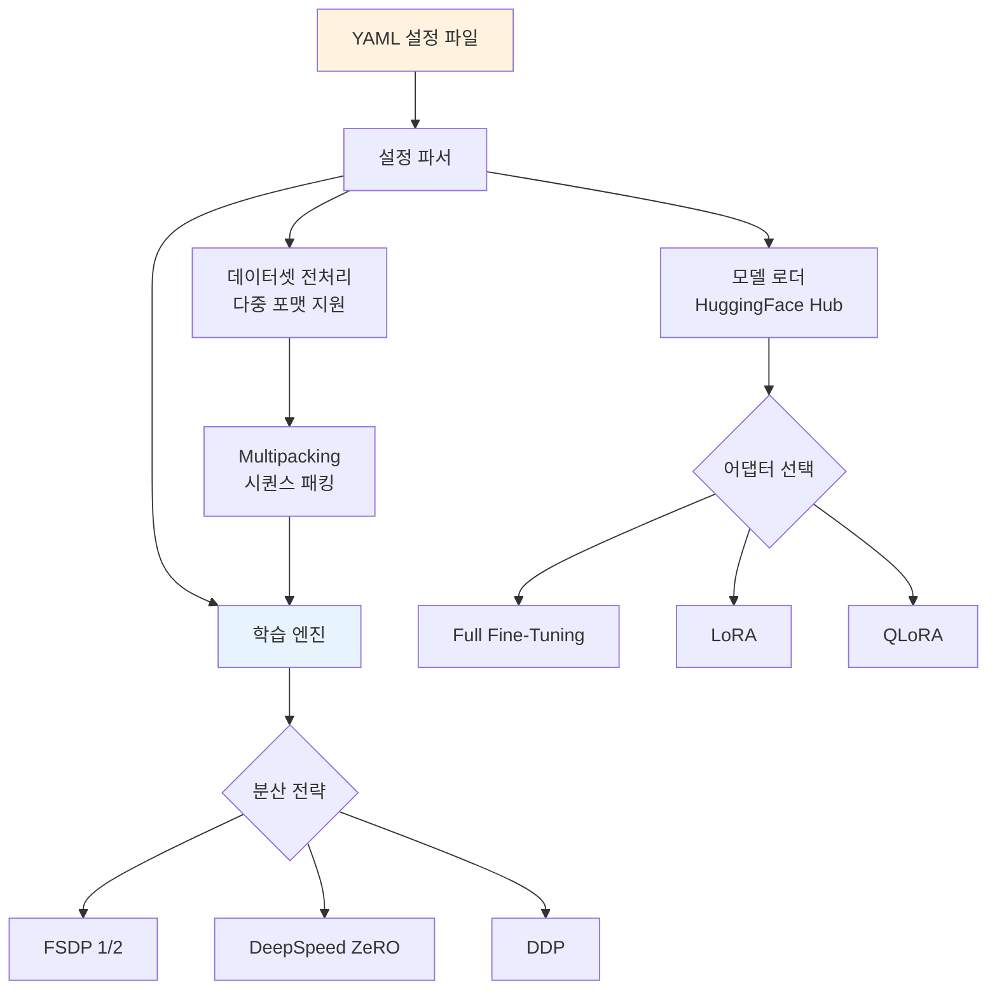
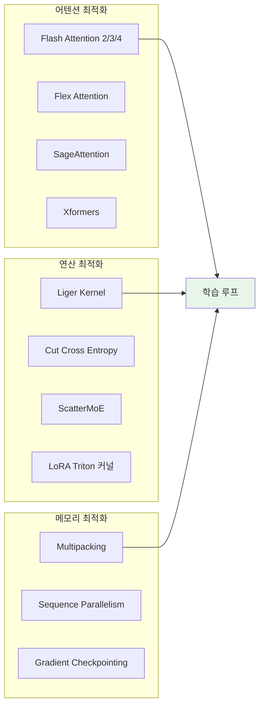

# Axolotl: YAML 기반 LLM 파인튜닝 프레임워크

## 개요

Axolotl은 대규모 언어 모델(LLM)의 포스트트레이닝과 파인튜닝을 간소화하기 위한 오픈소스 프레임워크다. 핵심 설계 철학은 **단일 YAML 설정 파일**로 모델 선택, 데이터셋 구성, 학습 하이퍼파라미터, 분산 전략까지 전체 파인튜닝 워크플로우를 제어하는 것이다. 보일러플레이트 코드 작성 없이 [[supervised-fine-tuning]]부터 [[direct-preference-optimization]]까지 다양한 학습 방법론을 실행할 수 있다.

axolotl-ai-cloud 조직에서 관리하며, Axolotl AI가 상업적 지원을 제공한다.

## 아키텍처



## 지원 학습 방법

### 파인튜닝 방식

| 방법 | 설명 | 메모리 요구 |
|------|------|------------|
| Full Fine-Tuning | 전체 파라미터 갱신 | 높음 |
| [[lora-qlora-finetuning\|LoRA]] | 저랭크 어댑터 | 중간 |
| QLoRA | 양자화 + LoRA | 낮음 |
| GPTQ | GPTQ 양자화 기반 | 낮음 |
| QAT | 양자화 인식 학습 (2025.05 추가) | 중간 |

### 포스트트레이닝 기법

- **SFT**: 표준 지도 미세조정
- **DPO / IPO / KTO / ORPO**: 선호도 기반 최적화 ([[direct-preference-optimization]] 변형)
- **GRPO / GDPO**: 강화학습 기반 정렬
- **Reward Modelling / PRM**: [[reward-model-training]] 및 프로세스 보상 모델

## 분산 학습 지원

Axolotl은 세 가지 분산 학습 백엔드를 지원한다:

### FSDP (권장)

PyTorch 네이티브 Fully Sharded Data Parallel. Axolotl에서 공식 권장하는 분산 전략이다.

- FSDP1과 FSDP2 모두 지원
- 파라미터/그래디언트/옵티마이저 상태를 GPU간 샤딩
- LoRA와 함께 사용 시 메모리 효율 극대화

### DeepSpeed

Microsoft의 최적화 라이브러리로 ZeRO Stage 1-3을 지원한다.

- Stage 1: 옵티마이저 상태 분할
- Stage 2: 그래디언트 추가 분할
- Stage 3: 파라미터까지 완전 분할 + CPU 오프로딩

### DDP

PyTorch 기본 Distributed Data Parallel. 가장 단순하지만 메모리 효율은 상대적으로 낮다.

## 성능 최적화 기능

Axolotl은 다수의 성능 최적화 기법을 내장한다:



- **Flash Attention 2/3/4**: 메모리 효율적 어텐션 연산
- **Multipacking**: 짧은 시퀀스를 하나의 배치로 묶어 GPU 활용률 극대화
- **Liger Kernel**: Triton 기반 커스텀 커널로 연산 가속
- **Cut Cross Entropy**: 메모리 효율적 손실 함수 계산
- **Sequence Parallelism**: 긴 시퀀스를 GPU간 분할 (2025.03 추가)
- **LoRA 최적화**: SwiGLU/GEGLU 활성화 함수 Triton 커널, MLP/어텐션 커스텀 autograd 함수
- **[[gradient-accumulation-checkpointing]]**: 메모리 절약을 위한 그래디언트 체크포인팅

## YAML 설정 체계

Axolotl의 가장 큰 차별점은 선언적 YAML 설정이다. 하나의 설정 파일로 전처리, 학습, 평가, 양자화, 추론까지 전체 파이프라인을 제어한다.

### 설정 예시

```yaml
base_model: meta-llama/Llama-3-8B-Instruct
load_in_8bit: false
adapter: lora
lora_r: 32
lora_alpha: 16
lora_dropout: 0.05
lora_target_modules:
  - q_proj
  - v_proj

datasets:
  - path: tatsu-lab/alpaca
    type: alpaca
  - path: custom_dataset.jsonl
    type: sharegpt

val_set_size: 0.05
sequence_len: 4096
sample_packing: true

output_dir: ./outputs/llama3-lora

micro_batch_size: 2
gradient_accumulation_steps: 4
num_epochs: 3
learning_rate: 2e-4
optimizer: adamw_bnb_8bit
lr_scheduler: cosine
warmup_steps: 100

fsdp:
  - full_shard
  - auto_wrap

flash_attention: true
```

### 데이터 포맷 지원

Axolotl은 다양한 프롬프트 템플릿과 데이터 형식을 지원한다:

- **alpaca**: instruction / input / output 형식
- **sharegpt**: 멀티턴 대화 형식
- **completion**: 단순 텍스트 완성
- **chat_template**: HuggingFace chat template 자동 적용
- 커스텀 포맷 정의 가능

## 2025년 주요 업데이트

| 시기 | 기능 |
|------|------|
| 2025.01 | Reward Modelling / PRM 지원 |
| 2025.03 | Sequence Parallelism(SP) |
| 2025.05 | Quantization Aware Training(QAT) |
| 2025.10 | Qwen3, Granite 4, HunYuan, Magistral 등 신규 모델 |

## 다른 도구와의 비교

| 특성 | Axolotl | TRL | LLaMA-Factory | Unsloth |
|------|---------|-----|---------------|---------|
| 설정 방식 | YAML 선언적 | Python API | Web UI + CLI | Python API |
| 학습 방법 폭 | 넓음 | 가장 넓음 | 넓음 | 제한적 |
| 성능 최적화 | Flash Attn, Liger | 기본 | 기본 | Triton 커널 |
| 분산 학습 | FSDP/DeepSpeed/DDP | Accelerate 기반 | DeepSpeed | 단일 GPU 중심 |
| 진입 장벽 | 중간 (YAML 이해 필요) | 낮음 (Python) | 낮음 (Web UI) | 매우 낮음 |

## 실행 방법

```bash
# 설치
pip install axolotl

# 데이터 전처리
axolotl preprocess config.yaml

# 학습 실행
axolotl train config.yaml

# 멀티 GPU (FSDP)
accelerate launch -m axolotl.cli.train config.yaml
```

## [[huggingface-hub]] 통합

- HuggingFace Hub에서 모델/데이터셋 직접 로딩
- 학습된 어댑터/모델을 Hub에 푸시
- [[lora-qlora-finetuning]] 어댑터의 자동 병합(merge) 및 업로드

## 참고 자료

- 공식 문서: https://docs.axolotl.ai
- GitHub: https://github.com/axolotl-ai-cloud/axolotl
- Axolotl AI: https://axolotl.ai
