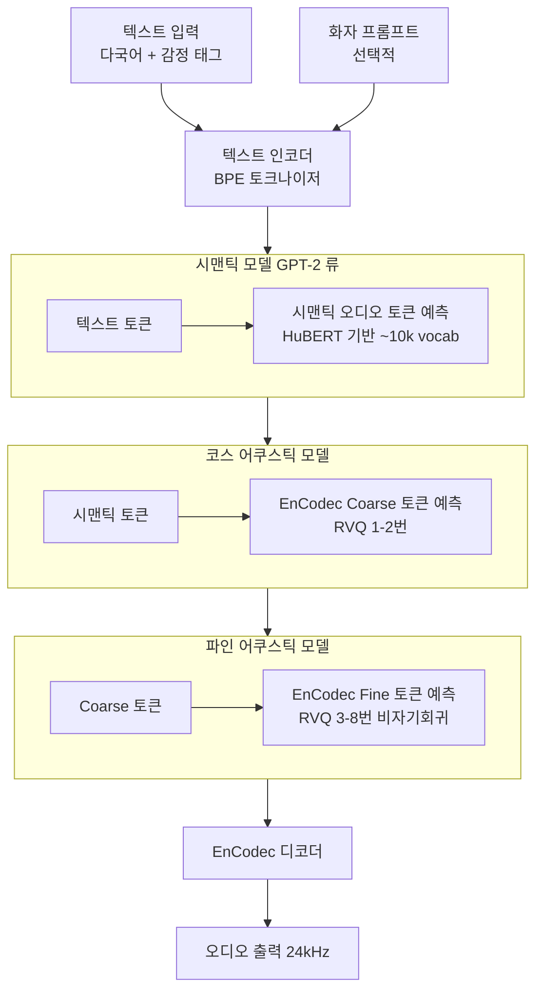

# Bark 생성형 TTS

## 개요

Bark는 Suno AI가 2023년 공개한 오픈소스 생성형 TTS(Text-to-Speech) 모델이다. [[valle-zero-shot-tts]]의 코덱 언어 모델 패러다임을 계승하면서 **다국어, 감정 표현, 비언어적 소리(웃음, 한숨 등)** 를 포함한 풍부한 오디오 생성을 지원하는 것이 차별점이다. 완전 오픈소스(MIT 라이선스)로 공개되어 연구 및 상업 활용이 자유롭다.

## 아키텍처 개요



[[valle-zero-shot-tts]]의 3단계 AR+NAR 구조와 유사하지만, Bark는 시맨틱 토큰 단계를 별도로 분리해 3개의 독립 모델로 구성한다.

## [[voxcpm2]]와의 비교

[[voxcpm2]]가 다국어 음성 이해와 생성을 위한 연구용 모델이라면, Bark는 즉시 사용 가능한 실용적 TTS 툴로 설계되었다.

| 비교 항목 | Bark | VoxCPM-2 |
|----------|------|---------|
| 목적 | 실용적 TTS 도구 | 연구용 다국어 음성 모델 |
| 공개 여부 | 오픈소스 (MIT) | [교차검증 필요] |
| 다국어 지원 | 13개+ 언어 | 다국어 |
| 비언어적 소리 | 지원 (웃음, 한숨 등) | 미확인 |

## 핵심 기능

### 다국어 지원

텍스트에 언어 힌트(`[ZH]`, `[EN]`, `[KO]` 등)를 포함하거나, 프롬프트 화자를 지정하면 해당 언어의 억양으로 발화를 생성한다. 한 문장 내에서 언어를 전환하는 코드스위칭도 제한적으로 지원한다.

### 감정 및 비언어적 표현

Bark의 가장 독특한 특징이다. 텍스트에 특수 태그를 삽입하면 해당 표현이 생성된다.

```python
text = "[웃음] 정말 재미있는 이야기네요! [한숨] 그런데..."
text = "Hello! [clears throat] As I was saying..."
```

지원되는 비언어적 표현(근사):
- `[laughs]`, `[sighs]`, `[gasps]`, `[clears throat]`
- `[music]` - 배경 음악 생성
- `...` - 망설임
- `♪` - 노래 발화

### 화자 프리셋

사전 정의된 화자 프리셋을 사용해 일관된 목소리를 재현할 수 있다.

```python
from bark import generate_audio, SAMPLE_RATE
audio = generate_audio("Hello world", history_prompt="v2/en_speaker_6")
```

## 사용 예시

```python
from bark import generate_audio, SAMPLE_RATE
import scipy

text = """
안녕하세요! [웃음] 오늘 날씨가 정말 좋네요.
"""

audio_array = generate_audio(text, history_prompt="v2/ko_speaker_0")
scipy.io.wavfile.write("output.wav", rate=SAMPLE_RATE, data=audio_array)
```

## 모델 크기와 성능

| 모델 구성 | 파라미터 수 (추정) | VRAM 요구 |
|----------|----------------|-----------|
| 시맨틱 모델 | ~700M | ~5GB |
| 코스 어쿠스틱 모델 | ~400M | ~3GB |
| 파인 어쿠스틱 모델 | ~400M | ~3GB |
| 합계 | ~1.5B | ~12GB (전체) |

소형화된 Bark Small 버전도 제공되며 ~2.5GB GPU로 실행 가능하다.

## 한계

- 생성 속도가 느림: GPU에서도 1분 오디오 생성에 15-30초 소요
- 화자 일관성이 불완전: 동일 화자 프리셋도 실행마다 미묘하게 다른 목소리 생성
- 긴 텍스트 처리 불안정: 500자 이상에서 품질 저하 가능
- 비언어적 소리는 확률적으로 생성되어 항상 원하는 위치에 나타나지 않음

## 실무 관점

Bark는 "무료 오픈소스로 사용할 수 있는 가장 자연스러운 TTS"로 자리잡고 있다. 빠른 응답이 필요한 실시간 서비스보다는 팟캐스트 자동 생성, 오디오북 제작, 게임 대사 프로토타이핑 등 배치(batch) 처리 용도에 적합하다. [[valle-zero-shot-tts]] 패러다임의 오픈소스 구현으로서 연구 기반 학습에도 유용하다.

## 관련 문서

- [[valle-zero-shot-tts]] - Bark의 이론적 기반이 된 코덱 LM TTS 모델
- [[encodec-audio-tokenizer]] - Bark가 음향 토크나이저로 사용하는 Meta 코덱
- [[rvq-residual-vector-quantization]] - 음향 토큰의 기반 양자화 기법
- [[voxcpm2]] - 관련 다국어 음성 언어 모델
- [[audiolm-framework]] - Bark 아키텍처의 계층적 생성 아이디어 출처
