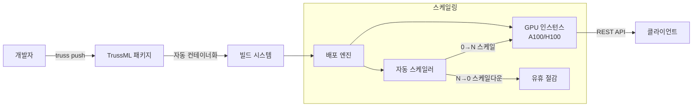
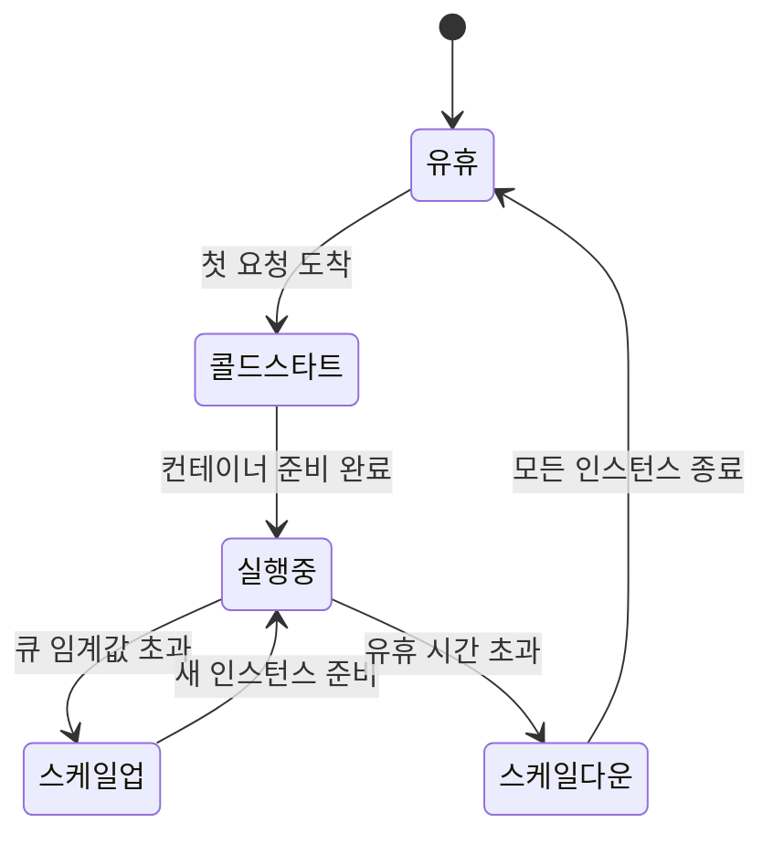
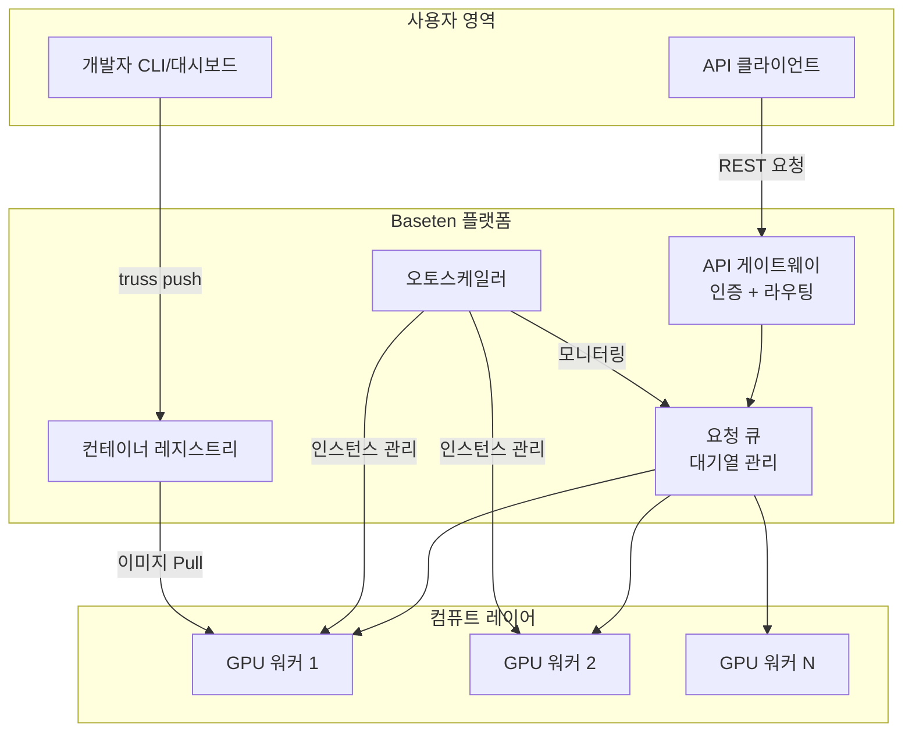
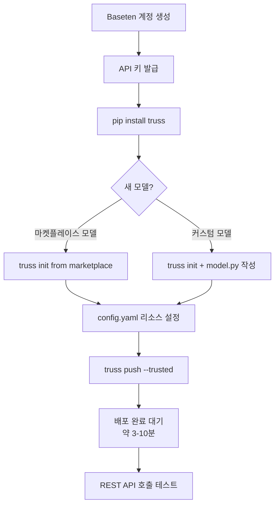

# Baseten - ML 모델 배포 플랫폼

Baseten은 ML 모델을 프로덕션 환경에 빠르게 배포하고 운영하기 위한 클라우드 플랫폼이다. TrussML이라는 오픈소스 패키징 포맷을 중심으로 GPU 인프라 관리, 자동 스케일링, 모델 마켓플레이스를 제공한다. 특히 A100/H100 고성능 GPU 인스턴스에 대한 접근성과 대기 시간 최소화에 강점이 있다.

## 플랫폼 개요



위 다이어그램은 코드 푸시부터 API 노출까지의 전체 흐름을 보여준다. 개발자는 TrussML로 모델을 패키징하고, Baseten이 나머지(컨테이너 빌드, GPU 할당, 오토스케일링)를 전담한다.

## 핵심 기능

### TrussML 패키징

TrussML은 Baseten이 개발한 오픈소스 ML 모델 패키징 표준이다. Docker 이미지를 직접 작성하지 않아도 모델을 일관된 형식으로 감쌀 수 있다.

디렉토리 구조:

```
my_model/
  config.yaml          # 환경, 의존성, 리소스 요구사항 정의
  model/
    __init__.py
    model.py           # Model 클래스 구현 (load, predict)
  data/                # 정적 파일, 토크나이저 등
  requirements.txt
```

`model.py`의 최소 인터페이스:

```python
class Model:
    def __init__(self, **kwargs):
        self._model = None

    def load(self):
        # 모델 가중치 로드 (컨테이너 시작 시 1회 실행)
        from transformers import AutoModelForCausalLM, AutoTokenizer
        self._tokenizer = AutoTokenizer.from_pretrained("meta-llama/Llama-3-8b")
        self._model = AutoModelForCausalLM.from_pretrained(
            "meta-llama/Llama-3-8b",
            torch_dtype="auto",
            device_map="auto",
        )

    def predict(self, model_input: dict) -> dict:
        # 추론 요청 처리
        prompt = model_input["prompt"]
        inputs = self._tokenizer(prompt, return_tensors="pt").to("cuda")
        outputs = self._model.generate(**inputs, max_new_tokens=512)
        text = self._tokenizer.decode(outputs[0], skip_special_tokens=True)
        return {"generated_text": text}
```

`config.yaml`에서 GPU, 메모리, Python 버전 등을 선언:

```yaml
model_name: llama3-8b
python_version: py311
requirements:
  - transformers==4.40.0
  - torch==2.3.0
  - accelerate
resources:
  cpu: "4"
  memory: 16Gi
  use_gpu: true
  accelerator: A100
runtime:
  predict_concurrency: 1
```

배포 명령:

```bash
pip install truss
truss push ./my_model --trusted
```

### GPU 자동 스케일링

Baseten의 자동 스케일링은 요청량 기반으로 GPU 인스턴스 수를 동적으로 조정한다.



주요 스케일링 파라미터:

| 파라미터 | 설명 | 기본값 |
|----------|------|--------|
| `min_replica` | 최소 인스턴스 수 | 0 (스케일-투-제로) |
| `max_replica` | 최대 인스턴스 수 | 자동 |
| `autoscaling_target` | 인스턴스당 목표 동시 요청 수 | 1 |
| `scale_down_delay` | 스케일다운 전 유휴 대기 시간(초) | 300 |

`min_replica: 0` 설정 시 트래픽이 없으면 GPU 비용이 0원이 되지만, 콜드스타트(cold start) 지연이 수십 초 발생한다. 레이턴시에 민감한 워크로드에는 `min_replica: 1` 이상을 권장한다.

### 지원 GPU 인스턴스

| GPU | VRAM | 용도 |
|-----|------|------|
| T4 | 16 GB | 소형 모델 추론, 비용 최소화 |
| A10G | 24 GB | 중형 모델, 이미지 생성 |
| A100 (40 GB) | 40 GB | 대형 LLM 추론 |
| A100 (80 GB) | 80 GB | 70B+ 모델, FP16 추론 |
| H100 SXM | 80 GB | 최고 성능, 대규모 배치 |
| H100 NVL | 94 GB | 초대형 모델, MoE(Mixture of Experts) |

H100 인스턴스는 Baseten의 차별화 포인트 중 하나로, 경쟁 플랫폼 대비 가용성이 높다고 알려져 있다.

### 모델 마켓플레이스

Baseten 마켓플레이스는 사전 패키징된 인기 모델을 원클릭으로 배포할 수 있는 카탈로그다.

포함된 모델 카테고리:
- **LLM**: Llama 3, Mixtral, Mistral 시리즈
- **임베딩**: BGE, E5, Nomic-Embed
- **이미지 생성**: SDXL, FLUX, Kandinsky
- **음성**: Whisper, Bark, MMS
- **비전**: LLaVA, InstructBLIP

마켓플레이스 모델은 TrussML 패키지 형태로 공개되어 있어, 코드를 열람하고 커스터마이징하는 것도 가능하다.

## 아키텍처 상세



### 스트리밍 응답 지원

LLM 토큰 스트리밍을 위해 `predict` 메서드를 제너레이터로 구현할 수 있다:

```python
def predict(self, model_input: dict):
    prompt = model_input["prompt"]
    inputs = self._tokenizer(prompt, return_tensors="pt").to("cuda")
    streamer = TextIteratorStreamer(self._tokenizer, skip_prompt=True)

    generation_kwargs = dict(
        **inputs,
        streamer=streamer,
        max_new_tokens=512,
    )
    thread = Thread(target=self._model.generate, kwargs=generation_kwargs)
    thread.start()

    for token in streamer:
        yield token  # Baseten이 SSE(Server-Sent Events)로 전달
```

클라이언트에서 스트리밍 수신:

```python
import requests

resp = requests.post(
    "https://model-<id>.api.baseten.co/production/predict",
    headers={"Authorization": "Api-Key <your_key>"},
    json={"prompt": "한국의 수도는?"},
    stream=True,
)
for chunk in resp.iter_content(chunk_size=None):
    print(chunk.decode(), end="", flush=True)
```

### 시크릿 및 환경 변수 관리

허깅페이스 토큰, API 키 등의 시크릿은 Baseten 대시보드에서 등록하고, `config.yaml`에서 환경 변수로 참조한다:

```yaml
secrets:
  hf_access_token: null   # 대시보드에서 실제 값 등록

environment_variables:
  CUDA_VISIBLE_DEVICES: "0"
  HF_HOME: "/tmp/huggingface"
```

`model.py`에서는 일반 환경 변수처럼 읽으면 된다:

```python
import os
hf_token = os.environ["hf_access_token"]
```

## 경쟁 플랫폼과 비교

| 기능 | Baseten | [[modal-com-runtime\|Modal]] | [[replicate-platform\|Replicate]] | [[bento-cloud-mlops\|BentoCloud]] |
|------|---------|-------|-----------|-----------|
| 패키징 형식 | TrussML | 데코레이터 함수 | Cog | BentoML |
| 스케일-투-제로 | 지원 | 지원 | 지원 | 지원 |
| H100 가용성 | 높음 | 높음 | 중간 | 중간 |
| 오픈소스 모델 마켓 | 있음 | 없음 | 풍부함 | 없음 |
| 커스텀 모델 배포 | 용이 | 용이 | 용이 | 용이 |
| 엔터프라이즈 기능 | 있음 | 제한적 | 제한적 | 있음 |
| 가격 모델 | 사용량 과금 | 사용량 과금 | 사용량 과금 | 사용량 과금 |
| Python API 복잡도 | 중간 | 낮음 | 낮음 | 중간 |

### Baseten vs Modal

- **Modal**은 Python 데코레이터 방식으로 코드를 그대로 배포하므로 진입 장벽이 낮다.
- **Baseten**은 TrussML 패키징 단계가 있어 초기 설정이 더 필요하지만, 모델 라이프사이클 관리와 마켓플레이스 통합에서 유리하다.

### Baseten vs Replicate

- **Replicate**는 오픈소스 커뮤니티 모델 접근성이 최고 수준이며, 퍼블릭 모델을 즉시 호출할 수 있다.
- **Baseten**은 프라이빗 모델 관리와 엔터프라이즈 SLA에 더 집중된 플랫폼이다.

## 실무 사용 가이드

### 빠른 시작 체크리스트



### 모델 버전 관리

Baseten은 배포마다 버전을 추적하고, 트래픽을 특정 버전에 고정하거나 점진적으로 이동할 수 있다:

- **프로덕션(Production)**: 트래픽을 받는 안정 버전
- **개발(Development)**: 테스트 중인 버전 (프로덕션 트래픽 미수신)

버전 프로모션은 대시보드에서 클릭 한 번으로 가능하다.

### 비용 최적화 전략

1. **스케일-투-제로 활용**: 배치 처리나 비정기 워크로드는 `min_replica: 0`으로 유휴 비용 제거
2. **요청 배칭**: `predict_concurrency`를 높이고 클라이언트 측에서 배치 요청을 묶어 GPU 활용도 향상
3. **양자화 모델 사용**: INT8/INT4 양자화([[inference-quantization]])로 작은 GPU에서 더 큰 모델 실행
4. **T4 → A100 선택적 사용**: 개발/테스트는 T4, 프로덕션 배치는 A100으로 분리

### 모니터링과 관찰성

Baseten 대시보드에서 제공하는 메트릭:
- 요청 수(RPS), 응답 시간(P50/P95/P99), 오류율
- GPU 활용률, 메모리 사용량
- 큐 깊이(queue depth) - 스케일링 근거

외부 모니터링 연동: Datadog, Grafana 등과 Webhook 또는 메트릭 엑스포트로 통합 가능.

## 한계 / 트레이드오프

| 항목 | 내용 |
|------|------|
| 콜드스타트 지연 | `min_replica: 0` 시 첫 요청에 30초~2분 지연 (모델 크기에 따라 다름) |
| 멀티-GPU 지원 | 단일 인스턴스 내 멀티-GPU 텐서 패럴리즘 설정이 비교적 복잡 |
| 지역(Region) 선택 | AWS us-east-1 중심, GCP/Azure 선택지가 제한적 |
| 벤더 종속성 | TrussML은 Baseten 중심 표준으로 타 플랫폼 이식 시 재작성 필요 |
| 가격 투명성 | 공개 가격표가 상세하지 않아 견적 예측이 어려운 편 |
| 로컬 테스트 | `truss run` 명령으로 로컬 Docker 실행 가능하나 GPU 환경 재현이 불완전할 수 있음 |

## 관련 문서

- [[replicate-platform]] - 오픈소스 모델 마켓플레이스 중심의 대안 플랫폼
- [[modal-com-runtime]] - Python 데코레이터 기반 서버리스 GPU 실행 환경
- [[bento-cloud-mlops]] - BentoML 기반 엔터프라이즈 MLOps 플랫폼
- [[bentoml]] - BentoML 오픈소스 프레임워크 (BentoCloud의 기반)
- [[ray-distributed]] - 분산 ML 실행 프레임워크 (대규모 커스텀 배포 대안)
- [[kserve]] - Kubernetes 네이티브 모델 서빙 표준
