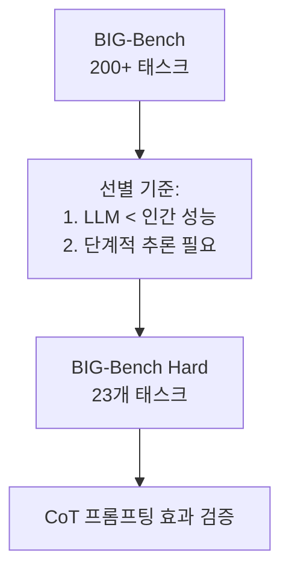

# BIG-Bench Hard (BBH)

BIG-Bench Hard(BBH)는 **BIG-Bench** 전체 태스크 중 당시 최신 언어 모델들이 인간 평균 성능 이하를 기록한 23개의 어려운 추론 과제만 선별한 서브셋이다. 2022년 Suzgun 외 연구진이 발표했으며, 체인-오브-씽킹(chain-of-thought) 프롬프팅이 이런 어려운 과제에서 얼마나 효과적인지 분석하기 위해 구성되었다. [[chain-of-thought-paper]]에서 제시된 추론 방법론의 효과를 체계적으로 검증하는 데 핵심적인 역할을 했다.

## BIG-Bench와 BBH의 관계

BIG-Bench(Beyond the Imitation Game Benchmark)는 200개 이상의 다양한 태스크로 구성된 대규모 벤치마크 모음이다. BBH는 그 중 특히 어렵고 흥미로운 23개 태스크를 추려낸 것으로, 다음 기준으로 선별되었다.

- 기존 LLM들이 **무작위 베이스라인보다 성능이 낮거나 비슷한** 태스크
- 단계적 추론(step-by-step reasoning)이 필요한 구조적 과제
- 언어적 패턴 매칭만으로는 해결 불가능한 논리적 과제



## 23개 태스크 목록

BBH는 크게 **알고리즘/형식 추론**, **언어 추론**, **상식/지식 추론** 세 범주로 나눌 수 있다.

| 범주 | 태스크 예시 |
|------|------------|
| 알고리즘/형식 추론 | Boolean Expressions, Multistep Arithmetic, Web of Lies, Logical Deduction, Dyck Languages |
| 언어 추론 | Causal Judgement, Disambiguation QA, Formal Fallacies, Temporal Sequences |
| 상식/지식 추론 | Movie Recommendation, Sports Understanding, Date Understanding, Salient Translation Error Detection |
| 코드/기호 | Word Sorting, Object Counting, Tracking Shuffled Objects |

대표 태스크 세부 내용:

- **Boolean Expressions**: 중첩된 논리 연산 결과 예측 (`True AND (False OR True)` 등)
- **Logical Deduction**: 여러 객체의 순서를 단서로부터 추론 (5-object, 7-object 변형)
- **Tracking Shuffled Objects**: 여러 이동 단계 후 객체의 최종 위치 추적
- **Causal Judgement**: 인과관계 판단 (원인-결과 방향 구별)
- **Dyck Languages**: 괄호 짝 맞추기로 문맥 자유 문법 추론

## 평가 방법

BBH는 **3-shot 체인-오브-씽킹** 프롬프팅을 표준으로 사용한다. 각 태스크에 대해 단계별 풀이 과정이 포함된 3개의 예시를 제공하고, 모델의 최종 답변의 정확도를 측정한다.


- 지표: 정규화 평균 정확도(Normalized Average Accuracy, %)
- 인간 평균: 약 89.8% (태스크별 상이)
- GPT-3 (direct): ~18% 수준
- GPT-3 (CoT): ~30% 수준 (대폭 향상)
- GPT-4: ~60-70% 수준

## CoT 프롬프팅의 효과

BBH는 [[chain-of-thought-paper]]의 핵심 주장을 실증하는 증거로 자주 인용된다.

| 모델 | Direct 프롬프팅 | CoT 프롬프팅 | 향상폭 |
|------|----------------|-------------|--------|
| LaMDA 137B | 14.8% | 17.9% | +3.1% |
| PaLM 62B | 18.7% | 23.6% | +4.9% |
| PaLM 540B | 26.2% | 42.8% | +16.6% |

대형 모델일수록 CoT의 효과가 두드러지는 **창발적 능력(emergent ability)** 패턴이 관찰된다. 소형 모델에서는 CoT가 오히려 성능을 저하시키는 경우도 있었다.

## [[evaluation-harness]]에서의 사용

[[evaluation-harness]]는 BBH를 `bbh_cot_fewshot_*` 형태의 개별 태스크로 지원한다.

```bash
# 전체 BBH 평가
lm_eval --model hf \
  --model_args pretrained=your-model \
  --tasks bbh_cot_fewshot_boolean_expressions,bbh_cot_fewshot_logical_deduction_five_objects \
  --num_fewshot 3 \
  --output_path results/

# 또는 bbh 그룹으로 한번에
lm_eval --model hf \
  --model_args pretrained=your-model \
  --tasks bbh \
  --output_path results/
```

## 한계와 발전

**데이터 오염(contamination) 위험**: GPT-4 시대 이후 모델들의 학습 데이터에 BBH 문제들이 포함되었을 가능성이 있어 벤치마크 신뢰성에 의문이 제기된다.

**포화 불균형**: 23개 태스크 간 난이도 차이가 크다. 일부 태스크는 GPT-4 수준에서 이미 거의 100%에 도달했지만, Logical Deduction(7개 객체)이나 Dyck Languages 같은 과제는 여전히 어렵다.

**후속 벤치마크**: BBH의 한계를 인식하고 더 어려운 과제를 포함한 BIG-Bench Extra Hard(BBEH), MATH, GPQA 등이 제안되었다.

## 관련 문서

- [[evaluation-harness]] - BBH 평가를 실행하는 통합 프레임워크
- [[chain-of-thought-paper]] - BBH 평가의 핵심 방법론인 CoT 프롬프팅 원논문
- [[mmlu]] - 지식 기반 광범위 평가 벤치마크
- [[hellaswag-benchmark]] - 상식 추론 평가 벤치마크
