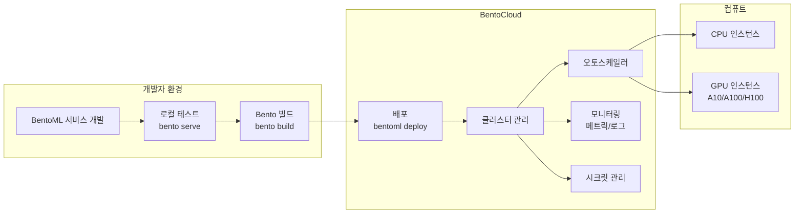
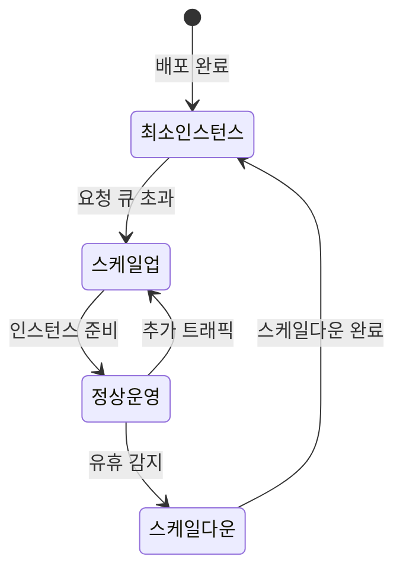
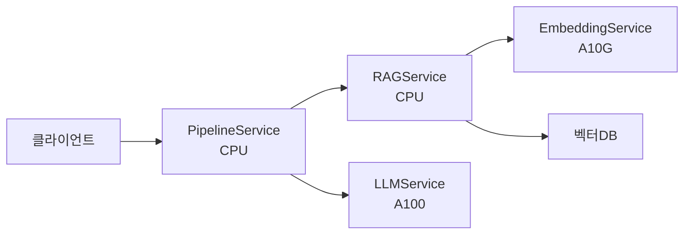
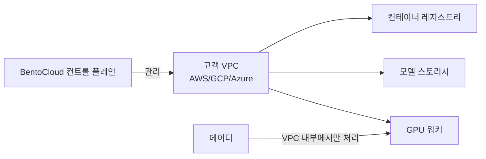

# BentoCloud - BentoML 매니지드 MLOps 플랫폼

BentoCloud는 오픈소스 ML 서빙 프레임워크인 [[bentoml|BentoML]]을 기반으로 하는 완전 관리형(fully managed) 클라우드 플랫폼이다. BentoML로 패키징한 서비스를 별도의 인프라 설정 없이 바로 배포하고, GPU 자동 스케일링과 엔터프라이즈 수준의 모니터링을 제공한다. BentoML 팀(BentoML Inc.)이 직접 운영한다.

## 플랫폼 개요



BentoCloud의 핵심은 "BentoML로 로컬에서 만든 서비스를 그대로 클라우드에 배포"하는 제로-마찰(zero-friction) 경험이다.

## BentoML 서비스 패키징

BentoCloud는 BentoML의 서비스 패키징 방식을 그대로 사용한다.

### 서비스 정의 (`service.py`)

```python
from __future__ import annotations

import bentoml
from bentoml.io import JSON, Text
from pydantic import BaseModel
from typing import AsyncGenerator

class ChatRequest(BaseModel):
    prompt: str
    max_tokens: int = 512
    temperature: float = 0.7

class ChatResponse(BaseModel):
    generated_text: str
    tokens_used: int

@bentoml.service(
    resources={
        "gpu": 1,
        "gpu_type": "nvidia-a100-80gb",
        "memory": "32Gi",
    },
    traffic={
        "timeout": 60,
        "max_concurrency": 4,
    },
)
class LLMService:
    model_ref = bentoml.models.get("llama3-8b:latest")

    def __init__(self):
        import torch
        from transformers import AutoModelForCausalLM, AutoTokenizer

        self.tokenizer = AutoTokenizer.from_pretrained(self.model_ref.path)
        self.model = AutoModelForCausalLM.from_pretrained(
            self.model_ref.path,
            torch_dtype=torch.bfloat16,
            device_map="cuda",
        )

    @bentoml.api
    async def generate(self, request: ChatRequest) -> ChatResponse:
        inputs = self.tokenizer(request.prompt, return_tensors="pt").to("cuda")
        outputs = self.model.generate(
            **inputs,
            max_new_tokens=request.max_tokens,
            temperature=request.temperature,
        )
        text = self.tokenizer.decode(outputs[0], skip_special_tokens=True)
        return ChatResponse(
            generated_text=text,
            tokens_used=outputs.shape[1],
        )

    @bentoml.api
    async def generate_stream(self, request: ChatRequest) -> AsyncGenerator[str, None]:
        """스트리밍 응답"""
        from transformers import TextIteratorStreamer
        from threading import Thread

        inputs = self.tokenizer(request.prompt, return_tensors="pt").to("cuda")
        streamer = TextIteratorStreamer(self.tokenizer, skip_prompt=True)

        thread = Thread(
            target=self.model.generate,
            kwargs={**inputs, "streamer": streamer, "max_new_tokens": request.max_tokens},
        )
        thread.start()

        for token in streamer:
            yield token
```

### Bento 빌드 및 배포

```bash
# 1. Bento 빌드 (의존성 + 서비스 패키징)
bentoml build

# 2. BentoCloud에 배포
bentoml deploy service.py:LLMService \
  --name llm-production \
  --bento llm-service:latest \
  --instance-type gpu.a100.1

# 3. 배포 상태 확인
bentoml deployment get llm-production
```

`bentofile.yaml`로 빌드 설정 관리:

```yaml
service: "service.py:LLMService"
labels:
  owner: ml-team
  stage: production

include:
  - "*.py"
  - "prompts/"

python:
  packages:
    - torch==2.3.0
    - transformers==4.40.0
    - accelerate
  requirements_txt: "./requirements.txt"

models:
  - llama3-8b:latest
```

## 핵심 기능

### GPU 자동 스케일링

BentoCloud의 오토스케일러는 큐 깊이(queue depth)와 인플라이트 요청 수를 기반으로 인스턴스를 조정한다:



스케일링 설정:

```python
@bentoml.service(
    resources={"gpu": 1},
    scaling={
        "min_replicas": 0,      # 스케일-투-제로 허용
        "max_replicas": 10,     # 최대 인스턴스 수
        "scale_up_behavior": {
            "stabilization_window_seconds": 0,   # 즉시 스케일업
        },
        "scale_down_behavior": {
            "stabilization_window_seconds": 300, # 5분 후 스케일다운
        },
    },
)
class MyService:
    ...
```

### 멀티-모델 파이프라인

BentoML은 여러 서비스를 연결하는 파이프라인 구성을 지원한다. BentoCloud는 이를 마이크로서비스 형태로 각각 독립 배포한다:

```python
import bentoml

# 임베딩 서비스
@bentoml.service(resources={"gpu": 1, "gpu_type": "nvidia-a10g"})
class EmbeddingService:
    @bentoml.api
    def embed(self, texts: list[str]) -> list[list[float]]:
        ...

# RAG 서비스 (임베딩 서비스 의존)
@bentoml.service(resources={"cpu": "2", "memory": "8Gi"})
class RAGService:
    embedding_svc = bentoml.depends(EmbeddingService)

    @bentoml.api
    async def retrieve(self, query: str) -> list[str]:
        embeddings = await self.embedding_svc.embed([query])
        # 벡터 검색...
        ...

# LLM 서비스 (RAG 서비스 의존)
@bentoml.service(resources={"gpu": 1, "gpu_type": "nvidia-a100-80gb"})
class PipelineService:
    rag = bentoml.depends(RAGService)
    llm = bentoml.depends(LLMService)

    @bentoml.api
    async def chat(self, question: str) -> str:
        contexts = await self.rag.retrieve(question)
        prompt = f"컨텍스트: {contexts}\n질문: {question}"
        response = await self.llm.generate({"prompt": prompt})
        return response.generated_text
```

BentoCloud에서 배포 시 각 서비스를 독립적으로 스케일링한다 - GPU가 필요한 임베딩/LLM 서비스와 CPU로 충분한 RAG 서비스를 분리해 비용을 최적화할 수 있다.



### 모델 레지스트리

BentoML 내장 모델 레지스트리로 모델 버전을 관리한다:

```python
import bentoml
import torch
from transformers import AutoModelForCausalLM

# 모델 저장
with bentoml.models.create("llama3-8b") as bento_model:
    model = AutoModelForCausalLM.from_pretrained("meta-llama/Meta-Llama-3-8B")
    model.save_pretrained(bento_model.path)
    bento_model.info.metadata = {
        "base_model": "meta-llama/Meta-Llama-3-8B",
        "quantization": "bfloat16",
        "created_by": "ml-team",
    }

# 모델 목록
bentoml.models.list()

# 특정 버전 참조
model_ref = bentoml.models.get("llama3-8b:abc123")
```

### 관찰성(Observability)

BentoCloud는 Prometheus 메트릭과 연동된 기본 대시보드를 제공한다:

| 메트릭 | 설명 |
|--------|------|
| `bentoml_service_request_total` | 총 요청 수 (상태별) |
| `bentoml_service_request_duration_seconds` | 응답 시간 분포 |
| `bentoml_service_request_in_progress` | 진행 중 요청 수 |
| GPU 활용률 | DCGM 기반 GPU 메트릭 |
| 큐 깊이 | 대기 중 요청 수 |

외부 관찰성 도구 연동:

```python
@bentoml.service(...)
class MyService:
    @bentoml.api
    async def predict(self, input_data):
        with bentoml.monitor("my_model") as mon:
            result = self.model.predict(input_data)
            mon.log(
                input_data=input_data,
                output_data=result,
                schema={
                    "input_data": bentoml.monitoring.Array(dtype="float", shape=(-1, 10)),
                    "output_data": bentoml.monitoring.Numerical(dtype="float"),
                },
            )
        return result
```

[[bentoml]]의 모니터링 API를 활용해 데이터 드리프트(data drift) 감지나 [[arize-phoenix]] 같은 관찰성 플랫폼과 연동할 수 있다.

## 엔터프라이즈 기능

### BYOC (Bring Your Own Cloud)

BentoCloud는 고객의 AWS/GCP/Azure 계정에 직접 BentoCloud 인프라를 설치하는 BYOC 모드를 지원한다:



데이터가 고객 VPC를 벗어나지 않으므로 금융, 의료 등 데이터 거주지(data residency) 규제가 있는 산업에 적합하다.

### SSO / RBAC

- 팀 기반 접근 제어(RBAC): 배포 생성/수정/삭제 권한 분리
- SSO 연동: Okta, Azure AD, Google Workspace
- API 키 관리: 서비스 계정별 API 키 발급 및 회전

## 경쟁 플랫폼과 비교

| 기능 | BentoCloud | [[baseten-deployment\|Baseten]] | [[replicate-platform\|Replicate]] | SageMaker |
|------|-----------|---------|-----------|-----------|
| 패키징 도구 | BentoML | TrussML | Cog | SageMaker SDK |
| 오픈소스 패키저 | O (BentoML) | O (TrussML) | O (Cog) | X |
| 멀티서비스 파이프라인 | 네이티브 | 미지원 | 미지원 | 지원 |
| 모델 레지스트리 | 내장 | 없음 | 없음 | 있음 |
| BYOC | 지원 | 지원 | 미지원 | AWS 전용 |
| 엔터프라이즈 RBAC | 지원 | 지원 | 미지원 | 지원 |
| 로컬 개발 연속성 | 최고 (동일 코드) | 좋음 | 좋음 | 보통 |
| 오픈모델 마켓 | 없음 | 있음 | 풍부함 | 제한적 |

### BentoCloud vs Baseten

- **BentoCloud**는 BentoML 오픈소스와 완벽하게 통합되어, 로컬 개발 코드가 클라우드에서 그대로 실행된다.
- **Baseten**은 TrussML 패키징이 필요하지만, 더 많은 사전 구성 모델 마켓플레이스를 제공한다.

### BentoCloud vs Replicate

- **BentoCloud**는 엔터프라이즈 기능(BYOC, RBAC, 멀티서비스)에 강점.
- **Replicate**는 커뮤니티 모델 접근성과 낮은 진입 장벽에 강점.

## 실무 사용 가이드

### 빠른 시작

```bash
# 설치
pip install bentoml

# BentoCloud 계정 연결
bentoml cloud login --api-token <token>

# 현재 클라우드 컨텍스트 확인
bentoml cloud current-context

# 서비스 배포 (service.py에 서비스 클래스 정의 필요)
bentoml deploy service.py:MyService --name my-service

# 배포 목록
bentoml deployment list

# 로그 확인
bentoml deployment logs my-service
```

### 시크릿 관리

```bash
# 시크릿 등록
bentoml secret create huggingface HF_TOKEN=<hf_token>

# 서비스에 시크릿 주입
bentoml deploy service.py:MyService \
  --secret huggingface
```

Python 코드에서는 일반 환경 변수로 접근:

```python
import os
hf_token = os.environ["HF_TOKEN"]
```

### 배포 업데이트 (롤링 배포)

```bash
# 새 버전 빌드
bentoml build

# 롤링 업데이트 (무중단 배포)
bentoml deployment update my-service \
  --bento my-service:new-version-tag
```

## 한계 / 트레이드오프

| 항목 | 내용 |
|------|------|
| BentoML 종속성 | BentoML을 모르면 학습 곡선 존재 |
| 오픈모델 즉시 사용 | Replicate/Together 대비 즉시 쓸 수 있는 모델 카탈로그 없음 |
| 비용 투명성 | 인스턴스 타입별 가격 정보가 공식적으로 상세하지 않음 |
| 지역 선택 | AWS 중심, 완전한 멀티클라우드 선택지 제한 |
| 무료 티어 | 무료 크레딧이 있지만 제한적 |
| 에코시스템 규모 | Baseten/Replicate 대비 커뮤니티 규모 작음 |

## 관련 문서

- [[bentoml]] - BentoCloud의 기반이 되는 오픈소스 ML 서빙 프레임워크
- [[baseten-deployment]] - TrussML 기반 경쟁 ML 배포 플랫폼
- [[replicate-platform]] - 오픈소스 모델 마켓플레이스 플랫폼
- [[ray-distributed]] - 분산 ML 실행 대안 (Anyscale과 연계)
- [[kserve]] - Kubernetes 네이티브 모델 서빙 표준
- [[arize-phoenix]] - ML 관찰성 및 모니터링 플랫폼
