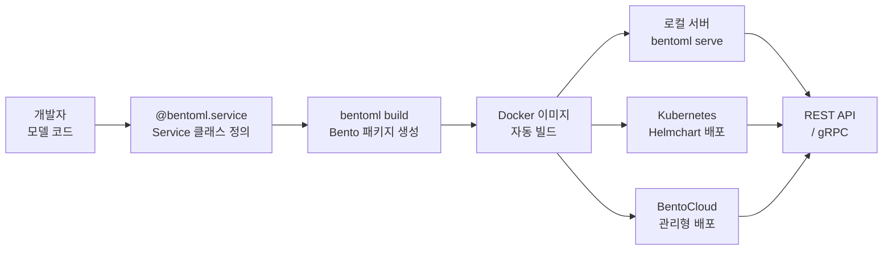

# BentoML

ML 모델을 프로덕션 마이크로서비스로 패키징하고 배포하기 위한 파이썬 프레임워크. 2019년에 시작된 오픈소스 프로젝트로, "Bento(도시락)"라는 이름처럼 모델, 의존성, 서빙 코드를 하나의 컨테이너로 묶는다는 컨셉이다. LLM부터 컴퓨터 비전 모델까지 다양한 ML 모델을 REST API 또는 gRPC 서비스로 노출할 수 있다.

## 프로젝트 개요

| 항목 | 내용 |
|---|---|
| 이름 | BentoML |
| 공개 | 2019년 |
| 언어 | Python |
| 라이선스 | Apache 2.0 |
| 저장소 | github.com/bentoml/BentoML |
| GitHub Stars | 7K+ (2026년 기준) |
| 관련 서비스 | BentoCloud (관리형 클라우드 플랫폼) |

## 핵심 추상화: Service

BentoML의 기본 단위는 `@bentoml.service` 데코레이터로 정의하는 **Service 클래스**다.

```python
import bentoml
import numpy as np

@bentoml.service(
    resources={"gpu": 1, "memory": "4Gi"},
    traffic={"timeout": 30}
)
class TextClassifier:
    def __init__(self):
        import torch
        self.model = torch.load("model.pt")

    @bentoml.api
    def classify(self, text: str) -> dict:
        # 추론 로직
        return {"label": "positive", "score": 0.92}
```

`@bentoml.service`는 리소스 요구사항, 트래픽 설정, 스케일링 정책을 선언적으로 정의한다. `@bentoml.api`로 표시된 메서드가 HTTP 엔드포인트가 된다.



코드에서 프로덕션 API까지의 배포 흐름을 보여준다.

## 주요 기능

### 모델 저장소 (Model Store)

BentoML은 자체 모델 저장소를 내장한다. 학습된 모델을 `bentoml.sklearn.save_model`, `bentoml.pytorch.save_model` 등으로 저장하면 버전이 자동으로 부여되고, 서빙 코드에서 버전 태그로 불러올 수 있다.

### 자동 Docker 이미지 빌드

`bentoml build`로 Bento 패키지를 만들고 `bentoml containerize`로 Docker 이미지를 생성한다. Python 의존성, CUDA 드라이버, 시스템 패키지가 모두 이미지에 포함된다. base image는 BentoML이 관리하는 공식 이미지를 사용하거나 커스터마이징할 수 있다.

### 어댑터 생태계

BentoML은 주요 ML 프레임워크용 어댑터를 공식 지원한다.

| 어댑터 | 지원 프레임워크 |
|---|---|
| `bentoml.sklearn` | Scikit-learn |
| `bentoml.pytorch` | PyTorch |
| `bentoml.tensorflow` | TensorFlow / Keras |
| `bentoml.xgboost` | XGBoost, LightGBM |
| `bentoml.transformers` | HuggingFace Transformers |
| `bentoml.mlflow` | MLflow 모델 |

### 적응형 배칭 (Adaptive Batching)

여러 요청을 자동으로 묶어 추론하는 배칭 기능을 내장한다. `@bentoml.api(batchable=True)` 설정만으로 활성화된다. GPU 활용률을 높이고 처리량을 개선하는 데 효과적이다.

## [[model-serving]] 프레임워크 비교

| 프레임워크 | 특징 |
|---|---|
| BentoML | 풀스택 ML 배포 (패키징 + 서빙 + 배포) |
| TorchServe | PyTorch 공식 서빙 (단순, 프레임워크 종속) |
| Triton Inference Server | NVIDIA GPU 최적화, 고성능 C++ 서버 |
| Ray Serve | 분산 컴퓨팅 기반, 복잡한 DAG 지원 |
| FastAPI + 직접 구현 | 최대 유연성, 최대 작업량 |

BentoML은 "모델 코드에 집중하고 나머지는 자동화"라는 개발자 경험(DX) 측면에서 FastAPI 직접 구현보다 생산성이 높다.

## [[docker-for-ml]] 통합

BentoML이 생성하는 Docker 이미지는 [[docker-for-ml]] 패턴의 모범 사례를 자동으로 따른다. 멀티 스테이지 빌드, 적절한 CUDA 베이스 이미지 선택, 레이어 캐싱 최적화가 내장된다.

Kubernetes 배포를 위한 Helm Chart도 공식 제공되며, BentoCloud에서는 자동 스케일링, A/B 테스트, 트래픽 분할까지 관리형으로 제공된다.

## 실무 활용 패턴

1. **LLM 엔드포인트화**: vLLM, llama.cpp로 로드한 오픈소스 LLM을 BentoML로 감싸 팀 내 공용 API로 제공
2. **앙상블 서비스**: 여러 모델을 하나의 Service에 조합해 전처리 → 추론 → 후처리 파이프라인을 단일 엔드포인트로 노출
3. **A/B 테스트**: BentoCloud의 트래픽 분할 기능으로 모델 버전 간 성능 비교

## 관련 문서

- [[model-serving]] - ML 모델 서빙 일반 패턴과 아키텍처
- [[docker-for-ml]] - ML 프로젝트의 Docker 활용 전략
- [[mlflow]] - 실험 추적 및 모델 레지스트리
- [[ray-distributed]] - 분산 ML 워크로드 처리
