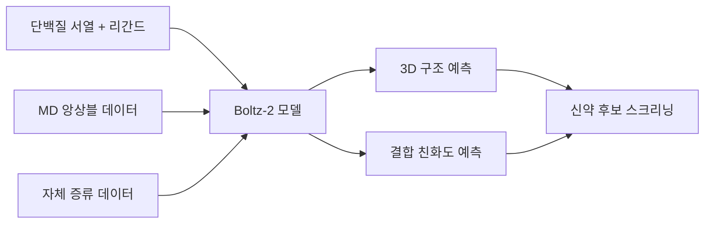

## 개요

Boltz-2는 MIT 연구진과 Recursion이 공동 개발한 오픈소스 생물분자 구조 예측 모델이다. 단백질-리간드 복합체의 3D 구조와 결합 친화도(binding affinity)를 동시에 예측하는 최초의 딥러닝 모델로, 기존 물리 기반 자유에너지 섭동(FEP) 방법 대비 약 1,000배 빠른 속도를 달성하면서도 동등한 정확도에 근접한다. GPU 1개로 약 20초 만에 예측을 완료할 수 있어, 대규모 신약 후보 물질 스크리닝에 혁신적인 효율을 제공한다. [[ai-scientific-discovery|AI 과학 발견]] 분야에서 딥러닝이 물리 기반 시뮬레이션을 대체하는 방향을 보여주는 대표 사례이며, [[ai-robotics-physical-ai|AI 로봇공학 및 피지컬 AI]]와 함께 AI가 물리 세계를 이해하는 두 축을 형성한다.

## 핵심 특징

- **구조 + 친화도 동시 예측**: 단백질-리간드 복합체의 3D 구조 예측과 결합 친화도 계산을 단일 모델에서 수행
- **방법 조건화(Method Conditioning)**: 특정 실험 방식(예: X-ray, Cryo-EM)을 지정하여 해당 조건을 모방한 예측 가능
- **템플릿 스티어링(Template Steering)**: 참고 구조 템플릿을 입력하여 사전 지식 기반 예측 유도
- **접촉/포켓 제약(Contact/Pocket Constraints)**: 특정 결합 부위나 접촉 조건을 강제하여 예측 제어
- **제로샷 스크리닝**: 미세조정 없이 미지의 표적 단백질에서도 우수한 예측 성능

## 기술 상세

### 훈련 데이터 및 방법론

Boltz-2는 전작인 Boltz-1을 기반으로 훈련 데이터를 대폭 확장했다:

- **구조 데이터**: 분자 동역학(MD) 시뮬레이션 앙상블과 Boltz-1의 자체 증류(self-distillation) 예측을 활용하여 구조 다양성을 확보
- **친화도 데이터**: Boltz-2 Affinity 모듈은 문헌에서 수집한 수백만 개의 배치 보정(batch-corrected) 결합 친화도 분석값으로 훈련
- **제로샷 일반화**: 미세조정 없이 미지의 표적(unseen targets)에서도 최신 기법 대비 의미 있는 성능 개선을 달성

### 핵심 혁신: 구조와 친화도의 통합

Boltz-2는 물리 기반 자유에너지 섭동(FEP) 방법의 정확도에 근접하는 최초의 딥러닝 모델이다. 기존 FEP는 높은 정확도를 제공하지만 계산 비용이 극히 높아 대규모 스크리닝에 부적합했다. Boltz-2는 GPU 1개로 약 20초 만에 예측을 완료하여 FEP 대비 약 1,000배 빠른 속도를 달성하면서 동등한 정확도에 근접한다.

### 제어 가능한 예측

| 제어 메커니즘 | 설명 | 활용 사례 |
|--------------|------|-----------|
| 방법 조건화(Method Conditioning) | 특정 실험 모달리티(X-ray, Cryo-EM 등)를 지정하여 해당 조건을 모방한 예측 | 실험 조건별 구조 비교 |
| 템플릿 스티어링(Template Steering) | 참고 구조 템플릿을 입력하여 사전 지식 기반 예측 유도 | 알려진 결합 모드 탐색 |
| 접촉/포켓 제약(Contact/Pocket Constraints) | 특정 결합 부위나 접촉 조건을 강제하여 예측 제어 | 특정 포켓 타게팅 |

### AlphaFold3 대비 차별점

| 항목 | AlphaFold3 | Boltz-2 |
|------|-----------|---------|
| 라이선스 | 제한적 | MIT (완전 오픈소스) |
| 결합 친화도 | 미지원 | 동시 예측 |
| 속도 | 상대적 저속 | ~1,000x 빠름 (GPU 1개, ~20초) |
| 코드/가중치 공개 | 부분 공개 | 전체 공개 (GitHub) |
| FEP 정확도 근접 | 해당 없음 | 최초 달성 |
| 제로샷 스크리닝 | 제한적 | 미세조정 없이 미지 표적 지원 |

### 오픈소스 및 배포

MIT 라이선스로 코드, 모델 가중치, 훈련 파이프라인 전체가 GitHub(`jwohlwend/boltz`)에서 공개되어 학술 및 상업적 사용이 모두 허용된다. NVIDIA NIM을 통한 배포도 지원하여 엔터프라이즈 환경에서의 대규모 스크리닝 파이프라인 구축이 가능하다.

### 신약 발견 워크플로우에서의 위치

기존에는 FEP를 전체 후보에 적용해야 했으나, Boltz-2를 1차 스크리닝에 활용하면 FEP 계산량을 대폭 줄이면서도 정확도를 유지할 수 있다.

## 학술적/산업적 영향

### 생물분자 구조 예측의 민주화

AlphaFold3가 제한적 라이선스로 상업적 활용에 장벽을 만든 반면, Boltz-2는 MIT 라이선스로 학술과 산업 모두에 완전 개방했다. 이는 소규모 바이오텍 스타트업부터 대형 제약사까지 동등한 접근을 보장하며, 오픈소스 AI 모델이 폐쇄형 모델과 경쟁할 수 있음을 신약 발견 분야에서 실증한 사례이다.

### FEP와의 상호보완 관계

Boltz-2가 FEP를 완전히 대체하는 것은 아니다. 오히려 대규모 1차 스크리닝에서 Boltz-2로 후보를 좁힌 뒤, 상위 후보에 대해 FEP로 정밀 검증하는 계층적 접근이 권장된다. 이 워크플로우는 전체 파이프라인의 비용을 수십 배 이상 절감하면서 최종 정확도를 유지할 수 있다.

### Recursion과의 협업

Recursion은 AI 기반 신약 발견을 전문으로 하는 기업으로, MIT 연구진과의 협업을 통해 산업 규모의 데이터와 학술적 혁신을 결합했다. Boltz-2 Affinity 모듈은 Recursion의 대규모 실험 데이터를 활용하여 훈련되었다.

## 관련 문서

- [[test-time-compute-scaling]] - 추론 시 계산 확장 패러다임
- [[open-source-ai-movement-2026]] - 2026 오픈소스 AI 생태계
