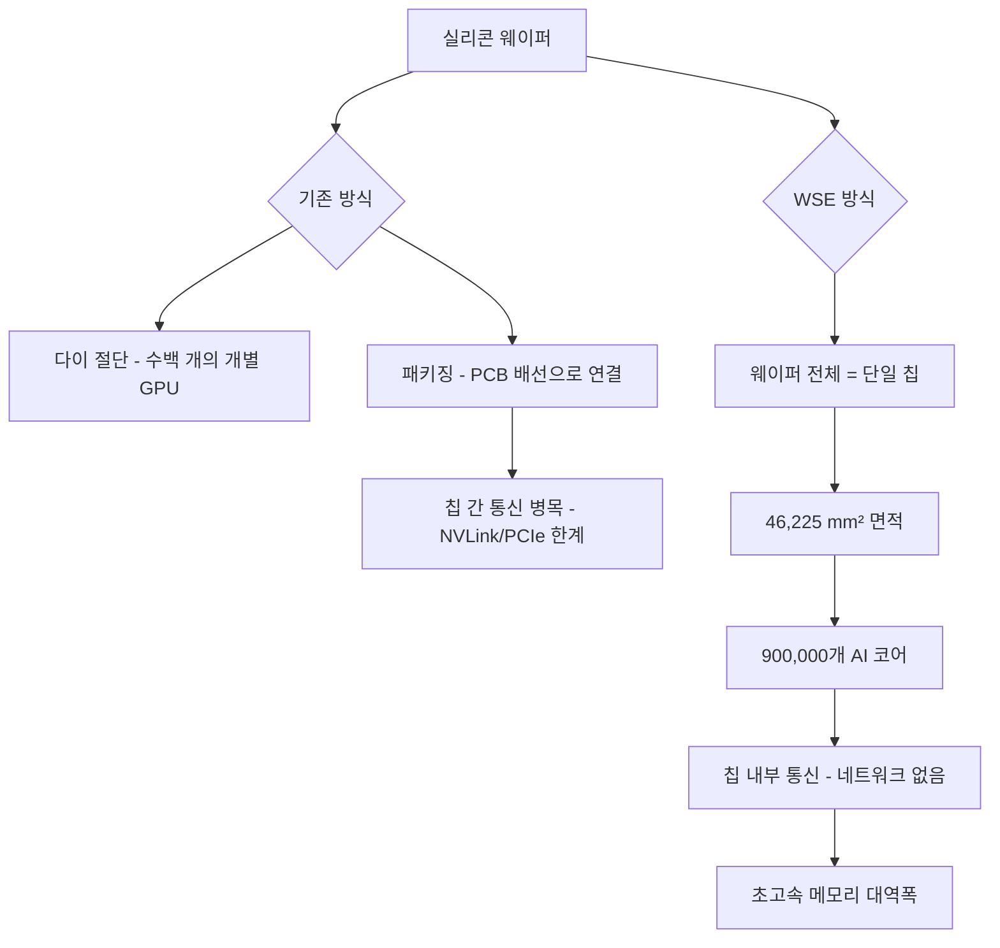
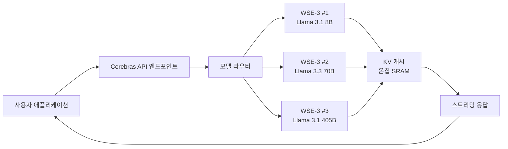
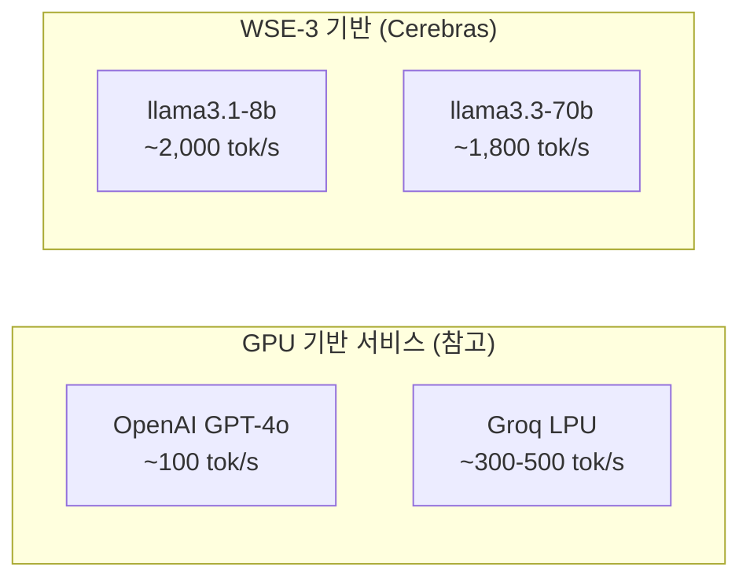
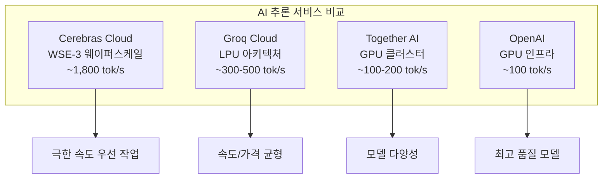
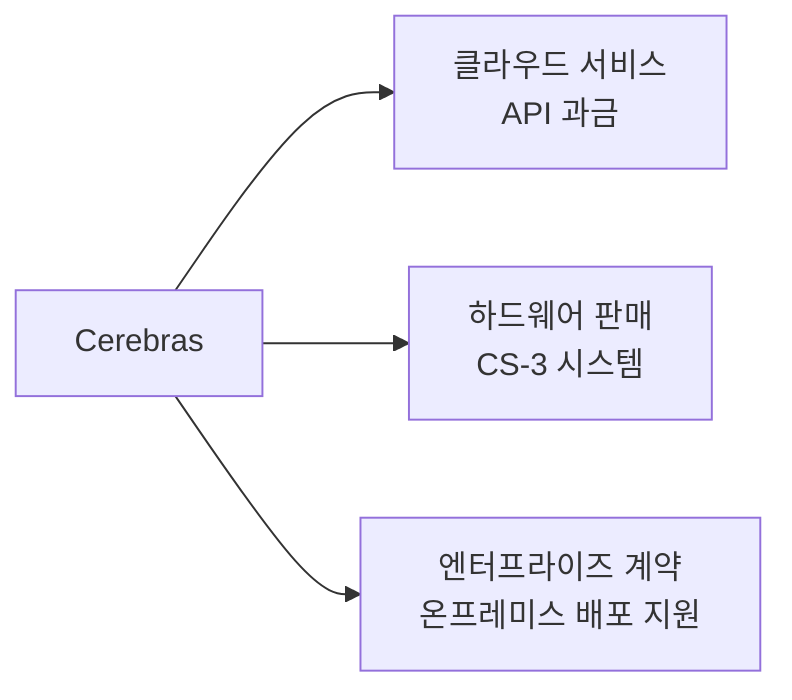

# Cerebras Cloud Inference

## 정체성

| 항목 | 내용 |
|------|------|
| 회사 | Cerebras Systems (미국 캘리포니아, 2016년 창립) |
| 제품 유형 | 클라우드 기반 LLM 추론 API 서비스 |
| 핵심 하드웨어 | WSE-3 (Wafer Scale Engine 3세대) |
| 가격 | $0.10~0.60/백만 토큰 (모델 크기별 차등) |
| 라이선스 | 독점 상용 서비스 |
| API 호환성 | OpenAI API 호환 엔드포인트 제공 |
| 웹사이트 | inference.cerebras.ai |

Cerebras Cloud Inference는 Cerebras Systems가 자사의 WSE-3 웨이퍼 스케일 칩을 기반으로 제공하는 LLM 추론 클라우드 서비스다. GPU 기반 경쟁 서비스 대비 수십 배 빠른 토큰 생성 속도를 제공하는 것으로 알려져 있으며, 특히 Llama 계열 모델에서 1,000~2,000 tokens/s 수준의 처리량을 보고한다.

## 핵심 하드웨어: WSE-3

WSE(Wafer Scale Engine)는 기존 GPU나 ASIC 칩과 근본적으로 다른 접근 방식을 취한다. 일반 반도체 칩이 웨이퍼를 작은 다이(die)로 잘라서 패키징하는 것과 달리, WSE는 실리콘 웨이퍼 전체를 하나의 단일 칩으로 사용한다.



위 다이어그램은 WSE-3가 왜 추론 속도에서 GPU 대비 우위를 가지는지를 설명한다. 칩 간 통신이 제거되고 모든 계산이 하나의 다이 안에서 처리되기 때문에, LLM 추론의 핵심 병목인 메모리 대역폭과 레이턴시 문제를 구조적으로 해결한다.

### WSE-3 주요 사양

| 사양 | 수치 |
|------|------|
| 다이 크기 | 46,225 mm² |
| AI 코어 수 | 900,000개 |
| 온칩 SRAM | 44 GB |
| 메모리 대역폭 | 20 PB/s (페타바이트/초) |
| 상호 연결 | 칩 내부 직접 통신 |
| 전력 소비 | ~15 kW |

WSE-3의 44 GB 온칩 SRAM은 현세대 H100 GPU의 80 GB HBM과 비교하면 총량은 적지만, 대역폭 측면에서 1-2 자릿수 이상 차이가 난다. LLM 추론에서 실제 병목은 메모리 용량보다 대역폭인 경우가 많기 때문에 이 특성이 속도 우위의 핵심이다.

## 아키텍처 개요



Cerebras Cloud는 WSE-3 클러스터 위에 OpenAI 호환 API 레이어를 올린 구조다. 사용자 입장에서는 기존 OpenAI SDK를 `base_url`만 변경하면 바로 사용할 수 있다.

## 지원 모델

2026년 4월 기준 Cerebras Cloud에서 제공하는 주요 모델은 다음과 같다.

| 모델명 | 파라미터 | 최대 컨텍스트 | 가격 (입력/출력) |
|--------|---------|--------------|-----------------|
| llama3.1-8b | 8B | 8,192 토큰 | $0.10/$0.10 |
| llama3.3-70b | 70B | 8,192 토큰 | $0.60/$0.60 |
| llama3.1-405b | 405B | 8,192 토큰 | 별도 문의 |
| llama-4-scout-17b | 17B | - | 베타 |

[교차검증 필요] 위 가격과 컨텍스트 길이는 변경될 수 있으니 공식 문서(inference.cerebras.ai/docs)에서 최신 정보를 확인하라.

## 주요 성능 지표

Cerebras가 공개하거나 독립 벤치마크에서 관측된 성능 수치다.



[교차검증 필요] 위 수치는 테스트 조건(배치 크기, 프롬프트 길이, 시스템 부하)에 따라 크게 달라질 수 있다. 공식 벤치마크 결과는 inference.cerebras.ai에서 확인하라.

## 실무 사용 가이드

### 빠른 시작

OpenAI SDK를 그대로 사용할 수 있다.

```python
from openai import OpenAI

client = OpenAI(
    api_key="csk-...",
    base_url="https://api.cerebras.ai/v1"
)

response = client.chat.completions.create(
    model="llama3.3-70b",
    messages=[
        {"role": "user", "content": "안녕하세요!"}
    ],
    stream=True,
    max_tokens=1024,
)

for chunk in response:
    if chunk.choices[0].delta.content:
        print(chunk.choices[0].delta.content, end="", flush=True)
```

### 스트리밍 지원

Cerebras Cloud는 서버-센트 이벤트(SSE) 방식의 스트리밍을 지원한다. 초고속 토큰 생성 속도 덕분에 스트리밍이 더욱 효과적으로 작동한다.

### API 키 발급

1. inference.cerebras.ai 방문
2. 계정 생성 및 로그인
3. API Keys 섹션에서 키 발급
4. `csk-` 접두사로 시작하는 키를 환경변수에 저장

```bash
export CEREBRAS_API_KEY="csk-your-key-here"
```

### LangChain 연동

LangChain의 ChatOpenAI를 통해 연동 가능하다.

```python
from langchain_openai import ChatOpenAI

llm = ChatOpenAI(
    model="llama3.3-70b",
    api_key="csk-...",
    base_url="https://api.cerebras.ai/v1",
    temperature=0.7,
)
```

## 차별점: 경쟁 서비스 비교



| 항목 | Cerebras | Groq | Together AI |
|------|---------|------|------------|
| 속도 | 최고 (WSE-3) | 매우 빠름 (LPU) | 보통 (GPU) |
| 모델 선택 폭 | 제한적 (Llama 위주) | 제한적 | 넓음 |
| 가격 | 중간 | 낮음 | 낮음~중간 |
| 컨텍스트 길이 | 8K (제한) | 32K | 모델별 상이 |
| 엔터프라이즈 지원 | 있음 | 있음 | 있음 |

Cerebras의 가장 큰 강점은 압도적인 추론 속도다. 반면 컨텍스트 창 길이가 비교적 짧고 지원 모델 수가 제한적이라는 단점이 있다.

## 한계 및 트레이드오프

### 현재 제약

- **컨텍스트 길이 제한**: 2026년 4월 기준 8,192 토큰. 장문 문서 처리에는 부적합할 수 있다.
- **모델 다양성 부족**: Llama 계열 중심으로, GPT-4/Claude/Gemini 등은 사용 불가.
- **온프레미스 배포**: WSE-3는 특수 인프라가 필요해 온프레미스 배포가 현실적으로 어렵다.
- **가용성**: 수요 폭증 시 GPU 서비스 대비 확장이 덜 유연할 수 있다.

### 사용 권장 시나리오

- 실시간 대화(챗봇)에서 응답 지연이 UX 핵심 지표인 경우
- 대량 배치 추론보다 인터랙티브 스트리밍 응답이 필요한 경우
- Llama 계열 오픈 웨이트 모델로 충분한 사용 사례

### 사용 비권장 시나리오

- 128K 이상 긴 컨텍스트가 필요한 경우
- GPT-4o/Claude 수준의 최고 품질 모델이 필요한 경우
- 특정 파인튜닝 모델을 직접 배포해야 하는 경우

## Cerebras 하드웨어 판매 사업

Cerebras는 클라우드 서비스 외에도 WSE 하드웨어를 직접 판매한다. 주요 고객으로는 연구기관, 국방 계약업체, 대형 기업의 AI 인프라 팀이 있다. 단일 CS-3 시스템(WSE-3 탑재)의 가격은 수백만 달러 수준으로 알려져 있다.



## 관련 문서

- [[groq-cloud-api]] -- Groq LPU 기반 고속 추론 서비스, Cerebras의 직접 경쟁자
- [[sambanova-systems-cloud]] -- 또 다른 특수 칩 기반 AI 추론 서비스
- [[ai-accelerators]] -- GPU 외 AI 가속기 전체 생태계 개요
- [[tenstorrent-grayskull]] -- Jim Keller 주도 오픈소스 AI 칩
- [[d-matrix-corsair]] -- 인메모리 컴퓨팅 기반 추론 전용 ASIC
