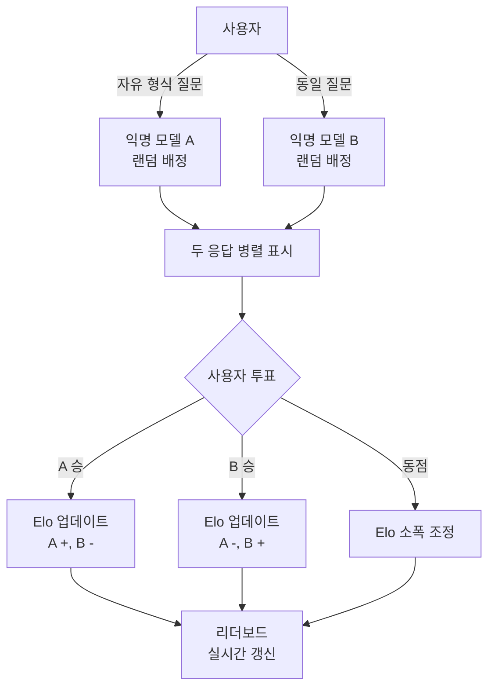
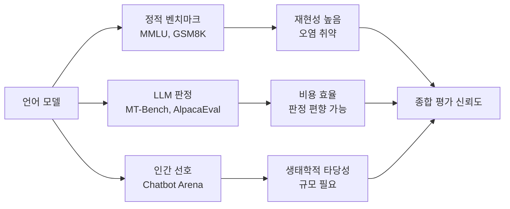

# Chatbot Arena

Chatbot Arena는 LMSYS(Large Model Systems Organization)가 운영하는 크라우드소싱 기반 LLM 평가 플랫폼이다. 사용자가 두 익명 모델과 동시에 대화하고 어느 쪽이 더 나은지 투표하는 방식으로, Elo 레이팅 시스템을 통해 모델 간 상대적 순위를 산출한다. 2023년 출시 이후 LLM 커뮤니티에서 가장 신뢰받는 인간 선호 기반 평가 지표로 자리잡았다.

## 프로젝트 개요

위 다이어그램은 사용자 투표가 Elo 시스템을 통해 리더보드에 반영되는 흐름이다.

| 항목 | 내용 |
|------|------|
| 운영 기관 | LMSYS (UC Berkeley + CMU) |
| 최초 공개 | 2023년 3월 |
| 평가 방식 | 인간 선호 쌍대 비교 (Pairwise) |
| 레이팅 시스템 | Elo (체스와 동일한 수학적 원리) |
| 누적 투표 수 | 수백만 건 (2025년 기준) |
| 지원 모델 | GPT, Claude, Gemini, LLaMA, Mistral 등 수십 종 |
| 공식 사이트 | lmarena.ai (구 chat.lmsys.org) |

## Elo 레이팅 시스템

Elo 시스템은 체스에서 유래한 레이팅 알고리즘으로, 두 플레이어(여기서는 두 모델) 간의 상대적 강도를 추정한다.

**기댓값 계산:**

$$E_A = \frac{1}{1 + 10^{(R_B - R_A)/400}}$$

여기서 $R_A$, $R_B$는 각 모델의 현재 레이팅이다.

**레이팅 업데이트:**

$$R_A' = R_A + K \cdot (S_A - E_A)$$

- $K$: 조정 계수 (Chatbot Arena에서는 배치 업데이트 변형 사용)
- $S_A$: 실제 결과 (승=1, 패=0, 무=0.5)
- $E_A$: 기대 결과

**Chatbot Arena의 변형**: 단순 Elo가 아닌 Bradley-Terry 모델을 기반으로 한 MLE(최대우도추정)로 레이팅을 산출해 통계적 신뢰 구간도 함께 제공한다.

## 평가의 특성

### 강점

**생태학적 타당성(Ecological Validity)**: 실제 사용자가 실제로 물어보는 질문으로 평가한다. 사전에 설계된 벤치마크 질문과 달리, 실제 사용 패턴을 반영한다.

**다양한 질문 분포**: 수백만 건의 대화가 축적되어 있어, 특정 카테고리에 치우치지 않는 광범위한 능력 평가가 가능하다.

**벤치마크 오염 저항성**: 사용자가 즉흥적으로 질문하므로, 모델이 미리 정해진 질문에 과적합하기 어렵다. [[benchmark-contamination]] 문제에 상대적으로 강건하다.

**익명성 보장**: 모델 이름을 숨겨 사용자의 브랜드 편향을 최소화한다.

### 한계

**투표 편향**: 영어권 사용자 비중이 높고, 기술적 사용자 비중도 일반 사용자와 다를 수 있다.

**스타일 편향**: 사용자는 길고 잘 형식화된 응답을 선호하는 경향이 있다. 실제로 더 정확한 응답이 더 짧아도 선호받지 못할 수 있다.

**영역 불균형**: 자연어 생성(글쓰기, 요약)에 편중되어 수학, 코딩, 사실성 등 전문 영역의 대표성이 낮다.

**통계적 유의성**: 모델 간 점수 차이가 작을 경우 신뢰 구간이 겹쳐 순위가 불확실해진다.

## MT-Bench와의 관계

Chatbot Arena와 [[mt-bench]]는 LMSYS의 양대 평가 도구로 상호 보완적이다.

| 항목 | Chatbot Arena | MT-Bench |
|------|--------------|---------|
| 질문 유형 | 자유 형식 (사용자 제공) | 고정 80문항 |
| 평가자 | 인간 (크라우드소싱) | GPT-4 자동 판정 |
| 재현성 | 낮음 (질문 무작위) | 높음 |
| 비용 | 낮음 (자원봉사 형태) | GPT-4 API 비용 |
| 오염 저항성 | 높음 | 낮음 |
| 통계적 안정성 | 대규모에서 높음 | 소규모에서 낮음 |

두 지표의 상관관계가 높게 나타나면서, [[llm-as-judge]] 접근법의 타당성이 검증되었다.

## LLM-as-Judge와의 연결

Chatbot Arena의 인간 투표 데이터는 [[llm-as-judge]] 접근법의 **골드 스탠다드(gold standard)** 역할을 한다. GPT-4 같은 LLM 판정자가 인간 선호와 얼마나 일치하는지를 Chatbot Arena 데이터로 검증한다.

Zheng et al. (2023)의 연구("Judging LLM-as-a-Judge with MT-Bench and Chatbot Arena")에서:
- GPT-4 판정자는 Chatbot Arena 인간 투표와 **80% 이상 일치**
- 이는 전문가 인간 간 일치율과 동등한 수준
- 이 결과가 LLM-as-Judge 방법론의 실용성을 입증

## AI 평가 생태계에서의 위치

위 다이어그램은 세 가지 평가 방식이 각각의 장단점을 가지며 상호 보완적으로 사용됨을 보여준다.

## 리더보드 해석 지침

- **신뢰 구간 확인**: 순위보다 신뢰 구간의 겹침 여부가 중요하다. 겹치면 사실상 동점이다.
- **카테고리 필터 활용**: 전체 순위 외에 코딩, 수학 등 카테고리별 필터로 용도에 맞는 모델을 선택한다.
- **언어 필터 활용**: 한국어 등 비영어 태스크가 중요하다면 언어별 필터를 사용한다.
- **시점 고려**: Elo는 누적 데이터를 반영하므로, 최근 업데이트된 모델은 아직 충분한 투표가 쌓이지 않았을 수 있다.

## [[ai-evaluation]] 맥락

Chatbot Arena는 [[ai-evaluation]] 분야에서 **인간 선호 기반 평가의 대표 사례**다. 고정 벤치마크의 한계(오염, 포화, 인위성)를 크라우드소싱으로 보완하는 패러다임을 제시했다. 이후 비디오, 이미지 등 멀티모달 영역으로도 확장되고 있다.

## 관련 문서

- [[llm-as-judge]] -- LLM을 판정자로 사용하는 평가 방법론
- [[ai-evaluation]] -- AI 평가 방법론 전반
- [[mt-bench]] -- LMSYS의 자동 평가 벤치마크
- [[benchmark-contamination]] -- 벤치마크 오염 문제
- [[alpacaeval]] -- 또 다른 LLM-as-Judge 기반 리더보드
