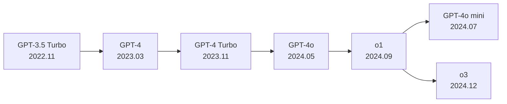
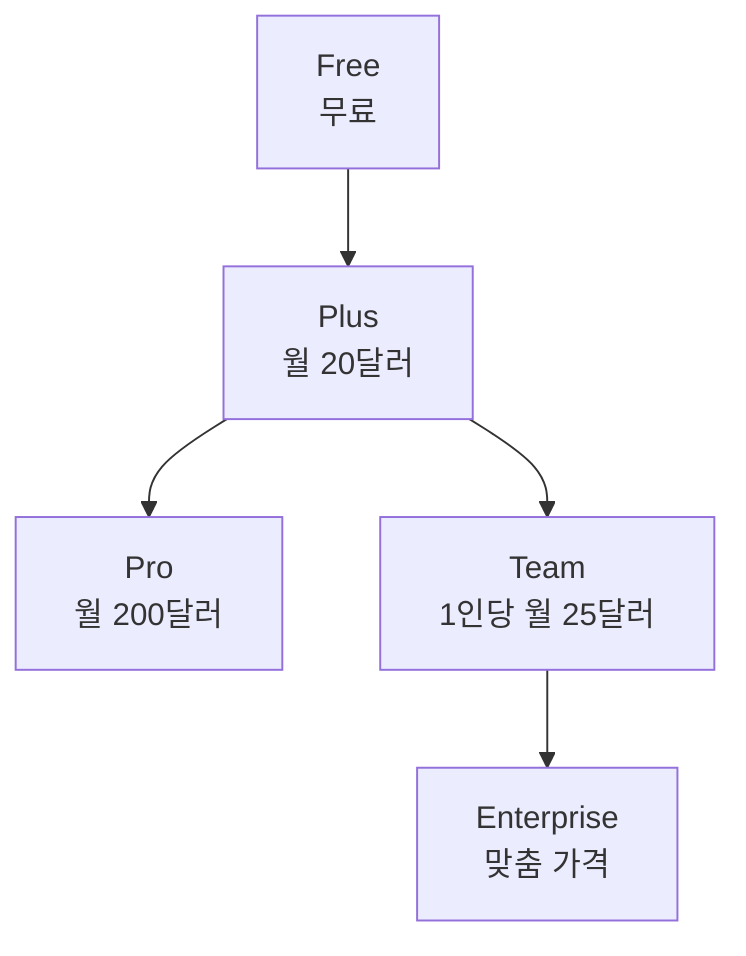

# ChatGPT - OpenAI 대화형 AI

## 개요

ChatGPT는 OpenAI가 2022년 11월 출시한 대화형 AI 제품이다. GPT 계열 언어 모델 위에 RLHF(Reinforcement Learning from Human Feedback)로 미세 조정해 사람과 자연스럽게 대화하도록 설계되었다. 출시 5일 만에 100만 사용자를 달성했고, 이후 역사상 가장 빠르게 성장한 소비자 애플리케이션으로 기록됐다. AI 산업의 대중화에 결정적인 역할을 했으며, 모든 주요 기술 기업의 AI 전략을 재편하는 계기가 됐다.

## 모델 진화

- **GPT-3.5 Turbo (2022.11)**: 초기 ChatGPT. InstructGPT 계열 RLHF 적용. 놀라운 지시 따르기 능력으로 세상을 놀라게 함
- **GPT-4 (2023.03)**: 멀티모달(이미지 입력), 대폭 향상된 추론 능력. MMLU 등 학문 벤치마크에서 인간 수준 달성
- **GPT-4 Turbo (2023.11)**: 128K 컨텍스트 창, 지식 컷오프 2023년 4월, JSON 모드
- **GPT-4o (2024.05)**: 텍스트·오디오·이미지 통합 멀티모달. 속도와 비용 개선. 실시간 음성 대화
- **o1 (2024.09)**: 추론 시점 계산 스케일링(internal chain-of-thought). 수학·코딩·과학 문제에서 새 기준 수립
- **o3 (2024.12)**: o1의 후속. ARC-AGI에서 87.5% 달성 (인간 수준)

## 주요 기능 진화

### 초기 (2022-2023): 대화와 도구

| 기능 | 출시 시점 | 설명 |
|------|---------|------|
| 기본 대화 | 2022.11 | 지시 따르기, 코드 작성, 설명 |
| 코드 인터프리터 | 2023.07 | Python 실행, 파일 처리, 데이터 분석 |
| 웹 브라우징 | 2023.09 | 실시간 웹 검색 및 참조 |
| DALL-E 통합 | 2023.10 | 이미지 생성 |
| 플러그인(Plugins) | 2023.05 | 서드파티 서비스 통합 (후에 GPTs로 대체) |

### 중기 (2023-2024): 개인화와 확장

- **커스텀 GPTs (2023.11)**: 누구나 특화된 ChatGPT 어시스턴트를 만들어 GPT Store에 배포 가능
- **메모리 (2024.02)**: 대화 간 사용자 정보를 기억하고 개인화. 사용자가 직접 관리 가능
- **음성 모드 Advanced Voice (2024.09)**: GPT-4o 기반 실시간 음성 대화. 감정 인식, 웃음, 노래 등

### 현재 (2024-2026): Canvas와 에이전트

- **Canvas (2024.10)**: 문서와 코드 편집을 위한 별도 작업 공간. 특정 섹션만 수정 지시 가능
- **Projects (2024.12)**: 대화를 프로젝트로 묶고 커스텀 지시사항과 파일을 프로젝트별로 관리
- **Tasks (2025)**: 예약 실행, 반복 작업 자동화
- **Operator/에이전트 모드**: 웹 브라우저를 직접 조작하는 컴퓨터 사용 에이전트

## 플랜 구성

- **Free**: GPT-4o 기본 접근, 제한된 고급 기능
- **Plus**: 모든 모델, 더 많은 메시지 한도, 새 기능 우선 접근
- **Pro**: o1 pro mode 포함 무제한 o1/o3, 확장된 컨텍스트
- **Team/Enterprise**: 대화 내용 학습 비사용, 관리 콘솔, SSO

## 산업적 영향

ChatGPT 출시는 AI 산업에 몇 가지 연쇄 반응을 일으켰다:

1. **구글의 비상 선언**: 내부적으로 "코드 레드" 발령, Bard(현 Gemini) 출시 가속
2. **Microsoft의 투자 강화**: OpenAI에 100억 달러 추가 투자, Bing에 ChatGPT 통합
3. **LLM 스타트업 붐**: Anthropic(Claude), Cohere, Mistral AI 등 수십 개 경쟁사 등장
4. **오픈소스 폭발**: LLaMA 유출 → Alpaca/Vicuna/Mistral 등 오픈소스 생태계 급성장
5. **규제 논의 촉발**: EU AI Act 가속화, 각국 정부의 AI 정책 논의 시작

## 기술적 의의

- **RLHF의 대중화 증명**: 인간 피드백으로 모델을 "사용하기 좋게" 만드는 것이 제품 성공의 핵심임을 입증
- **사전 학습 vs 정렬**: 큰 사전 학습 모델 위에 상대적으로 적은 비용의 RLHF만으로 극적인 사용성 향상 가능
- **창발적 능력 전달**: 연구소의 모델 능력을 일반 대중이 체험 가능한 형태로 패키징

## 관련 문서

- [[GPT-3 아키텍처]]
- [[GPT-4 아키텍처]]
- [[rlhf|RLHF (인간 피드백 강화학습)]]
- [[test-time-compute|추론 시점 계산 스케일링 (Test-Time Compute)]]
- [[OpenAI Agents SDK]]
- [[Claude - Anthropic의 AI 어시스턴트]]
