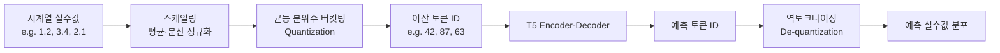
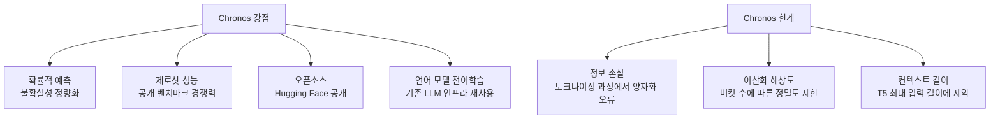

# Chronos (Amazon)

## 개요

Chronos는 Amazon이 개발한 오픈소스 시계열 파운데이션 모델이다. 기존 언어 모델 아키텍처([[patchtst|PatchTST]]처럼 시계열 전용으로 새로 설계하는 대신) T5 언어 모델을 그대로 재사용하고, 시계열 값을 **토큰 시퀀스로 변환하는 토크나이저**를 핵심 혁신으로 제시한다.

[[time-series-forecasting-dl|딥러닝 기반 시계열 예측]] 분야에서 "언어 모델을 시계열에 재활용할 수 있다"는 가설을 검증한 대표적 사례다.

## 핵심 아이디어: 시계열 토크나이저

Chronos의 본질적 기여는 연속 실수값인 시계열을 이산 토큰으로 변환하는 방법론이다.



### 변환 과정 상세

1. **스케일링**: 입력 시계열을 평균과 표준편차로 정규화하여 스케일 차이를 흡수
2. **균등 분위수 토크나이징**: 정규화된 값의 분포를 균등하게 나누는 버킷을 정의하고, 각 실수값을 가장 가까운 버킷의 정수 토큰 ID로 변환
3. **T5 모델 입력**: 토큰 ID 시퀀스를 기존 T5 언어 모델의 어휘(vocabulary)에 추가하거나 전용 어휘를 구성해 입력
4. **자기회귀 예측**: T5가 다음 토큰을 확률 분포로 예측하며, 이를 통해 예측 분포(probabilistic forecast)를 얻음
5. **역토크나이징**: 예측 토큰을 다시 실수값으로 복원

## 모델 구성

Chronos는 T5 크기별로 여러 변형을 제공한다:

| 변형 | 파라미터 수 | 비고 |
|------|------------|------|
| Chronos-T5-Tiny | ~8M | 경량 배포용 |
| Chronos-T5-Mini | ~20M | |
| Chronos-T5-Small | ~46M | |
| Chronos-T5-Base | ~200M | 균형 모델 |
| Chronos-T5-Large | ~710M | 최고 성능 |

## 학습 데이터

Chronos는 대규모 공개 시계열 데이터셋과 **합성 데이터(synthetic data)**를 혼합해 학습한다. 합성 데이터는 가우시안 프로세스(Gaussian Process)와 다양한 시계열 생성 프로세스를 사용해 생성되며, 데이터 다양성을 높이는 역할을 한다.

## 성능 특성



## 오픈소스 접근성

Chronos는 Apache 2.0 라이선스로 HuggingFace Hub에 공개되어 있어, TimeGPT와 달리 로컬 배포가 가능하다.

```python
from chronos import ChronosPipeline
import torch

pipeline = ChronosPipeline.from_pretrained(
    "amazon/chronos-t5-base",
    device_map="cuda",
    torch_dtype=torch.bfloat16,
)
forecast = pipeline.predict(context=time_series, prediction_length=12)
```

## 관련 문서

- [[time-series-forecasting-dl]] - 딥러닝 기반 시계열 예측 전반
- [[patchtst]] - 유사한 시계열 파운데이션 모델 접근법
- [[timegpt-foundation]] - Nixtla의 폐쇄형 시계열 FM 대안
- [[moirai-unified-forecasting]] - Salesforce의 통합 예측 모델
