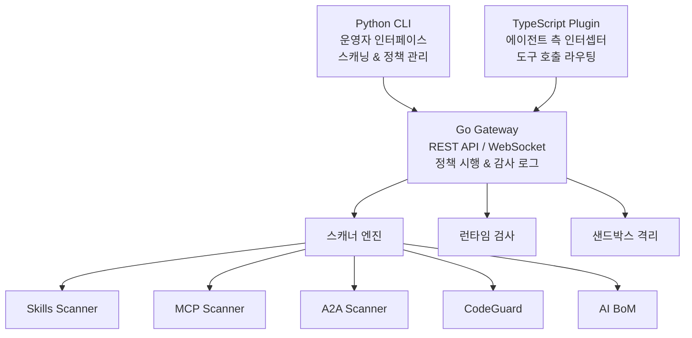
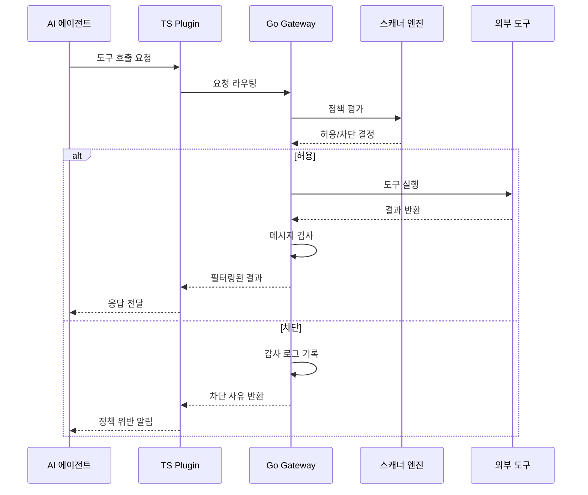

# Cisco DefenseClaw

## 정의

**Cisco DefenseClaw**는 2026년 3월 23일 RSAC 2026에서 발표된 오픈소스 AI 에이전트 보안 프레임워크다. AI 에이전트의 스캐닝, 샌드박싱, 인벤토리 관리를 자동화하며, 약 5분 내에 설치 가능하다. 2026년 3월 27일 GitHub에 공개되었다.

## 왜 지금 중요한가

기업의 85%가 AI 에이전트를 실험 중이지만 프로덕션 배포는 5%에 그치는 현실에서, 에이전트 보안은 채택의 가장 큰 병목이다. DefenseClaw는 [[owasp-agentic-top-10|OWASP Agentic Top 10]]의 ASI-02(Tool Misuse), ASI-04(Supply Chain), ASI-05(Code Execution) 위협에 직접 대응하는 최초의 통합 오픈소스 도구다.

## 아키텍처

DefenseClaw는 3-티어 시스템으로 구성된다:

### 5대 스캐닝 엔진

| 스캐너 | 역할 | 대응 OWASP 위협 |
|---|---|---|
| **Skills Scanner** | 에이전트 스킬의 정적 코드 분석. 위험 패턴, 과도한 권한, 알려진 취약점 탐지 | ASI-02 |
| **MCP Scanner** | [[model-context-protocol-mcp]] 서버의 인증, 인가, 무결성 검증 | ASI-04 |
| **A2A Scanner** | 에이전트 간 통신 채널의 인증, 인가, 데이터 유출 위험 감사 | ASI-07 |
| **CodeGuard** | 에이전트가 생성/소비하는 코드의 정적 분석. 하드코딩된 시크릿, `eval`, `subprocess(shell=True)`, 약한 암호화, SQL 인젝션, 경로 순회 탐지 | ASI-05 |
| **AI BoM** | 조직의 AI 자산(에이전트, 스킬, MCP 서버, 모델) 통합 인벤토리. 심각도 순위 결과 생성 | 전체 |

### 런타임 검사

라이브 LLM 트래픽에 대해 두 가지 검사 모드가 동작한다:

**메시지 검사**: 프롬프트와 응답에서 시크릿, 개인식별정보(PII), 인젝션 패턴 탐지.

**도구 검사**: 6개 위협 카테고리 평가:
- `secret` - API 키가 인자에 포함
- `command` - 셸 유틸리티 호출
- `sensitive-path` - 시스템 파일 접근
- `c2` - 커맨드 앤 컨트롤 패턴
- `cognitive-file` - 메모리 변조 시도
- `trust-exploit` - 위장된 인젝션

### 샌드박스 격리

OS 수준 보안 제어로 실행 환경을 격리한다:

- **Landlock LSM** - 파일시스템 접근 제한
- **seccomp-BPF** - 시스템 콜 필터링으로 제한된 실행 영역 생성

NVIDIA의 [[openclaw]] 런타임과 통합되어, MCP 서버가 차단되면 런타임 수준에서 네트워크 연결을 거부한다. 알림 생성이 아닌 **실시간 정책 시행**이 이루어진다.

## Cisco 에이전틱 보안 3대 축

DefenseClaw는 Cisco의 더 넓은 에이전틱 보안 플랫폼의 일부다:

1. **에이전트로부터 세계를 보호** - Duo IAM을 통한 신원 기반 온보딩, 세밀하고 시간 제한된 권한, MCP 게이트웨이 라우팅
2. **세계로부터 에이전트를 보호** - AI Defense: Explorer Edition을 통한 셀프서비스 레드 팀, 프롬프트 인젝션 테스트
3. **기계 속도의 탐지 및 대응** - Splunk와 XDR 통합으로 에이전트 상호작용 전반의 자동화된 위협 탐지

## 엔터프라이즈 통합

| 통합 대상 | 방식 |
|---|---|
| 감사 저장소 | SQLite에 전체 결정 이력 보존 |
| SIEM | Splunk HEC로 실시간 이벤트 전달 |
| 관측성 | OTLP 내보내기 (Jaeger, Grafana, Datadog) |

## 동작 흐름

에이전트가 도구를 호출하면 DefenseClaw가 개입하는 전형적인 흐름은 다음과 같다:

이 흐름에서 모든 도구 호출은 Gateway를 경유하므로, 에이전트가 직접 외부 도구에 접근하는 것이 불가능하다. 이것이 DefenseClaw의 "admission + runtime" 이중 검사 모델의 핵심이다.

## DefenseClaw vs AgentMon 비교

| 구분 | DefenseClaw | [[agentmon|AgentMon]] |
|---|---|---|
| 초점 | 사전 스캐닝 + 런타임 차단 | 사후 관측 + 이상 탐지 |
| 접근 방식 | 예방적 (preventive) | 탐지적 (detective) |
| 정책 시행 | 실시간 차단 가능 | 알림 및 인사이트 제공 |
| 오픈소스 | Apache 2.0 | 상용 제품 |
| 보완 관계 | 스캐닝/샌드박싱 | 행동 모니터링/비용 추적 |

두 도구는 경쟁이 아닌 **보완** 관계에 있다. DefenseClaw가 입구에서 위협을 차단하고, AgentMon이 통과한 에이전트의 런타임 행동을 지속 모니터링하는 구조가 이상적이다.

## 배포 요구사항

- Python 3.10+
- Go 1.25+
- Node.js 20+ (TypeScript 플러그인)
- `make build`로 빌드, ARM64 크로스 컴파일 지원

## 대표 자료

- [Cisco 보도자료: DefenseClaw 발표](https://newsroom.cisco.com/c/r/newsroom/en/us/a/y2026/m03/cisco-reimagines-security-for-the-agentic-workforce.html)
- [DefenseClaw 기술 상세](https://appsecsanta.com/cisco-defenseclaw)
- [OpenClaw 블로그: DefenseClaw 오픈소스 분석](https://openclawai.io/blog/cisco-defenseclaw-open-source-agent-security-rsac-2026)

## 관련 문서

- [[owasp-agentic-top-10]] - DefenseClaw가 대응하는 위협 분류 체계
- [[zero-trust-ai-agents]] - Cisco Zero Trust 에이전트 접근 제어
- [[mcp-server-cards]] - MCP Scanner가 검증하는 서버 발견 인프라
- [[agentmon]] - 보완적 에이전트 모니터링 도구
- [[nist-ai-agent-standards]] - 에이전트 신원/인가 표준화
